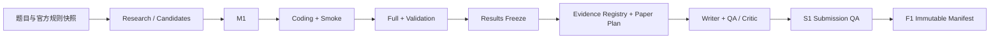
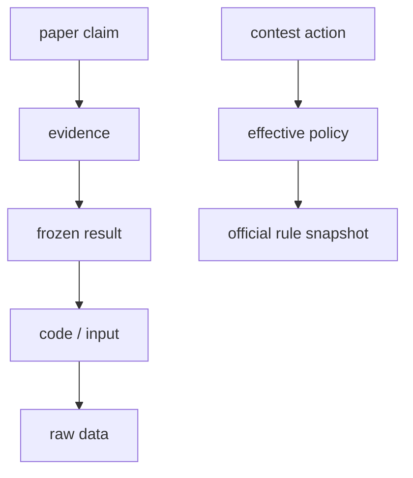

# Math Modeling Evidence Harness

面向 CUMCM、MCM/ICM 等数学建模竞赛的本地 Skill/Harness。它把“当届规则—模型—代码—验证—结果—证据—论文—提交”连接成可复核链路，重点降低四类风险：比赛违规、验证占位、关键数字漂移、最终文件与规则不符。

> 当前状态：已有 P0 基础链路、research-first 模型选型门、技术首稿 readiness、分级完整性、真实模板使用检查、实际 LaTeX/PDF QA 和回归测试；并可把用户提供的完整模板目录受控导入为 draft 项目，保留字体、文献样式与图件。CUMCM 的锁定 community snapshot 和用户模板都不等于官方模板；当届 official golden profile、自动选择性重跑和独立能力 benchmark 仍在后续发布门。它是可组合 Harness，不是全自动解题 Agent；模型选择、结论负责和最终提交仍由参赛队完成。

## 架构



两条追溯链并行存在：



数学公式、约束、验证义务和论文论证顺序的实现状态见 [Math Harness Implementation Status](docs/MATH_HARNESS_IMPLEMENTATION_STATUS.md)。

## P0 能力

- **Contest Safety**：固定当届官方规则快照；区分官方规则与本地保守策略；检查 live contest 的队外求助、赛题讨论、公开发布、外部写入与 AI 使用。
- **AI Usage + Human Checkpoints**：在 `run_manifest` 中登记影响交付物的 AI 使用；M1/P2/W2/S1 绑定当前 artifact 做人工确认，只有 submission 模式强制全量哈希。
- **Research-first Model Contract**：先记录中英检索词、大模型知识侦察、外部文献搜索和候选模型比较，再固定变量、公式、参数、实现步骤、验证与失败模式。
- **保守 Auto-EDA**：显式 target、split/time 边界后才允许把泄漏审计提升为 `pass`；未提供边界时数据契约保留 `not_run`，不会把画像推断冒充验证。
- **Validation Obligations**：P2 不再只看验证文件是否存在；由有限比较合同和 measurement snapshot 独立导出 `PASS/FAIL/ERROR`，`{"ok": true}` 不能替代重算。
- **Experiment Evidence**：敏感性必须有逐 grid 重跑回执；OOS 必须有独立 train/test 场景身份和泄漏检查；FAIL/ERROR 可编译为 diagnostic evidence，但不能伪装成 PASS 结果。
- **First-Draft Coverage**：`paper_plan.draft_coverage` 把 formulation/result/validation/interpretation 锚点和最低内容量绑定到 writer package；正式 QA 可阻断只写结果、不写模型和验证的简陋首稿。
- **Result Freeze**：禁止覆盖已有冻结文件，绑定模型合同、输入、代码、可重算验证报告与结果哈希；保留失败 run，但只有 `claimable=true` 的 PASS run 可进入论文证据链。
- **Evidence Registry**：一个可增量账本同时承载文献与结果证据；文献身份、全文支持和出版状态分开核验。
- **Argument Plan / Writer Package**：central thesis、claim type、段落研究动作和按风险分配的篇幅在写作前锁定；每问必须覆盖 formulation/result/validation/interpretation，避免第一版只有摘要式结果。
- **Math Writing Contract**：argument unit 显式绑定 model/equation/constraint/validation/result，并检查 prerequisite DAG、首稿 locator 和 Writer package 是否漂移；自动检查追溯与顺序，W2 人工确认代数正确性。
- **Equation Contract / Derivation DAG**：公式可声明 equation type、math risk、symbols、domains、unit signature、preconditions、verification 和中间量依赖；`check_derivation_integrity.py` 防守未定义符号、断链、孤立公式和常见操作前提缺失。
- **M1 正式合理性门槛**：`research/submission` 的 Gate 会运行 `check_modeling_plan.py --formal --strict`，检查外部检索 evidence linkage、候选数、选型理由、风险处置和已声明的结构性推导完整性；它不替代人的机制判断。
- **Paper Plan / Figure Contract**：requirement → claim → evidence 驱动章节与图表；不硬编码图数。
- **Vector Diagram Workflow**：总览图、任务流程图和模型框架图先生成 `diagram_spec.json`，再用 draw.io/Figma/PowerPoint 等可编辑矢量工具制作；默认输出 SVG/PDF，兼容性需要时显式选择高 DPI `raster_only`，不把 Mermaid/Python 成品或 AI 位图直接塞进论文。
- **Deterministic QA + Semantic Critic**：机械一致性交给脚本，边界外推和论证强度交给 Critic。
- **Template Usage + Submission Freeze**：正式构建验证实际 `documentclass`、类文件、命令和引擎；W2 与 S1 分离，最终由不可覆盖的 `submission_manifest.json` 固定比赛 profile、规则、文件、截止时间和包哈希。

## 核心 artifact

基础兼容 profile 长期维护五个核心 JSON。新项目默认使用 `integrity_mode=research`（必填字段，缺失会被 schema 校验拒绝）；只有最终提交切换到 `submission` 并强制全量文件哈希。新加入的派生/敏感性/OOS/失败辅助 artifact 在 dev/research 只需路径和语义绑定，已有哈希会被校验，但本地不必为每一步生成哈希。`enhanced_integrity_profile=true` 是额外的题面、数据、实现、呈现与 PDF receipts 检查，不应和哈希模式混为一谈：

| 文件 | 作用 |
|---|---|
| `model_contract.json` | M1 数学、数据与验证合同 |
| `run_manifest.json` | 可变控制面：规则、安全、AI、人审、命令、Gate、Reviewer |
| `frozen_results.json` | P2 可信结果与上游快照 |
| `evidence_registry.json` | 唯一增量证据账本 |
| `paper_plan.json` | W1 claim-evidence、章节、摘要和图表计划 |

F1 阶段追加第六个不可变文件：`submission_manifest.json`（最终提交快照，`freeze_submission.py` 生成、禁止覆盖，不属于常规维护的五个合同）。

增强 profile 另外要求：`problem_snapshot.json`、每个权威数据集的 `data_contract.json`、`implementation_map.json`、`artifact_dag.json`、`presentation_contract.json`、工具生成的 `claim_inventory.json`、`build_receipt.json`、`pdf_visual_qa.json` 与人工/多模态 `visual_review_receipt.json`。详见 [第二轮整合审计](docs/SECOND_ROUND_EDITORIAL_INTEGRATION_AUDIT_2026-08-13.md)。

临时推理、阶段摘要和重复结果报告不需要长期保存。

## 目录

```text
SKILL.md                         Skill 入口与阶段路由
agents/openai.yaml               UI 元数据
schemas/                         核心、增强 integrity、视觉、diagram 与提交回执 JSON Schema
scripts/validation/              有限比较的独立验证求值器
scripts/freeze_results.py        重算验证后冻结完整 run，并派生 claimable
scripts/register_evidence.py     初始化/合并唯一 Evidence Registry
scripts/freeze_submission.py     生成 F1 不可变提交 manifest
scripts/qa/                      Safety、合同、一致性、引用、Gate、S1 QA
scripts/qa/check_math_writing.py 数学引用、论证 DAG 与首稿定位检查
scripts/qa/check_derivation_integrity.py Equation Contract 与推导图结构检查
references/safety/               规则快照、网络/外写、AI 与人审政策
references/validation/           题型触发的验证义务
references/research/             文献真实性与优秀论文隔离规则
references/precedents/            隔离的优秀论文本地预留区（不进证据链）
references/cards/                 方法、题型与失败机制卡
references/contracts/            核心 artifact 与 Figure Contract
references/writing/              Writer 按需加载的摘要/一致性规则
scripts/claims/                  编译只读 writer package
scripts/figures/generate_drawio.py 结构化图稿 → native .drawio 后端
scripts/figures/check_diagram_spec.py 结构化概念图与可编辑源/导出检查
scripts/latex/                   数值宏生成与隔离安全构建
assets/templates/               原创清洗骨架与 Template Contract（不内嵌受限上游 class）
scripts/pdf/                     实际 PDF 检查、逐页渲染与 contact sheet
scripts/figures/                 Figure export 确定性检查
references/visualization/        evidence-driven 科研绘图规则
references/review/               Critic 与有界修订
references/submission/           S1/F1 规则
docs/HARNESS_INTEGRATION_ANALYSIS.md
                                  开源机制审计与整合决策
docs/UPSTREAM_STRENGTHS_REVIEW_2026-08-13.md
                                  用户补充仓库的分层复核与本轮落地映射
docs/MATH_HARNESS_IMPLEMENTATION_STATUS.md
                                  已实现能力、人工边界与 M0–M4 后续路线
tests/test_p0_harness.py          P0 正/负例回归测试
vendor/template_sources.json     模板来源、锁定提交与许可证决策
vendor/clone_templates.ps1       重建本地浅克隆（clone 目录不随 Skill 分发）
```

## 调用示例（发给 Agent 的 prompt）

标准场景——给定赛题，按 Harness 跑完整证据链与论文草稿。可直接复制后替换路径与比赛名：

```text
请用 math-modeling-skill-sion 完成 <比赛名，如 2025 国赛> A 题的建模全流程。

题目与附件位于 <题目目录路径>；请在工作区新建 <项目目录，如 battle/YYYY-MM-DD/> 下运行，
manifest 显式写入 integrity_mode=research，并按 SKILL.md 的 Gate 顺序推进：
S0 画像/数据契约 → M1 研究、候选比较与模型合同（check_modeling_plan --formal --strict）
→ P1 smoke → P2 独立重算并冻结结果 → W1 论文计划/数值宏 → W2 LaTeX 论文与确定性 QA
→ 生成三个 result*.xlsx；不需要 S1/F1。

硬性要求：
1. 每个数值只能来自冻结结果或由 derive_results 计算；禁止手填或编造；
2. 验证义务由 evaluate_obligations 独立重算，FAIL 保持 FAIL；
3. 人工 checkpoint 如无真人复核，decision 保持 ask，不得代签；
4. 正式图按 Figure Contract：数据图由冻结数据生成，框架图走 diagram_spec→draw.io，
   如要用 AI 生成的重要示意图/框架图，走 illustration 通道（backend_comparison 择优、
   ≥300 DPI、prompt 落盘、人工复核、caption 声明不承载数值结论）；
5. 最后输出一份"问题与摩擦点清单"：哪些 Gate 失败、哪些能力缺失、哪些表述含糊。

先读取 SKILL.md 与 references/safety/contest_safety.md，再开始执行。
```

精简版（已熟悉 Harness 时）：

```text
用 math-modeling-skill-sion 在 <目录> 按 Gate 顺序跑 <题目路径>，
integrity_mode=research；数值只来自冻结链，AI 图走 illustration 通道，
结束时给我 Gate 状态表和问题清单。
```

说明：`<比赛名>` 决定 Competition Profile（cumcm / mcm_icm / apmcm）；需要更强数学阻断时可让 manifest 追加 `"math_correctness_profile": "strict"`（见 [Strict Math Correctness Profile](references/workflow/math_correctness_profile.md)）；真实提交前才升级 `integrity_mode=submission` 并执行 S1/F1。

## 快速开始

### 0. 比赛前离线自检与模板锁定

```powershell
powershell -ExecutionPolicy Bypass -File vendor/clone_templates.ps1
python scripts/doctor.py --offline
```

运行完整的 EDA、数值脚手架与增强回归测试前，先在项目 Python 环境安装可选开发依赖：

```powershell
python -m pip install -r requirements-dev.txt
```

以下模板来源与许可证细节供赛前审计与分发合规使用，首次本地运行可先跳过：

默认锁定 CUMCMThesis、mcmthesis、Eisvogel 和 SciencePlots。用户指定的三个 Overleaf 页面也逐项登记，但公开 Gallery 项目需要进入登录账户后才能导出 source ZIP，不能冒充 Git clone；manifest 将它们与可验证的兼容仓库明确分开。Scientific Visualization Book 与 Python Graph Gallery 需要显式传 `-IncludeLargeReferences` 才下载；当前已按稀疏路径锁定到指定提交，仅作为本地图形设计参考，整个 `vendor/upstream/` 已被 Git 忽略，禁止随 Skill 分发。所有社区上游都不是当届官方规则。CUMCMThesis 的当前审计快照没有仓库级 LICENSE，因此也禁止随 Skill 分发；具体页面、提交、稀疏路径和许可证见 `vendor/template_sources.json`。

两条可验证论文模板已经实际通过隔离编译并完成全页渲染。兼容测试发现 CUMCM 示例含未嵌入字体，mcmthesis 示例默认采用 Letter 纸；这两个发现会阻止它们未经 visual profile 修补直接成为生产模板。
机器可读结果见 [`docs/TEMPLATE_COMPATIBILITY_AUDIT_2026-08-13.json`](docs/TEMPLATE_COMPATIBILITY_AUDIT_2026-08-13.json)。

CUMCM 新工程不要手写 `ctexart`。从锁定上游复制 class，并套用仓库内的清洗电子版骨架：

```powershell
python scripts/latex/init_cumcm_project.py `
  --destination paper `
  --title "论文题目" `
  --problem C `
  --keywords "关键词一;关键词二;关键词三" `
  --year 2026 --month 9 --day 4
```

这会生成 `paper/main.tex`、`paper/template_contract.json`、匿名 metadata 和正文分片，并实际使用 `cumcmthesis`。community class 只作技术底座；提交前仍须通过当届官方 profile 与最终 PDF QA。

若已从 Overleaf 下载完整 source ZIP，使用 [完整模板适配流程](references/writing/template_adapter.md)，不要只复制 `main.tex` 和 `.cls`。它会保留 `.sty/.bib/.bst`、字体、图件和数据文件，同时以 Harness 的 metadata/正文分片替换示例内容：

```powershell
python scripts/latex/import_user_template.py `
  --project-root . `
  --template-root "C:\Users\Administrator\Desktop\美赛模板" `
  --destination paper_en `
  --template-id mcm-user-template-2026 `
  --competition-profile mcm_icm `
  --family mcm_icm `
  --title "Paper title" `
  --problem A `
  --control-number 2600000 `
  --keywords "keyword 1, keyword 2"
```

### 1. 建立规则、题面与数据快照

赛前从赛事官网保存当届规则、格式规范、AI 政策和提交说明，登记 URL、抓取时间和 SHA-256。不要把往届规则写成当前规则。

先复制完整的 `run_manifest` 结构，再按当届快照填写 Competition Profile。下面只是 AI/提交差异片段，不能替代完整 schema。

CUMCM 当前可核验的 AI 专项基线仍是 2025 试行规定；2026 赛前规则已要求遵守该专项规定。使用 AI 时需要正文标注、AI 工具参考文献和支撑材料中的详情 PDF；未使用时需要在参考文献后声明：

```json
{
  "ai_disclosure_policy": "required_when_used",
  "ai_disclosure_format": "separate_file",
  "ai_manual_checks": {
    "when_used": [
      "ai_generated_content_marked",
      "ai_tool_in_references",
      "ai_disclosure_in_support"
    ],
    "when_not_used": ["no_ai_declaration_after_references"]
  }
}
```

COMAP 官网会滚动更新赛季。当前规则是一个 PDF、受限主体 25 页，使用 AI 时在主体之后附不计页数的 AI Report：

```json
{
  "support_policy": "prohibited",
  "max_pages": 25,
  "max_pages_excludes_ai_report": true,
  "ai_disclosure_policy": "required_when_used",
  "ai_disclosure_format": "in_paper_section",
  "ai_manual_checks": {
    "when_used": [
      "ai_inline_citations",
      "ai_tool_in_references",
      "ai_report_in_paper",
      "ai_report_position"
    ],
    "when_not_used": []
  }
}
```

每次比赛开始前都重新抓取官方页面；示例只能帮助配置字段，不能作为当届规则证据。

```powershell
python scripts/qa/check_contest_safety.py `
  --manifest run_manifest.json `
  --strict
```

在 M1 前创建并校验 `problem_snapshot.json`、`data_contract.json` 与 `implementation_map.json`：

```powershell
python scripts/qa/check_problem_coverage.py `
  --problem-snapshot problem_snapshot.json `
  --model-contract model_contract.json `
  --paper-plan paper_plan.json `
  --strict

python scripts/qa/check_data_contract.py `
  --data-contract data_contract.json `
  --model-contract model_contract.json `
  --strict

python scripts/qa/check_implementation_map.py `
  --implementation-map implementation_map.json `
  --model-contract model_contract.json `
  --strict

python scripts/qa/check_artifact_dag.py `
  --dag artifact_dag.json `
  --strict
```

### 1.5 先调研并通过 M1，再开始实现

不要从题面直接跳到一个算法名。对每个子问题先做两轮检索：第一轮用大模型知识生成方法族、关键词和待核验假设；第二轮通过 Web Search/OpenAlex/Crossref/CNKI/出版社或官方仓储核验真实文献。把文献写入同一个 `evidence_registry.json`，再在 `model_contract.research_basis` 中比较候选模型并形成详细实施蓝图。详见 [Research-first Model Planning](references/research/model_planning.md)。

```powershell
python scripts/qa/check_modeling_plan.py `
  --model-contract model_contract.json `
  --evidence-registry evidence_registry.json `
  --strict
```

M1 会拒绝：无外部检索、无全文 locator、每问只有一个无豁免候选、没有明确选型标准、选中候选没有映射到模型，或缺公式/参数/实现步骤/输出/验证/失败模式。M1 未通过不得进入 P1。

### 2. 完整验证后冻结结果

先为每项 `validation_obligations[]` 写入带定位器的 measurement snapshot，再由独立求值器生成报告；报告的 verdict 不能手填。FAIL/ERROR 也可冻结用于审计，但不能通过 P2 或写入 Evidence Registry。

```powershell
python scripts/validation/evaluate_obligations.py `
  --model-contract model_contract.json `
  --measurements reports/validation_measurements.json `
  --output reports/full_validation.json
```

求值报告生成后，冻结完整 run（PASS/FAIL/ERROR 均会冻结，供审计）：

```powershell
python scripts/freeze_results.py `
  --source results/raw_results.json `
  --output results/frozen_results.json `
  --run-id run-001 `
  --model-contract model_contract.json `
  --command "python code/run_all.py --seed 42" `
  --seed 42 `
  --input data/input.csv `
  --code code/run_all.py `
  --validation reports/full_validation.json
```

### 3. 合并证据

M1 前可以先用 seed 建立文献 evidence；P2 后合并冻结结果。输出已存在时应写新文件，确认后再使用 `--force` 替换。

```powershell
python scripts/register_evidence.py `
  --seed evidence_registry.seed.json `
  --frozen-results results/frozen_results.json `
  --output evidence_registry.json
```

`type=citation` 且要标为 verified 时，必须满足：metadata 已核验、读过全文并记录 locator、检查过撤稿/勘误状态。Crossref/OpenAlex metadata 本身不能证明 claim。

### 4. W2 确定性 QA

先检查论文计划是否足以写技术首稿，再编译只读 writer package。正式编译默认要求每个子问题都有建模/推导、结果、验证、解释/边界和图表或豁免；只有本地检查轮廓时才显式使用 `compile_writer_package.py --preview`。

```powershell
python scripts/qa/check_paper_readiness.py `
  --paper-plan paper_plan.json `
  --evidence-registry evidence_registry.json `
  --minimum-stage technical_draft `
  --strict

python scripts/claims/compile_writer_package.py `
  --paper-plan paper_plan.json `
  --frozen-results results/frozen_results.json `
  --evidence-registry evidence_registry.json `
  --output reports/writer_package.json `
  --integrity-mode research
```

随后由 `presentation_contract.json` 生成统一数值宏，再从最终草稿生成 claim inventory；不要在摘要、表格和图注中手填派生百分比。

```powershell
python scripts/latex/generate_values_tex.py `
  --presentation-contract presentation_contract.json `
  --frozen-results results/frozen_results.json `
  --output paper/generated/results.tex `
  --provenance reports/result_provenance.json

python scripts/claims/inventory_claims.py `
  --paper-plan paper_plan.json `
  --frozen-results results/frozen_results.json `
  --draft paper/main.tex `
  --output reports/claim_inventory.json `
  --strict
```

```powershell
python scripts/qa/run_deterministic_qa.py `
  --model-contract model_contract.json `
  --run-manifest run_manifest.json `
  --frozen-results results/frozen_results.json `
  --evidence-registry evidence_registry.json `
  --paper-plan paper_plan.json `
  --abstract paper/abstract.txt `
  --paper paper/main.tex `
  --conclusion paper/conclusion.txt `
  --writer-package reports/writer_package.json `
  --require-first-draft-coverage `
  --require-math-writing-coverage `
  --require-derivation-integrity `
  --problem-snapshot problem_snapshot.json `
  --data-contract data_contract.json `
  --implementation-map implementation_map.json `
  --artifact-dag artifact_dag.json `
  --output reports/deterministic_qa.json

python scripts/qa/check_gates.py --manifest run_manifest.json --strict
```

LaTeX 项目可再传 `--tex`、`--bib` 和 `--check-figures`。

需要直接生成正式科研图时，使用 `scripts/figures/plot_templates.py`。它支持 line/interval、comparison、distribution/ECDF、scatter/residual、sensitivity、Pareto、heatmap 与 network，并为每张图记录输入、输出、style、字段和完整参数 hash；PDF 元数据时间戳已移除，完整参数见 [Plot Recipes](references/visualization/plot_recipes.md)。

### 4.1 安全构建与实际 PDF 视觉 QA

```powershell
python scripts/latex/safe_build.py `
  --source-root paper `
  --entrypoint main.tex `
  --engine xelatex `
  --integrity-mode research `
  --template-contract paper/template_contract.json `
  --output submission/solution.pdf `
  --receipt reports/build_receipt.json

python scripts/pdf/check_pdf.py `
  --pdf submission/solution.pdf `
  --profile profiles/visual_profile.json `
  --source paper/main.tex `
  --render-dir reports/rendered_pages `
  --contact-sheet reports/contact_sheet.jpg `
  --output reports/pdf_visual_qa.json
```

`safe_build.py` 的 `dev/research` receipt 只记录路径和模板身份，不强制本地文件哈希；`submission` 才记录 source tree、模板、输出与日志哈希。`check_pdf.py` 只给 formal verdict，并渲染每一页；随后必须按 `visual_review_receipt.schema.json` 由人或多模态逐页确认无裁切、重叠、空白/重复页、中文缺失和不可读图表。`pdffonts` 的 encoding 标签不能单独判断中文显示成功。

### 5. S1/F1

S1 前按以下顺序准备：

1. 停止修改最终 PDF、支撑包和 AI 详情文件；
2. 补齐 `run_manifest.ai_usage[]`，每项通过人工核验；
3. 让 S1 human checkpoint 绑定最终文件哈希，并完成通用及 AI 条件人工检查；
4. 运行比赛专属 S1；通过后才把 report 登记回 manifest。

CUMCM 式“论文 + 支撑包 + AI 详情源文件”示例：

```powershell
python scripts/qa/check_submission.py `
  --run-manifest run_manifest.json `
  --paper submission/solution.pdf `
  --paper-pages 25 `
  --page-count-method pdfinfo `
  --support submission/support.zip `
  --ai-disclosure submission/AI_use_report.pdf `
  --output reports/submission_qa.json
```

这里的 `--ai-disclosure` 用于固定 AI 详情源文件；如果当届规则要求它位于支撑材料中，S1 还必须确认最终 ZIP/RAR 已实际包含该文件。它不表示要额外上传第三个顶层文件。

MCM/ICM 使用 AI、整个 PDF 28 页且末尾 AI Report 为 3 页的示例：

```powershell
python scripts/qa/check_submission.py `
  --run-manifest run_manifest.json `
  --paper submission/0000000.pdf `
  --paper-pages 28 `
  --ai-report-pages 3 `
  --page-count-method pdfinfo `
  --output reports/submission_qa.json
```

`--paper-pages` 始终是整个 PDF 的总页数。只有 profile 设置 `max_pages_excludes_ai_report: true` 时才传 `--ai-report-pages`；未使用 AI 时传 `0`。S1 会记录总页数、AI Report 页数和实际受限页数。

S1 通过后，在 `run_manifest.json` 中完成三项状态更新：

```json
{
  "status": "submission_ready",
  "phase": "submission",
  "gates": {
    "s1": {
      "status": "pass",
      "checked_at": "<ISO-8601>",
      "evidence": ["reports/submission_qa.json"]
    }
  },
  "artifacts": [
    {
      "role": "submission_qa",
      "path": "reports/submission_qa.json",
      "sha256": "<64-hex>"
    }
  ]
}
```

这是字段片段，不要覆盖 manifest 中其他 Gate 和 artifact。

将 S1 report 登记回 manifest 并把状态设为 `submission_ready` 后：

```powershell
python scripts/freeze_submission.py `
  --run-manifest run_manifest.json `
  --s1-report reports/submission_qa.json `
  --paper submission/solution.pdf `
  --support submission/support.zip `
  --ai-disclosure submission/AI_use_report.pdf `
  --deadline "2026-09-01T20:00:00+08:00" `
  --timezone "Asia/Hong_Kong" `
  --output submission_manifest.json
```

F1 文件不可覆盖。最终文件发生变化时，重新执行 S1/F1。

S1 report 同时绑定 Competition Profile、submission rules、AI Usage Registry 和 S1 human checkpoint。S1 后新增 AI 使用、修改人工检查或改规则，即使论文文件没变，F1 也会拒绝旧报告；正确做法是重新执行 S1，不要手改报告。

冻结后可随时复验最终文件未漂移：

```powershell
python scripts/qa/check_submission_manifest.py `
  --submission-manifest submission_manifest.json
```

## 优秀论文预留区

国赛与美赛目录已经预留，但论文文件不会提交到 Git：

- `references/precedents/cumcm/`
- `references/precedents/mcm-icm/`

把合法获得的论文放到本地，并在各自 `index.json` 记录赛事、年份、题号、奖项、官方来源、哈希和用途。先提炼成 `pattern-cards/` 机制卡，再供 Writer 赛前参考；不要复制原文，也不要把优秀论文当成科学 evidence。详见 [Outstanding Paper Quarantine](references/research/precedent_policy.md)。

## Figure / Reviewer 边界

Figure Contract 现在要求 message、comparison、visual encoding、selection rule 与 accessibility。数据图继续由确定性绘图库生成；概念流程图/框架图使用 [Diagram Workflow](references/visualization/diagram_workflow.md) 的可编辑源和 `diagram_spec.json`，AI 位图可经 [Figure Contract](references/contracts/figure_contract.md) 的 `illustration` 通道成为正式图（框架图须与可编辑后端 `backend_comparison` 择优并保留可编辑源；一律 ≥300 DPI、prompt 落盘、人工复核、caption 声明不承载数值结论）。默认 SVG/PDF，另有 `raster_only` 选项时必须声明 `raster_text`、DPI 和源文件。`check_figure.py` 检查导出格式、PDF 字体和栅格有效 DPI，`check_diagram_spec.py` 检查节点/边/来源/编辑性，`check_pdf.py` 负责最终 PDF 全页渲染。灰度/色觉、视觉强调和可读性仍由 visual review receipt 裁决，不冒充纯自动审美评分。

Reviewer 默认不堆 Agent：

| 模式 | 组成 |
|---|---|
| `sprint` | Deterministic QA + 1 Semantic Critic |
| `final_submission` | 上述检查 + 1 Blind Reviewer |
| `award_max` | 冻结成稿后按需使用 3 个隔离盲席 |

修订最多两轮，只处理稳定 issue ID 指向的问题；blocker/high 不下降时停止并写 decision memo。

## Acknowledgement / 开源项目致谢

本 Harness 的合同、审查、写作和绘图流程是在以下开源项目的公开设计与资料基础上融合、重写和本地化形成的。这里的“融合”表示吸收可验证的机制或作为本地参考入口，不表示把上游仓库整体复制进本项目；未声明为运行时依赖的资料不会自动注入模型上下文。逐仓裁决基于 2026-08-08 审计快照（commit 见 [开源机制整合审计](docs/HARNESS_INTEGRATION_ANALYSIS.md)）；上游演进后应按赛前复核节奏重审对应裁决，不把旧裁决当作长期有效。

| 项目 | 实际吸收的部分 | 本项目的边界 |
|---|---|---|
| [XiaoMaColtAI/math-modeling-skill](https://github.com/XiaoMaColtAI/math-modeling-skill) | Model Contract、M1/P1/P2 短链和角色化建模流程 | 重写为本地 schema、Evidence Registry、冻结结果和 Gate；不把固定图数、默认哈希或自然语言合同当作强制规则 |
| [sweetcornna/mathodology](https://github.com/sweetcornna/mathodology) | 有界修订（两轮定向返修 + decision memo）、稳定 issue ID、reviewer 分档（sprint/final_submission/award_max）与 handoff lint 思想 | 不搬九阶段逐段 Critic 与默认三盲席；盲审仍是隔离上下文的可选 profile，阈值按赛事校准 |
| [jihe520/MathModelAgent](https://github.com/jihe520/MathModelAgent) | 题目分析—候选模型—代码接口、关键中间结果落盘和人工检查节点 | 不复制多 Agent 平行事实源；结果以 `frozen_results.json` 为唯一可声明数值源 |
| [yuanchen-home/cumcm-step-review](https://github.com/yuanchen-home/cumcm-step-review) | 逐问审阅、研究顺序与呈现顺序分离、摘要 Draft→Fact Backcheck→Final、claim-first 图选择和 draw.io 工作流 | 不照搬固定摘要句式、固定图/表数量或上游语料；转化为可选 editorial profile 与本地 Figure Contract |
| [Yuan1z0825/nature-skills](https://github.com/Yuan1z0825/nature-skills) | Claim-first Figure Contract、源码/导出/PDF 渲染分层 QA 和 consistency sweep | 不套用 Nature 的版心、字体和固定期刊规格；竞赛 profile 负责最终参数 |
| [zLanqing/codex-claude-academic-skills](https://github.com/zLanqing/codex-claude-academic-skills) | 一个 Writer 按需加载章节规则、claim→evaluation 和证据边界 | 不拆成多个 Writer，不允许修辞覆盖冻结结果或数学合同 |
| [lishix520/academic-paper-skills](https://github.com/lishix520/academic-paper-skills) | 写作前 Paper Strategy、贡献/论证顺序和 reviewer 视角 | 合并到 `paper_plan`，不引入固定样本数、文献数和多份平行报告 |
| [lingzhi227/agent-research-skills](https://github.com/lingzhi227/agent-research-skills) | backward traceability、引用验证、渐进实验和 concern-driven revision | 采用证据链思想，不采用自动占位 BibTeX 或与竞赛无关的科研硬编码配额 |
| [zhanwen/MathModel](https://github.com/zhanwen/MathModel)、[personqianduixue/Math_Model](https://github.com/personqianduixue/Math_Model)、[HuangCongQing/Algorithms_MathModels](https://github.com/HuangCongQing/Algorithms_MathModels)、[datawhalechina/intro-mathmodel](https://github.com/datawhalechina/intro-mathmodel) | 本地方法族、算法实现、教程和往届案例的检索入口 | 只用于候选发现和学习；候选必须回到题面、真实文献和独立验证，不把资料库内容自动当作本题 evidence |
| [latexstudio/CUMCMThesis](https://github.com/latexstudio/CUMCMThesis) | `cumcmthesis` 类与完整模板结构作为国赛技术底座 | 用户模板/社区模板与当届官方规则分开锁定；不把未确认许可证的上游 class 随 Harness 分发 |
| [garrettj403/SciencePlots](https://github.com/garrettj403/SciencePlots) | 科研绘图样式（science/ieee 风格）的设计参考 | 运行时使用自有轻量样式与 `assets/styles/mathmodel.mplstyle`，不强依赖该包；锁定提交与许可证见 `vendor/template_sources.json` |

更完整的 commit、许可证、吸收/拒绝理由见 [开源机制整合审计](docs/HARNESS_INTEGRATION_ANALYSIS.md) 和 [上游长处复核](docs/UPSTREAM_STRENGTHS_REVIEW_2026-08-13.md)。

## 验证

```powershell
python -m unittest discover -s tests -v
```

回归测试覆盖：规则/安全策略、人工 checkpoint、验证占位拒绝、失败 run 冻结与 evidence 边界、敏感性/OOS/失败凭证、题面漏答、数据泄漏、公式—代码绑定、推导图/数学写作追溯、Auto-EDA 语义与泄漏边界、Reflexion 分类、模板实际使用、LaTeX/PDF 构建和图表 QA。具体数量随本地依赖和测试集合更新，以实际 `unittest` 输出为准。

## 进一步阅读

- [Harness Integration Analysis](docs/HARNESS_INTEGRATION_ANALYSIS.md)
- [Artifact Contracts](references/contracts/artifact_contracts.md)
- [Contest Safety](references/safety/contest_safety.md)
- [Validation Obligations](references/validation/validation_obligations.md)
- [Literature Evidence](references/research/literature_evidence.md)
- [Figure Contract](references/contracts/figure_contract.md)
- [Submission Freeze](references/submission/submission_freeze.md)
