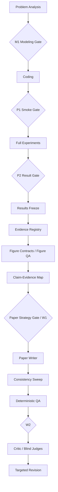
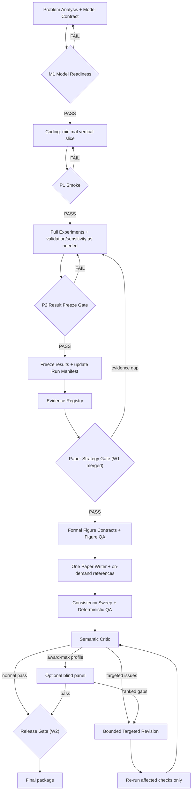

# Harness Integration Analysis

> 审计日期：2026-08-08。本文只做架构审计与整合方案，不代表当前目录已经实现这些机制。

## 1. 当前架构概览

### 1.1 先澄清“当前”状态

当前工作区并没有已搭建的主 Skill/Harness，只有两份补充 reference：

- [`abstract_guidelines.md`](../references/writing/abstract_guidelines.md)：摘要结构、数字、单位、有效数字与自检规则。
- [`figure_design.md`](../references/visualization/figure_design.md)：图表应服务论证、按任务选图、避免硬凑数量和模板化图表。

因此，下文的“当前是否已有”分成三种状态：

1. **本地已有**：当前两份 reference 已明确写出该原则；
2. **设计基线已有**：主骨架参考仓库已经设计，但当前工作区尚未内化；
3. **未有**：两边都没有可直接复用的机制。

主骨架参考仓库已经形成“建模手—编程手—论文手”三角色、`M1/P1/P2/W1/W2` 五个检查点、复现清单和若干确定性校验，但它同时带有固定图数、默认双格式论文、每个 Gate 都要求独立 Subagent 等较重约束。相关依据见其 [`SKILL.md`](https://github.com/XiaoMaColtAI/math-modeling-skill/blob/6ff5fd31c19af97e13babb0dd2a8cef81e3b822d/SKILL.md)、[`Subagent调度.md`](https://github.com/XiaoMaColtAI/math-modeling-skill/blob/6ff5fd31c19af97e13babb0dd2a8cef81e3b822d/references/Subagent%E8%B0%83%E5%BA%A6.md) 与三个角色 Skill。

### 1.2 设计基线流程（尚未在本地实现）



这个方向是对的，但顺序和职责仍需收束：最终图表需求应由论文主张和证据缺口推出，所以 **Paper Strategy 应先于正式 Figure Contract 冻结**；探索性图可在实验阶段产生，但不能因为已有图就倒推论文必须使用它。

### 1.3 审计快照

本次实际读取了各仓库的 `SKILL.md`、相关 workflow/agent/reference 和关键脚本，以下 commit 用于固定审计语境：

| 仓库 | 审计 commit | 重点读取文件 |
|---|---:|---|
| XiaoMaColtAI/math-modeling-skill | `6ff5fd3` | `SKILL.md`、三个角色 Skill、`Subagent调度.md`、`前置合同.md`、`repro_manifest.py`、`figure_audit.py`、相关测试 |
| jihe520/MathModelAgent | `11f3862` | `1start`、`2analysis-modeling`、`3coding-visual`、`5writing`、`6verity`、`writing_check.sh`、`math_modeling_norms.md` |
| sweetcornna/mathodology | `737f7ab` | `mathodology-agent-pipeline`、`mathodology-award-gates`、award workflow、Critic、Blind Judge、`lint_run.py`、`figqa.py`、`pdf_qa.sh` |
| Yuan1z0825/nature-skills | `db6a388` | `nature-figure`、Figure Contract、QA Contract、`validate_figure.py`、`audit_pdf_text.py`、`nature-polishing`、Consistency Sweep |
| lingzhi227/agent-research-skills | `9e6c085` | backward-traceability、citation-management、self-review、paper-revision、experiment-design 及其脚本/reference |
| lishix520/academic-paper-skills | `c325557` | `strategist/SKILL.md`、quality standards、sample/gap validators |
| zLanqing/codex-claude-academic-skills | `7ed6377` | `research-writing-skill/SKILL.md`、editorial principles、section rhetorical moves、figure spec template |

## 2. 各仓库值得吸收的机制

判断口径：每个仓库只选 1～3 个高价值机制；“建议”列同时说明增强/替换、冲突和是否现在实现。

| 来源 | 机制 | 当前是否已有 | 建议 | 放置位置 | 成本 | 收益 |
|---|---|---|---|---|---|---|
| [math-modeling-skill / `SKILL.md`](https://github.com/XiaoMaColtAI/math-modeling-skill/blob/6ff5fd31c19af97e13babb0dd2a8cef81e3b822d/SKILL.md)、[`Subagent调度.md`](https://github.com/XiaoMaColtAI/math-modeling-skill/blob/6ff5fd31c19af97e13babb0dd2a8cef81e3b822d/references/Subagent%E8%B0%83%E5%BA%A6.md) | 三角色串行主链 + 阶段 Gate | 设计基线已有，本地未实现 | **增强，不照搬。现在实现。** 保留 M1/P1/P2；W1 并入 Paper Strategy Gate；W2 改为最终 Release Gate 的汇总决定。不要让五个 Gate 等于五个独立 Agent。与 Mathodology 九阶段逐阶段 Critic 冲突时，采用较短链路。 | A Workflow | 中 | 高 |
| [math-modeling-skill / `前置合同.md`](https://github.com/XiaoMaColtAI/math-modeling-skill/blob/6ff5fd31c19af97e13babb0dd2a8cef81e3b822d/references/roles/%E5%BB%BA%E6%A8%A1%E6%89%8B/references/%E5%89%8D%E7%BD%AE%E5%90%88%E5%90%8C.md)、[`repro_manifest.py`](https://github.com/XiaoMaColtAI/math-modeling-skill/blob/6ff5fd31c19af97e13babb0dd2a8cef81e3b822d/references/roles/%E7%BC%96%E7%A8%8B%E6%89%8B/scripts/repro_manifest.py) | Model Contract + 输入哈希/种子/参数/复现命令 | 设计基线部分已有，本地未实现 | **增强。P0 实现。** 把自然语言合同升级为可校验 schema；复现清单进一步记录代码版本、输出哈希和结果 ID，形成 raw data → code → result 的主链。 | B Artifact Contract | 中 | 高 |
| [math-modeling-skill / `figure_audit.py`](https://github.com/XiaoMaColtAI/math-modeling-skill/blob/6ff5fd31c19af97e13babb0dd2a8cef81e3b822d/references/roles/%E7%BC%96%E7%A8%8B%E6%89%8B/scripts/figure_audit.py)、[`test_figure_tools.py`](https://github.com/XiaoMaColtAI/math-modeling-skill/blob/6ff5fd31c19af97e13babb0dd2a8cef81e3b822d/tests/test_figure_tools.py) | 图文件格式、DPI、SVG 文本、子问题覆盖的确定性检查 | 本地可视化指南只有原则；设计基线有脚本 | **替换其中的数量规则，保留机械检查。P0 做轻量版，深度 QA 放 P1。** 删除“三类各 3 张、正式图至少 8 张”；检查应围绕 `claim_id/evidence_id` 覆盖、可读性、来源和导出质量。 | D Reviewer/QA + C Figure reference | 中 | 高 |
| [MathModelAgent / `2analysis-modeling`](https://github.com/jihe520/MathModelAgent/blob/11f38624cd9128bc2ce22d7b3254106e624490cd/skills/2analysis-modeling/SKILL.md) | 赛题分析与模型设计合并；末尾给出代码实现接口表 | 设计基线的题目分析报告已有相似思想 | **增强。现在实现。** 不额外拆“分析 Agent”和“模型 Agent”；把任务、输入、输出、方法、校验写进 `model_contract`。 | A Workflow + B Contract | 低 | 高 |
| [MathModelAgent / `3coding-visual`](https://github.com/jihe520/MathModelAgent/blob/11f38624cd9128bc2ce22d7b3254106e624490cd/skills/3coding-visual/SKILL.md)、[`writing_check.sh`](https://github.com/jihe520/MathModelAgent/blob/11f38624cd9128bc2ce22d7b3254106e624490cd/skills/6verity/scripts/writing_check.sh) | 中间数据/图数据落盘 + 论文文本确定性检查 | 设计基线有复现清单和论文校验，但结果权威源不够统一 | **合并，不新增 `RESULTS_REPORT` 作为第二权威源。P0/P1 分步实现。** 机器可读结果进 `frozen_results`；Markdown 只做人读摘要。借用占位符、图片引用、重复标签、关键数值扫描等检查。 | B Artifact + D QA | 中 | 高 |
| [MathModelAgent / `1start`](https://github.com/jihe520/MathModelAgent/blob/11f38624cd9128bc2ce22d7b3254106e624490cd/skills/1start-mathmodel/SKILL.md)、[`math_modeling_norms.md`](https://github.com/jihe520/MathModelAgent/blob/11f38624cd9128bc2ce22d7b3254106e624490cd/skills/_references/math_modeling_norms.md) | 子问题数量动态化；数据图与概念图职责分离 | 本地可视化指南部分已有 | **增强。现在实现为 reference。** 动态按题目和论证需求确定章节/图；“数据图由结果生成、概念图不冒充数据证据”写入 Figure Contract。不要照搬 `plan.md + todo.md + 多份阶段报告`。 | C Micro-Skills | 低 | 中 |
| [Mathodology / `mathodology-award-gates`](https://github.com/sweetcornna/mathodology/blob/737f7abd0d23e933ed8c456c0f3b419cae200e8a/.claude/skills/mathodology-award-gates/SKILL.md)、[`lint_run.py`](https://github.com/sweetcornna/mathodology/blob/737f7abd0d23e933ed8c456c0f3b419cae200e8a/.claude/skills/mathodology-award-gates/scripts/lint_run.py) | 结构化 handoff/gate、稳定 issue ID、schema lint | 设计基线只有文字版固定回执 | **增强。P1 实现。** 内化为一个紧凑 `run_manifest`，不为每个阶段生成一堆 YAML。稳定 issue ID 用于判断问题是否真正减少。 | B Artifact + D QA | 中 | 高 |
| [Mathodology / award workflow](https://github.com/sweetcornna/mathodology/blob/737f7abd0d23e933ed8c456c0f3b419cae200e8a/.claude/workflows/mathodology-award-submission.md) | 有界修订：每阶段有限循环、无改善即停止、耗尽后 decision memo | 当前没有 | **新增。现在实现规则，脚本化放 P1。** 默认最多两轮定向修订；只重跑受影响 Gate；若 blocker/high 数量不下降就停止，不让“继续润色”无限循环。 | D Reviewer/QA | 低 | 高 |
| [Mathodology / Blind Judge](https://github.com/sweetcornna/mathodology/blob/737f7abd0d23e933ed8c456c0f3b419cae200e8a/.claude/agents/mathodology-award-judge.md)、[panel contract](https://github.com/sweetcornna/mathodology/blob/737f7abd0d23e933ed8c456c0f3b419cae200e8a/.claude/skills/mathodology-award-gates/SKILL.md) | Critic 后三席盲审、独立 scorecard、冲突不直接平均 | 当前没有 | **条件吸收，不作默认。现在只设计开关，不实现三席调度。** 普通比赛不启用；成稿已冻结、目标明确为最高奖且仍有一次返修余量时才启用三席。阈值必须按具体竞赛校准，不能照搬 85/80/75。 | D Reviewer/QA | 高 | 中；冲奖模式高 |
| [Nature Figure / `figure-contract.md`](https://github.com/Yuan1z0825/nature-skills/blob/db6a3888a40c09b222b34aaeecfe5ed7fa620e15/skills/nature-figure/references/figure-contract.md) | Claim-first Figure Contract：核心结论、证据层级、panel map、统计与 reviewer risk | 本地可视化指南已有“图服务论证”，但没有结构化合同 | **增强并成为唯一 Figure Contract。P0 实现。** 一张图是否存在由它支持的 claim 和不可替代证据决定；不从模板或图数开始。与 research-writing 的 Figure Spec 合并，不能并存两套。 | B Artifact（嵌入 paper plan）+ C Reference | 低 | 高 |
| [Nature Figure / `qa-contract.md`](https://github.com/Yuan1z0825/nature-skills/blob/db6a3888a40c09b222b34aaeecfe5ed7fa620e15/skills/nature-figure/references/qa-contract.md)、[`validate_figure.py`](https://github.com/Yuan1z0825/nature-skills/blob/db6a3888a40c09b222b34aaeecfe5ed7fa620e15/skills/nature-figure/scripts/validate_figure.py)、[`audit_pdf_text.py`](https://github.com/Yuan1z0825/nature-skills/blob/db6a3888a40c09b222b34aaeecfe5ed7fa620e15/skills/nature-figure/scripts/audit_pdf_text.py) | 源码预检 + 导出 PDF 字形检查 + 最终尺寸逐 panel 人工审查 | 设计基线只覆盖部分 DPI/SVG/数量检查 | **增强，P1 实现。** 借检查分层，不照搬 Nature 的固定版心/字体值；竞赛模板值应配置化。自动检查不能宣称替代实际渲染检查。 | D Deterministic QA | 中 | 高 |
| [Nature Polishing / `consistency-sweep.md`](https://github.com/Yuan1z0825/nature-skills/blob/db6a3888a40c09b222b34aaeecfe5ed7fa620e15/skills/nature-shared/core/consistency-sweep.md) | 全文数字、单位、精度、术语、声明—数据、交叉引用一致性 Sweep | 本地摘要指南只检查摘要内部；设计基线有零散终检 | **新增为 Writer 内部 reference + 确定性脚本。P0 实现最小版。** 顺序固定为数字/声明优先，再术语，再冗余，再重编译。 | C Micro-Skill + D QA | 中 | 高 |
| [agent-research-skills / backward-traceability](https://github.com/lingzhi227/agent-research-skills/blob/9e6c085d65e313e475e921fdfe795ac11eb7589e/skills/backward-traceability/SKILL.md)、[`ref_numeric_values.py`](https://github.com/lingzhi227/agent-research-skills/blob/9e6c085d65e313e475e921fdfe795ac11eb7589e/skills/backward-traceability/scripts/ref_numeric_values.py) | 论文数字反向追到代码输出 | 设计基线只有输入哈希和复现命令，链路未到 claim | **借机制，不借 LaTeX 超链接实现。** P0 先做 `claim → evidence_id → result_id → artifact/code/input hash`；逐数字 `hypertarget`、附录完整代码和编译期 `\num{}` 过重且绑定 LaTeX，放 P2 或不做。 | B Artifact Contract | 中（注册表）；高（全超链） | 高（注册表）；中（全超链） |
| [agent-research-skills / citation-management](https://github.com/lingzhi227/agent-research-skills/blob/9e6c085d65e313e475e921fdfe795ac11eb7589e/skills/citation-management/SKILL.md)、[`validate_citations.py`](https://github.com/lingzhi227/agent-research-skills/blob/9e6c085d65e313e475e921fdfe795ac11eb7589e/skills/citation-management/scripts/validate_citations.py) | cite key、重复 key/label、未定义引用、缺图的确定性验证 | 设计基线有引用可追溯原则，缺统一脚本入口 | **吸收 validator，拒绝自动占位参考文献。P0 实现。** `--fix` 生成 TODO BibTeX 和“选最高被引候选”的 harvesting 不能进入正式链路。 | D Deterministic QA | 低 | 高 |
| [agent-research-skills / experiment-design](https://github.com/lingzhi227/agent-research-skills/blob/9e6c085d65e313e475e921fdfe795ac11eb7589e/skills/experiment-design/SKILL.md)、[paper-revision](https://github.com/lingzhi227/agent-research-skills/blob/9e6c085d65e313e475e921fdfe795ac11eb7589e/skills/paper-revision/SKILL.md) | 渐进实验 + reviewer concern → section/action/experiment 的定向修订 | P1 Smoke 与 P2 Full 实验已有雏形，修订映射没有 | **增强。P0 采用原则，P1 丰富题型模板。** 保留“先 smoke、再 baseline/验证、再必要的敏感性/消融”；删除“至少 2/3 数据集、固定 3 seeds”等科研论文硬编码。修订只修改 issue 指向的 artifact。 | A Workflow + C Reference | 中 | 高 |
| [agent-research-skills / self-review](https://github.com/lingzhi227/agent-research-skills/blob/9e6c085d65e313e475e921fdfe795ac11eb7589e/skills/self-review/SKILL.md)、[`review-form.md`](https://github.com/lingzhi227/agent-research-skills/blob/9e6c085d65e313e475e921fdfe795ac11eb7589e/skills/self-review/references/review-form.md) | 多 persona 审稿与综合 | 当前没有 | **只借 rubric 维度，不借三 persona 默认编排。** 与 Mathodology 三盲审重复；普通模式交给一个 semantic critic，冲奖模式再用真正隔离的盲席。NeurIPS 接收阈值不适用于数模竞赛。 | D Reviewer/QA | 低（rubric）；高（多审稿） | 中 |
| [academic-paper-strategist / `SKILL.md`](https://github.com/lishix520/academic-paper-skills/blob/c325557646e9418939ccc7b99171b149ad6314f1/strategist/SKILL.md) | 写作前的 Paper Strategy Gate：问题、贡献、论证顺序、reviewer 视角检查 | 设计基线有 W1 Claim-Evidence 大纲，本地未实现 | **增强并替代独立 W1 文件。P0 实现。** `paper_plan` 同时承载 claim-evidence map、章节计划、图表需求和摘要候选结果；不过度引入平台样本分析。 | A Workflow + B Artifact | 低 | 高 |
| [academic-paper-strategist / evaluators](https://github.com/lishix520/academic-paper-skills/blob/c325557646e9418939ccc7b99171b149ad6314f1/strategist/scripts/evaluate_samples.py)、[`gap_analysis.py`](https://github.com/lishix520/academic-paper-skills/blob/c325557646e9418939ccc7b99171b149ad6314f1/strategist/scripts/gap_analysis.py) | 固定样本数、文献数、gap 数和七份报告 | 当前没有 | **不建议引入。** 数模时限下会制造文档和搜索负担；其中“每项有证据、outline 从 reviewer 视角检查”已由 `paper_plan` 和 critic 覆盖。 | 不引入 | 高 | 低 |
| [research-writing-skill / `SKILL.md`](https://github.com/zLanqing/codex-claude-academic-skills/blob/7ed6377f0efb6a38951b48ef03b19d996e454b1f/research-writing-skill/SKILL.md) | 一个 Writer，按 section 按需加载写作规则；区分已有数据、用户确认、推断和建议 | 本地只有摘要专项规则 | **增强。P0 实现。** 保持一个 Paper Writer；摘要、结果分析、灵敏度、结论等作为 reference，不拆 Agent。 | C Micro-Skills | 低 | 高 |
| [research-writing / editorial principles](https://github.com/zLanqing/codex-claude-academic-skills/blob/7ed6377f0efb6a38951b48ef03b19d996e454b1f/research-writing-skill/references/paper-writing/author_profile/editorial_principles.md)、[evaluation moves](https://github.com/zLanqing/codex-claude-academic-skills/blob/7ed6377f0efb6a38951b48ef03b19d996e454b1f/research-writing-skill/references/paper-writing/section_rhetorical_moves/evaluation.md) | “Intro 写两次”、claim→evaluation、实验簇后 Takeaway、claim-first headings | 当前没有 | **作为写作 reference 吸收，不设新 Gate。P1 完善。** Draft 0 只作临时推理，不持久化；最终引言/摘要必须受已冻结证据约束。 | C Micro-Skills | 低 | 中高 |
| [research-writing / `figure_spec_template.md`](https://github.com/zLanqing/codex-claude-academic-skills/blob/7ed6377f0efb6a38951b48ef03b19d996e454b1f/research-writing-skill/references/paper-writing/figure_templates/figure_spec_template.md) | 图对应 paper claim、删掉会损失什么、叙事角色、caption | 本地可视化指南部分已有；与 Nature Figure Contract 高度重复 | **合并进唯一 Figure Contract，不单独保存第二套 spec。** 保留 claim、why-exists、placement、caption 字段，舍弃仅面向非数据图/AI/TikZ 的 backend 细节。 | B/C | 低 | 中 |

### 2.1 逐仓总裁决

- **math-modeling-skill**：最值得保留的是三角色主链、M1/P1/P2 早期止损、Model Contract/复现清单；当前设计基线已有，本地未实现。应增强合同和脚本，替换固定图数、默认双格式和“五 Gate 五 Subagent”。现在做 P0。
- **MathModelAgent**：最值得保留的是“分析+建模”合并、给 Coder 的结构化接口、关键中间结果落盘；与主骨架属于互补增强，不应再复制 `plan/todo/RESULTS_REPORT` 形成平行事实源。现在吸收接口和结果落盘原则，完整脚本 P1。
- **Mathodology**：最值得保留的是结构化 gate/handoff、稳定 issue ID、有界修订；与短时比赛冲突的是九阶段、逐阶段 Critic 和默认三盲席。现在先借规则，三席编排只在 Award-Max 模式以后实现。
- **nature-skills**：最值得保留的是 claim-first Figure Contract、源码/导出/渲染分层 QA、Consistency Sweep；它与本地可视化和摘要指南方向一致，应作为增强与统一，而不是另起一个 Nature Agent。Contract 和最小 Sweep 现在做，高级图审 P1。
- **agent-research-skills**：最值得保留的是向后可追溯思想、引用 validator、concern-driven revision；与本 Harness 冲突的是 LaTeX 逐数字超链、固定科研数据集/seeds 规则和三 persona 默认审稿。现在做 ID/哈希级回溯和引用检查，重实现放 P1/P2。
- **academic-paper-skills**：最值得保留的是 Writer 前的 strategy/outline/reviewer checkpoint；固定样本数、文献数、gap 数和七份报告会放大 Artifact，明确不引入。现在把精华并入 `paper_plan`。
- **codex-claude-academic-skills**：最值得保留的是一个 Writer 按需加载 section rules、claim→evaluation、Takeaway 写法；它与 Nature Figure Spec 重复的部分必须合并。现在先吸收 Writer 路由和证据边界，修辞细化放 P1。

## 3. 重复与冲突

### 3.1 重复机制应如何合并

| 重复簇 | 涉及来源 | 合并后的唯一归属 |
|---|---|---|
| Figure Contract | 本地可视化指南、math-modeling-skill 图表契约、Nature Figure、research-writing Figure Spec | `paper_plan.figures[]` 为唯一结构化事实；`references/visualization/figure_contract.md` 解释写法 |
| Claim-Evidence Map | XiaoMa W1、Mathodology claim map、research-writing claim-first、Nature claim-first | `paper_plan.claims[]` 保存 claim→evidence；`evidence_registry` 保存 evidence→result/source |
| 结果记录/复现 | `复现清单.json`、MathModelAgent `RESULTS_REPORT`、Mathodology handoff/manifest | `frozen_results.json` 保存结果与来源，`run_manifest.json` 保存运行与 Gate 状态；Markdown 报告只做人读视图 |
| Consistency Check | 本地摘要检查、MathModelAgent `writing_check.sh`、Nature Consistency Sweep、Writer final pass | 一个 `check_consistency` 确定性入口 + Writer 的语义复核；不让每个模块各扫一遍 |
| Reviewer | XiaoMa M/W Subagent、Mathodology Critic、三盲席、agent-research self-review personas | 默认一个 semantic critic；Blind Reviewer 是可选的外部视角；确定性 QA 永远不由 LLM 代替 |
| Experiment stages | P1/P2、MathModelAgent 逐题实现、agent-research 四阶段实验 | 统一为 smoke → full/validation → 必要的 sensitivity/robustness；不新增四个 Gate |

### 3.2 可以删除或降级的设计

- 删除“三类候选图每类至少 3 张、合计至少 9 张”和“正式图至少 8 张”的硬编码。源文件依据是主骨架 [`SKILL.md`](https://github.com/XiaoMaColtAI/math-modeling-skill/blob/6ff5fd31c19af97e13babb0dd2a8cef81e3b822d/SKILL.md) 与编程手 [`SKILL.md`](https://github.com/XiaoMaColtAI/math-modeling-skill/blob/6ff5fd31c19af97e13babb0dd2a8cef81e3b822d/references/roles/%E7%BC%96%E7%A8%8B%E6%89%8B/SKILL.md)。保留图质量、来源和覆盖检查。
- 默认不同时生成 Word 与 LaTeX。比赛官方提交格式或用户要求决定单一主格式；双格式只在确有交付需求时启用，否则一致性成本大于收益。
- 不保留 `plan.md`、`todo.md`、多个分析报告、多个 reviewer 报告作为长期 contract。运行状态和问题列表进入 `run_manifest`，可读报告按需生成。
- 不拆 Abstract Agent、Results Agent、Conclusion Agent、Figure Agent。Writer 只按任务加载 reference。
- 不把 Mathodology 的九个 phase 和“每 phase 一个 Critic”搬进短时数学建模。它适合长周期冲奖工程，不适合作为默认比赛路径。
- 不引入逐数字 LaTeX `hypertarget/hyperlink` 和附录全代码作为 P0。它绑定排版引擎，也会污染正文；先实现 ID/哈希级回溯。
- 不采用 citation harvester 的“自动选择最高被引候选”或 validator 的占位 BibTeX 自动修复。它们无法证明语义支持关系。
- 不采用 academic-paper-strategist 的固定样本数、文献数、gap 数和七份 supporting reports；其目标是长周期 preprint planning，不是竞赛交付。

### 3.3 关键冲突及裁决

1. **Figure 数量冲突**：主骨架用固定数量；本地指南、Nature Figure 和 Mathodology 新版则强调论证覆盖。裁决：采用 evidence coverage，图数只是结果，不是输入。
2. **Figure 与 Paper Strategy 顺序冲突**：先画图再规划论文会产生“已有图驱动叙事”。裁决：实验阶段允许探索图；结果冻结后先过 Paper Strategy，再冻结正式 Figure Contracts。
3. **Critic 与 Blind Judge 的信息边界冲突**：Critic 必须看完整证据链定位错误；Blind Judge 必须不知道构建过程以模拟阅卷。裁决：两者不能互相替代，也不能使用同一上下文。
4. **Artifact 表示冲突**：Markdown 易读但难校验，JSON/YAML 可校验但不适合长篇解释。裁决：合同采用 JSON/YAML；解释性正文从合同生成或引用，不再双向人工维护。
5. **Gate 数量与比赛时限冲突**：检查点本身合理，独立 Agent 数量过多。裁决：Gate 是状态转换，不是 Agent 数量；能由 schema/脚本判定的先机械判定，只在高风险语义处调用 reviewer。

## 4. 推荐目标架构



### 4.1 Gate 取舍

| Gate | 结论 | 真正阻断条件 | 执行方式 |
|---|---|---|---|
| M1 | 保留 | 子问题、变量、单位、约束、假设、输入输出、验证方案或实现口径缺失 | schema/checklist 为主；高风险模型选择再由 critic 看 |
| P1 | 保留 | 最小真实/等价输入不能贯通、退出码非零、范围/单位/约束明显错误 | 代码执行与断言，必要时独立复现 |
| P2 | 保留并与 Results Freeze 合并 | 全量结果不稳定、无法复现、关键约束失败、来源/哈希缺失 | 确定性检查通过即写 freeze，不再单独做“Freeze 阶段” |
| W1 | 与 Paper Strategy Gate 合并 | 题目要求没有 claim，claim 没有 evidence，关键结论没有图/表/推导计划，摘要候选数字未注册 | `paper_plan` schema + 一次语义检查 |
| W2 | 保留为 Release Gate，不设独立写作 Agent | 确定性 QA、semantic critic、所选 review profile 任一未通过，或 Gate 后 artifact 改变 | 聚合已有检查结果，不重复审稿 |

所以答案不是简单“删掉哪个字母 Gate”，而是：**保留五个状态名以便恢复和追责，但只让 M1/P1/P2 成为前期硬停点；W1 是 Paper Strategy 的一次合并检查；W2 只是最终发布汇总，不再新增一轮重复审稿。**

### 4.2 Abstract Gate 的位置

Abstract Gate 不应成为第六个 Agent 或第六个顶层 Gate。它是 Paper Strategy 与最终 Consistency QA 共同执行的一组阻断断言：

- 每个必须回答的子问题在摘要中都有方法和结论落点，除非 `paper_plan` 明确说明不应进入摘要；
- 摘要的每个关键数字都引用 `paper_plan.abstract_result_ids`，且能在 `frozen_results` 找到完全一致的值、单位、显示精度和统计定义；
- “稳健、显著、最优、提升”等表述必须有对应 evidence 和明确 baseline；
- 摘要、正文结果、结论和图表 caption 复用同一 result/evidence ID，而不是各自复制数字；
- 任一 result 在 P2 后改变，Abstract Gate 和所有下游写作检查自动失效。

## 5. Artifact Contract

### 5.1 回溯主链

```text
paper_plan.claims[].evidence_ids
  → evidence_registry[evidence_id]
  → frozen_results[result_id / artifact_path / value / unit / precision]
  → run_manifest[command / code hash / input hashes / environment / seed]
  → raw data
```

论文中的关键数字必须引用 `evidence_id` 或 `result_id`，Writer 只能从 Registry 取值和格式化，不能从聊天上下文重新估算。

### 5.2 真正需要长期保存的五个核心 contract

| Artifact | 最小内容 | 为什么必须存在 | 权威写入者 |
|---|---|---|---|
| `model_contract.json` | 题目要求 ID、子问题、输入数据及单位、变量/参数、假设与依据、目标/约束、候选与选定模型、输入输出、验证指标、回退条件 | 阻止 Coder 为填空而发明数学定义；是 M1 和 P1 的共同基线 | Modeling 阶段；后续只能带变更理由修订 |
| `run_manifest.json` | run ID、当前 phase、输入/代码/输出哈希、环境、唯一命令、随机种子、Gate 状态、issue ID、artifact 路径、冻结时间 | 支持恢复、复现、Gate 失效判定和有界修订；替代散落的 plan/todo/gate YAML | Harness 主控 |
| `frozen_results.json` | `result_id`、精确值、单位、显示精度、统计定义、子问题、来源文件/行列或 key、生成命令、哈希、验证状态 | 提供唯一“关键数字事实表”；CSV/XLSX/图片仍作为被引用的实际 artifact 保存 | Coder/Freeze 工具；P2 后只读 |
| `evidence_registry.json` | `evidence_id`、类型（result/table/figure/derivation/citation）、支持与不支持的边界、`result_id`/路径/DOI、来源核验状态、适用 claim | 把结果、图表、推导和文献统一成可被 Writer 使用的证据对象 | Freeze 后由主控汇总，各角色补充但需校验 |
| `paper_plan.json` | requirement→claim、claim→evidence、章节落点、摘要候选结果 ID、`figures[]` 合同、表格需求、局限、canonical recommendation | 同时承担 Claim-Evidence Map、W1 证据大纲、Figure Contract 集和论文 outline，避免四份同义文件 | Paper Strategy 阶段；Writer 只按计划展开 |

`paper_plan.figures[]` 推荐字段：

```yaml
- figure_id: fig_q2_tradeoff
  claim_ids: [C-Q2-3]
  evidence_ids: [E-R17, E-R18]
  purpose: 比较三个可行方案在成本与稳定性上的权衡
  why_figure: 同时表达 Pareto 关系和不确定性，表格不够直观
  data_artifacts: [results/q2_tradeoff.csv]
  chart_archetype: pareto_with_intervals
  panel_map: {a: 主权衡, b: 稳健性}
  statistical_definition: median_and_95pct_interval
  paper_location: results.q2
  caption_claim: 在可行域内，方案 B 提供更稳定的成本折中
  qa_status: pending
```

字段是合同，不是要求每张图各生成一个文件。默认所有图合同集中在 `paper_plan.json`；只有未来出现多人/多工具并行编辑或文件大到难以 review 时，才拆成 `figure_contracts.json`。

### 5.3 不应长期保存的临时信息

- 候选模型脑暴、未入选路线的长篇草稿；只保留选型理由和关键 rejection reason 到 `model_contract`。
- Writer 的逐段思维、Draft 0 引言、措辞候选、同义句列表。
- 每次 Critic 的自由文本长评；只把稳定 issue ID、严重度、证据、owner、状态写入 `run_manifest`。
- 图表试色、布局草图、未被选中的低价值候选图；可在临时目录保留到 Release Gate，最终包不带。
- 重复的 `RESULTS_REPORT.md`、Claim Map、Evidence Map、Figure Map。需要人读视图时从核心 contract 生成，不反向手工维护。

## 6. Micro-Skill / Reference 设计

推荐目录不是 Agent 清单，而是一个主 Skill 的按需知识层：

```text
math-modeling/
├── SKILL.md
├── references/
│   ├── workflow/
│   │   ├── competition_workflow.md
│   │   ├── gate_policy.md
│   │   └── revision_policy.md
│   ├── contracts/
│   │   ├── model_contract.md
│   │   ├── result_freeze.md
│   │   ├── evidence_registry.md
│   │   └── paper_plan.md
│   ├── modeling/
│   │   ├── problem_analysis.md
│   │   ├── model_selection.md
│   │   └── validation_patterns.md
│   ├── coding/
│   │   ├── reproducibility.md
│   │   ├── experiment_design.md
│   │   └── sensitivity_and_robustness.md
│   ├── writing/
│   │   ├── abstract_guidelines.md
│   │   ├── results_and_takeaways.md
│   │   ├── section_moves.md
│   │   └── consistency_sweep.md
│   ├── visualization/
│   │   ├── figure_contract.md
│   │   ├── chart_selection.md
│   │   └── figure_qa.md
│   └── review/
│       ├── semantic_critic_rubric.md
│       ├── blind_reviewer_rubric.md
│       └── issue_severity.md
├── schemas/
│   ├── model_contract.schema.json
│   ├── run_manifest.schema.json
│   ├── frozen_results.schema.json
│   ├── evidence_registry.schema.json
│   └── paper_plan.schema.json
└── scripts/
    ├── freeze_results.py
    └── qa/
        ├── validate_contracts.py
        ├── check_consistency.py
        ├── check_citations.py
        ├── check_figures.py
        └── check_paper.py
```

### 6.1 加载规则

- **Modeler**：固定读 `model_contract` 说明；只有匹配题型时才加载对应模型/验证 reference。
- **Coder**：固定读 contract 和 reproducibility；需要随机实验、优化、预测或敏感性时再加载相应 reference。
- **Paper Writer**：固定读 `paper_plan`；写摘要时加载 `abstract_guidelines`，写结果时加载 `results_and_takeaways`，全文结束后加载 `consistency_sweep`。
- **Figure 工作**：不是独立 Writer Agent。Coder 负责数据型图，Writer 负责论文位置与 caption；两者共用一个 Figure Contract。概念流程图可以调用专门绘图工具，但它仍消费同一个合同。
- **Reviewer**：只加载其 rubric。Critic 看完整 evidence；Blind Reviewer 只看冻结 PDF 与 manifest，避免上下文污染。

现有两份本地文件可以分别迁入 `references/writing/abstract_guidelines.md` 与 `references/visualization/chart_selection.md`，但迁移时要去掉任何固定图数暗示，并为摘要补上 `evidence_id` 强制来源规则。

## 7. Reviewer 架构

### 7.1 三层职责必须互斥

| 层 | 负责什么 | 不负责什么 | 典型输入 | 典型输出 |
|---|---|---|---|---|
| Deterministic QA | schema、哈希、复现命令退出码、数值/单位/精度一致性、引用 key、图路径/DPI/字体/裁切线索、页数、占位符、匿名性 | 不判断模型是否聪明、论证是否有说服力 | 全部源 artifact 与编译产物 | 可复跑的 PASS/FAIL + 命令证据 |
| Semantic Critic | 题意覆盖、假设合理性、模型—代码一致、claim—evidence 充分性、基线与比较口径、结论边界、图是否真正证明 claim | 不重复检查文件存在、hash、cite key 等机械事项；不负责奖项打分 | model contract、registry、结果、代码摘要、成稿和 QA 报告 | 带稳定 ID 的 blocker/high/medium/low 问题 |
| Blind Reviewer | 模拟真实阅卷：只根据最终 PDF 和精简 artifact manifest 判断清晰度、完整性、可信度、创新性和奖项上限 | 不参与修复，不读取过程日志，不知道目标阈值，不验证所有内部细节 | 冻结 PDF + manifest + 当届 rubric | scorecard、最大短板、不可回退优点 |

### 7.2 Reviewer 强度分档

| 模式 | 使用时机 | Reviewer 配置 |
|---|---|---|
| Sprint / 普通比赛默认 | 时间紧，目标是稳定完成 | Deterministic QA + 1 个 Semantic Critic；不启用 Blind Judge |
| Final Submission | 主结果已冻结，论文有一次完整返修机会 | 上述配置 + 1 个 Blind Reviewer |
| Award-Max | 明确冲最高奖、成稿已冻结、没有 blocker/high、还留有一次修订与复验窗口 | 3 个隔离 Blind Seats；只执行一次初审，出现证据冲突时只复核冲突席位 |

三席的价值不是“三个人更可靠”，而是用不同 rubric 暴露：一般阅卷、创新/决策价值、数学正确性/复现性三种奖项风险。若三个 seat 使用相同 prompt 或共享历史，它们只是三次相关采样，不是真正独立盲审。

### 7.3 Bounded Revision

1. 每个问题有稳定 ID、严重度、证据位置、owner 和 required fix。
2. 默认最多两轮定向修订；一轮只处理 blocker/high 和少量会影响结论的 medium。
3. 修订后只重跑受影响的 contract/计算/图/论文 QA，但最终 Release Gate 必须重新汇总所有状态。
4. 若 blocker+high 数量不下降，或新修订破坏已冻结结果，立即停止自动循环，输出 decision memo。
5. Blind Reviewer 不边审边改；它只返回排序后的问题。修改由原责任角色执行，避免 reviewer 同时成为作者。

## 8. 改造优先级

### P0：下一次比赛前必须完成

1. **最小可用证据链**：定义 `model_contract`、`run_manifest`、`frozen_results`、`evidence_registry`、`paper_plan` 五个 schema；先允许手工填充，但字段和权威来源必须唯一。
2. **收束 Gate**：落地 M1、P1、P2 三个前期硬 Gate；W1 合并为 Paper Strategy Gate，W2 只做 Release 汇总；写清 Gate 失效条件。
3. **Claim-driven Paper/Figure Planning**：把 Claim-Evidence Map 和 Figure Contracts 放入 `paper_plan`；删除固定图数，按题目要求与证据覆盖生成图表需求。
4. **摘要与一致性底线**：让现有摘要规则只从 Evidence Registry 取关键结果；加入数字、单位、有效数字、术语、摘要/正文/结论、图表/正文的最小一致性检查。
5. **轻量 Reviewer 机制**：默认一个 Semantic Critic、稳定 issue ID、最多两轮 targeted revision；三盲席只保留设计开关。

### P1：实战验证后加入

- 把 schema 验证、freeze、引用检查、全文一致性检查做成脚本，并用一场完整赛题验证误报/漏报。
- 增强 Figure QA：源码预检、最终尺寸渲染、PDF 字体/裁切/重复 caption、图数据来源检查；数值阈值配置化。
- 为预测、优化、评价、仿真等题型增加 experiment/validation reference；规则由题型触发，不统一要求固定 seeds、数据集或消融数量。
- 在一次真实比赛中试用单 Blind Reviewer，评估它是否发现 Semantic Critic 未发现的“阅卷体验”问题。
- 生成核心 contract 的人读摘要视图，确认团队成员不需要直接编辑多份 Markdown。

### P2：未来平台化 / API Harness 再做

- 多 run 数据库、Web/API 状态机、分布式任务队列和可视化 dashboard。
- 三席 Blind Judge 并行调度、scorecard 聚合与竞赛特定阈值校准。
- 更细粒度的字段/单元格/代码行级 provenance，或 PDF 内逐数字可点击回溯。
- Word/LaTeX 双格式同步构建、跨格式像素/文本一致性比较。
- 自动从历史比赛学习 reviewer calibration、失败模式和 rubric 权重。

## 9. 最终建议

如果下一次比赛马上开始，应该只改五件事：

1. 把“关键数字从聊天里复制”改成 `frozen_results + evidence_registry`；
2. 把建模结论写进一个可执行的 `model_contract`，并用 P1 smoke 证明代码能兑现；
3. 在写正文前生成一个 `paper_plan`，其中直接包含 claim→evidence 和 figure requirements；
4. 把现有摘要与可视化指南改成 Writer/Coder 的按需 reference，并增加 Abstract Evidence Gate 与 Consistency Sweep；
5. 使用一个 Semantic Critic 和两轮以内的 targeted revision，最终由 Release Gate 汇总机械 QA 与语义审查。

坚决不要继续折腾的部分：默认三 Blind Judge、九阶段 Agent 流水线、Abstract/Results/Conclusion 等章节 Agent、固定 8/9 张图、每阶段一份 Markdown/JSON、逐数字 PDF 超链接、默认 Word+LaTeX 双份、平台/API/UI 和复杂奖项评分器。

最重要的判断是：**下一场比赛的质量瓶颈不是 Agent 数量，而是“结果没有冻结、主张没有绑定证据、图没有明确证明对象、修改后没有全局一致性复验”。** 先把这四条链路做实，现有三角色骨架已经足够；其余机制只有在真实赛题暴露重复痛点后，才值得平台化。
