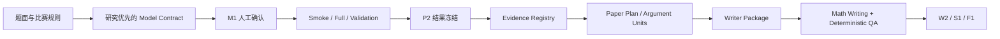
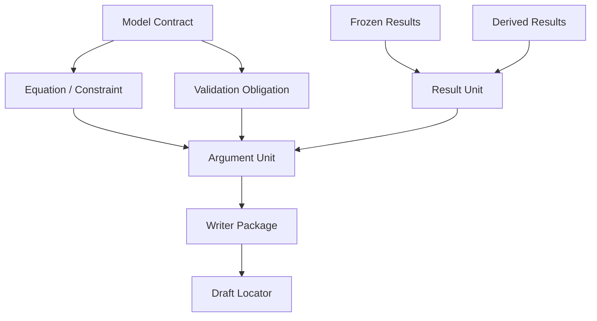

# 数学建模 Harness：实现状态与后续路线图

更新时间：2026-08-15

本文是本仓库的状态总表。它把“已经能运行的能力”和“已经排期但尚未完成的能力”分开记录，避免把设计目标、静态规则或原型误写成已交付功能。

## 先看结论

当前 Harness 已经能约束一条可审计的交付链：



但“自动检查通过”目前只代表合同、追溯、顺序和有限语义检查通过，不等于已经自动证明每个公式的代数等价性。高风险数学仍需独立 W2 复核；这条边界是设计的一部分，不是遗漏。

## 状态标记

| 标记 | 含义 |
|---|---|
| 已实现 | 当前仓库有脚本/Schema/测试支持，可以在项目目录中运行 |
| 本轮新增 | 2026-08-15 更新批次加入的能力，并有对应的负向回归测试 |
| 已排期 | 已确定接口或验收方向，但实现尚未完成，不能作为当前 Gate 的通过依据 |
| 人工边界 | 自动检查不能可靠替代，必须由队员或独立审阅者确认 |

## 已实现能力

| 能力 | 主要入口或合同 | 当前作用 |
|---|---|---|
| 当届规则、安全边界、AI 使用记录 | `check_contest_safety.py`、`run_manifest.json` | 区分官方规则与本地保守策略；记录 AI 使用和人工 checkpoint；持续包围整条流程 |
| Research-first 建模计划 | `check_modeling_plan.py`、`model_contract.schema.json` | M1 前记录题意、候选模型、文献/网络调研、假设分叉、参数来源、实现步骤、验证义务和失败模式 |
| typed parameter provenance | `model_contract.schema.json`、`check_modeling_plan.py` | 强制区分 GIVEN/DERIVED/ESTIMATED/CALIBRATED/ASSUMED/POLICY，并检查来源语义 |
| 题目作用域与事件一致性（本轮新增） | `scope_contract`、`check_scope_consistency.py`、`references/contracts/scope_contract.md` | 按小题绑定官方参数、单位、时间原点/坐标系和论文段落；可拒绝串题值、错事件和未绑定模型；默认仅在合同已声明 `scope_contract` 时检查，strict 档或显式 `--require-scope-contract` 才把缺失视为阻断；本地研发不强制哈希 |
| 结构化公式回放（本轮新增） | `equation_verification.numeric_replay`、`check_formula_replay.py`、`run_deterministic_qa.py` | 对声明的标量公式执行安全数值回代，使用每个案例自己的绝对/相对容差，并可检查正文结果锚点；默认 skip-if-absent（未声明回放案例即跳过），strict 档或显式 `--require-formula-replay` 才阻断；不冒充求解器重跑或全局最优证明 |
| 安全展示值与连续极值候选（本轮新增） | `check_presentation_safety.py`、`presentation_contract.schema.json`、`check_extremum_certificate.py` | 下界/上界强制方向舍入并复核展示值；网格结果必须与连续精化候选一致；仅在提供 presentation contract 时运行，strict 档要求该合同就绪并通过；自动检查明确拒绝自报“全局最优” |
| 真实验证与图表数据谱系（本轮新增） | `sensitivity_experiment.execution`、`check_sensitivity_experiment.py`、`paper_plan.data_lineage`、`check_consistency.py` | 可选正式模式要求每个敏感性网格点有命令/退出码/输入绑定/独立 receipt；正式数据图必须声明真实输入与输出，拒绝 synthetic/demo 生成命令 |
| 源码—PDF 数学一致性（本轮新增） | `scripts/pdf/check_math_pdf_consistency.py`、`run_deterministic_qa.py` | 提取最终 PDF 文本，复用作用域与公式锚点检查，并在源码更新时间晚于 PDF 时阻断；仅在传入 `--pdf/--pdf-source` 且启用 strict 档（`--require-pdf-math-consistency`）时执行；避免源码已修正但交付 PDF 仍是旧版本 |
| 有限数学语义检查 | `check_math_semantics.py` | 防守 CVaR 方向、风险身份、相关矩阵/PSD/Cholesky、概率域、单位与尺度漂移、过强最优性表述等高频错误 |
| Smoke/Full/独立验证/结果冻结 | `evaluate_obligations.py`、`freeze_results.py`、`frozen_results.schema.json` | 通过 `PASS/FAIL/ERROR` 和 `claimable` 区分可写入论文的结果与诊断性失败结果 |
| 派生结果不可手算 | `derive_results.py`、`derived_results.schema.json` | 百分比、差值、比值等二次指标由冻结结果编译，Writer 只引用 `derived_result_id` |
| OOS/敏感性/失败证据 | `check_oos_artifact.py`、`check_sensitivity_experiment.py`、`check_failure_evidence.py` | 对声明过的 OOS、敏感性和失败 run 要求对应语义 artifact；失败不伪装成通过 |
| Claim-Evidence-Result 追溯 | `paper_plan.json`、`evidence_registry.json`、`validate_contracts.py` | 论文 claim 必须绑定 verified evidence，结果必须来自 claimable 冻结 run |
| 论文首稿深度与覆盖 | `check_paper_readiness.py`、`draft_coverage`、`compile_writer_package.py` | 防止首稿只有结果没有模型、验证、边界和解释；Writer 只接收编译后的 package |
| Writer 数字和结论边界 | `check_writer_package.py` | 阻断未注册数字、无证据的强因果/解释性措辞和超出 inference strength 的结论 |
| 图表语义绑定 | `figure_references`、`check_consistency.py` | 图的语义类型、章节位置、claim/evidence 和正文引用形成闭环 |
| 真实模板使用与 PDF QA | `check_template_usage.py`、`safe_build.py`、`check_pdf.py` | 不把“模板文件在目录里”当成“用了模板”；检查实际入口、文档类、构建和渲染结果 |
| 完整用户模板适配 | `import_user_template.py`、`template_contract.json`、`template_usage.py` | 保留用户模板的 preamble、类/样式、字体、图件与文献资产，仅替换 demo 正文；新导入为 `draft`，保留资产 hash 漂移或 metadata/body 未实际加载都会阻断检查 |
| 本地探索不强制哈希 | `integrity_mode=dev/research/submission` | `dev/research` 允许登记路径和语义证据；`submission` 才强制最终引用哈希。哈希是提交完整性工具，不是每一步本地运行的目的 |
| 保守 Auto-EDA 与数据泄漏边界 | `scripts/eda/auto_eda.py`、`profile_generator.py`、`check_data_contract.py` | 目标列可显式传入；自动检查精确重复 target 和明显 future/lead 字段；无 split/time boundary 时保持 `not_run`，不能生成泄漏 `pass`；目录中任一数据文件失败时 CLI 返回非零 |
| 有界诊断/返修编排 | `scripts/reflexion/error_classifier.py`、`runner.py` | 区分代码错误、语义错配、验证失败和模型不可行；runner 默认诊断不改文件，只有显式 `repair_callback` 才能进入最多 N 轮返修，并保留阻塞原因 |
| Profile/模板身份绑定 | `profile_engine.py`、`competition_profiles/*.yaml`、`assets/templates/*/template_contract.json` | resolved profile 输出非空 `profile_id`，CUMCM/MCM 的 base template 名称与本地模板合同对齐；仍需 `check_template_usage.py` 证明源码实际加载模板 |
| M1 计划合理性最低门槛 | `check_modeling_plan.py --formal`、`check_gates.py` | `research/submission` Gate 对外部搜索的 evidence linkage、候选数、选型理由、风险处置和已声明的结构性 Equation Contract 做可重复检查；它是 L1 完整性/证据链检查，不冒充语义合理性证明 |
| Equation Contract/实现映射加固 | `check_derivation_integrity.py`、`check_implementation_map.py` | 空 verification、未完整满足操作前提、未知 source/terminal、缺推导边和未声明 equation_id 会阻断正式检查；代码引用还要能找到声明的 symbol |
| 拆题器只产候选、不替代 M1 | `scripts/ideation/problem_decomposer.py` | 输出 schema-compatible 的小写 `question_id`、独立展示 ID、带 checks 的 assumption fork 和 pending candidate seeds；不再自动选择解释 A |
| Enhanced W2 独立重算 | `scripts/qa/check_gates.py`、`run_deterministic_qa.py` | Gate 从 deterministic report 的声明输入重建临时 QA，不覆盖原报告；重算不为 `ok=true` 时阻断增强 W2 |
| Required Answer 覆盖与摘要事实回查（本轮新增） | `model_contract.questions[].required_answer`、`paper_plan.abstract_results[].fact_check`、`scripts/qa/presentation_semantics.py` | 可选把官方问题→答案要求→模型输出→冻结结果→摘要答案串起来；回查模型身份、数字、单位、比较、验证和边界；默认报告、显式 profile 才阻断 |
| 图表语义与最终尺寸审阅（本轮新增） | `paper_plan.figures[]`、`check_consistency.py`、`check_figure.py` | 记录 data shape、argument intent、sample regime、不确定性和候选图型；发现高风险语义误导并检查最终尺寸字段、DPI、可读性和裁切 |
| 软性论文完整性与评委速扫（本轮新增） | `check_paper_readiness.py`、`check_paper_style.py --judge-scan` | 输出 `RECOMMENDED/MISSING/NOT_APPLICABLE`，并以 issue-only 方式提醒摘要可发现性、模型身份、验证、图后主张和渲染页人工复核；不生成分数、不强制单独模型评价章节 |
| CUMCM 经验先验（本轮新增） | `references/writing/cumcm_empirical_style.md`、`abstract_guidelines.md`、`editorial_style.md` | 吸收逐问审阅、摘要二次回查、研究/呈现顺序分离和图表语义原则；不复制上游语料，不引入固定句式、图数、文献数或敏感性配额 |
| Editorial Semantics profile（本轮新增） | `run_manifest.editorial_semantics_profile`、`check_gates.py` | 默认 baseline；显式设为 `strict` 后，W2 独立重跑 Required Answer、Abstract Backcheck、Figure Semantics，并要求 writer package/数学写作覆盖 |
| NIPT Batch A–D 负例裁决（本轮新增） | `docs/NIPT_BATCH_A_D_ACCEPTANCE_2026-08-15.md`、`tests/test_nipt_batches_a_d.py` | T-NIPT-01～09、11～14 已映射到现有检查器并有精确负例；T-NIPT-10 明确留在 P1；这不等于 Batch E benchmark 已完成 |
| Record-count population semantics（本轮新增） | `frozen_results.result.metric_semantics`、`check_consistency.py` | 把 raw/valid/included/excluded record count 写入冻结结果语义，并阻断摘要或结论在句内改写计数口径 |
| Primary inference role consistency（本轮新增） | `check_consistency.py --require-inference-role-consistency`、`run_deterministic_qa.py`、strict math Gate | 当模型合同声明 mixed/GEE/cluster 等为 primary inference 时，阻断 Writer 把 OLS 写成主要推断或把合同主方法降为 sensitivity |

### 可编辑流程图/框架图工作流

`diagram_spec.schema.json`、`generate_drawio.py`、`check_diagram_spec.py` 和 `references/visualization/diagram_workflow.md` 已落地：总览图、任务流程图和模型框架图先声明节点、边、来源和唯一 message，再由受控布局生成 native `.drawio`，最后在 draw.io 中人工微调/导出。生成器已提供七套默认配色（可用 `--list-style-profiles` 查询），未知配色会显式失败而非静默回退。默认输出 SVG/PDF；需要兼容性时可显式使用保留源文件的高 DPI `raster_only`，不把 Mermaid、Python 成品或 AI 生成位图默认为正式论文图。

## 本轮新增：数学部分与写作逻辑

### 1. 数学引用合同

`paper_plan.argument_units[]` 现在可以显式绑定：

```text
model_ids
equation_ids
constraint_ids
validation_obligation_ids
result_ids / derived_result_ids
math_locators
```

绑定关系的方向是：



`scripts/qa/check_math_writing.py` 会检查：

- 公式、约束和验证义务是否存在，并且属于该论证单元声明的模型；
- 论证单元和结果是否属于同一个子问题；
- 结果是否来自 `claimable=true` 且验证通过的冻结结果；
- 派生结果是否来自已提供的派生结果 artifact；
- Writer package 是否篡改了 paper plan 中的数学引用；
- prerequisite 是否存在、是否有环、是否把“解释/推荐”放在结果或验证之前；
- 正式首稿是否能通过 `math_locators` 找到相应公式、约束和验证位置。

LaTeX 首稿推荐使用不影响正文显示的稳定标签，例如 `\label{eq:EQ-Q1-01}`、`\label{con:C-Q1-01}` 和 `\label{val:VAL-Q1-01}`，再把这些标签或稳定章节短语登记到 `math_locators`。

### 4. 绘图与写作借鉴边界

本轮核对 `yuanchen-home/cumcm-step-review` 后，保留其最有价值的机制：逐问“要求—方法—结果—验证—边界”审阅；摘要先起草、再事实回查；图先写 primary claim，再根据数据形态、论证意图和样本制度选型；最终按论文实际尺寸检查图。上游的固定候选数、固定图数、固定文献数、摘要模板和经验性模型映射没有进入 Harness 硬规则。

正式运行时可以显式追加：

```powershell
python scripts/qa/check_paper_style.py `
  --paper-plan paper_plan.json `
  --draft paper/main.tex `
  --abstract paper/abstract.txt `
  --conclusion paper/conclusion.txt `
  --model-contract model_contract.json `
  --frozen-results results/frozen_results.json `
  --judge-scan

python scripts/qa/check_consistency.py `
  --paper-plan paper_plan.json `
  --model-contract model_contract.json `
  --frozen-results results/frozen_results.json `
  --evidence-registry evidence_registry.json `
  --abstract paper/abstract.txt `
  --paper paper/main.tex `
  --conclusion paper/conclusion.txt `
  --require-answer-contract `
  --require-abstract-backcheck `
  --require-figure-semantics `
  --strict
```

这些选项是迁移后的显式增强，不会静默改变旧项目的默认通过条件。`judge_scan` 只输出问题和人工检查清单；自动检查也不声称已经证明公式代数正确或图表机理解释成立。

### 2. 推导图与 Equation Contract

`model_contract.plan_details` 已支持以下数学元数据：

- `equation_type`：definition、derivation、constraint、objective、approximation、reformulation、theorem_application 等；
- `math_risk`：low/medium/high；
- `inputs`、`outputs`、`symbols`、`domains`、`unit_signature`；
- `preconditions`、`transformation_rule`；
- `verification`：`PASS/FAIL/UNVERIFIED/NOT_APPLICABLE`；
- `derivation_graph.nodes/edges`：记录中间量和公式依赖关系。

`scripts/qa/check_derivation_integrity.py` 当前执行结构层检查：

- `UNDEFINED_SYMBOL`：公式符号没有登记；
- `UNDEFINED_INTERMEDIATE`：中间量没有来源；
- `BROKEN_DERIVATION_CHAIN`：断链、环或不可达节点；
- `UNUSED_MECHANISM/ORPHAN_EQUATION`：公式或机制没有进入目标终点；
- 常见 Cholesky、inverse、log、sqrt、CVaR 操作的前提元数据检查；
- 高风险公式缺少 preconditions 或 verification 状态时阻断正式模式。
- `verification: {}` 不再被视为有验证；中间量输出会进入符号命名空间，图节点输入还必须有对应的上游边。

### 3. W2 的自动与人工边界

增强完整性模式下，`run_deterministic_qa.py` 使用：

```powershell
python scripts/qa/run_deterministic_qa.py `
  --model-contract model_contract.json `
  --run-manifest run_manifest.json `
  --frozen-results results/frozen_results.json `
  --evidence-registry evidence_registry.json `
  --paper-plan paper_plan.json `
  --abstract paper/abstract.txt `
  --paper paper/main.tex `
  --conclusion paper/conclusion.txt `
  --writer-package reports/writer_package.json `
  --require-first-draft-coverage `
  --require-math-writing-coverage `
  --require-derivation-integrity `
  --output reports/deterministic_qa.json
```

增强 W2 还要求人工 checkpoint 明确完成：

```text
math_formula_correctness
equation_constraint_mapping
argument_logic_order
units_and_boundary_consistency
```

自动检查负责“能否追到、是否有环、是否按顺序、是否越过证据边界”；人工复核负责“公式代数是否真的正确、假设是否合理、模型是否贴合题意”。

## 已排期但尚未完成

以下项目已经采用推荐的 M0→M4 顺序，但仍不能在当前状态报告中写成“自动证明已完成”：

| 阶段 | 计划功能 | 验收条件 |
|---|---|---|
| M0 | 完整 Equation Contract、推导 DAG、统一 `PASS/FAIL/UNVERIFIED/NOT_APPLICABLE` receipt | 基础结构合同和 negative regression 已落地；仍缺通用代数/单位/索引执行器 |
| M1 | Symbol/domain/index/units 统一调度；轻量 operation-precondition registry | 加减量纲、索引边界、定义域、概率归一化、操作前提可执行检查；未验证不得冒充 PASS |
| M2 | SymPy 等价性、边界/退化测试、property/metamorphic tests、tiny-instance oracle | 线性化、CVaR、Big-M、状态转移、优化小实例可与精确 oracle 对照 |
| M3 | 自然语言↔数学语义双向检查、semantic role、method-specific correctness profile | 题面“不可分割/因果/上限”等语义与可行域、变量角色和结论边界一致 |
| M4 | LLM Semantic Critic 后置接入 | 仅在 deterministic checks 之后运行；只输出 PASS/FAIL/UNVERIFIED 和具体 issue，不负责单位、PSD、gap 或等价性 |
| 工程化 | 失败驱动回归库 | 每个真实错误抽象为通用 pattern，并至少配原始 case 与两个结构等价 synthetic case |
| 工程化 | 选择性重跑调度 | artifact DAG 能识别 stale 后，自动选择受影响节点重跑并重新计算 Gate |
| 比赛交付 | 官方 golden profile、正式模板基线、跨题型能力 benchmark | 有锁定来源、可复现运行、渲染 QA 和独立评测结果；不能以 demo 或静态报告替代 |

## 当前不承诺的能力

- 不承诺自动证明任意公式、定理或符号等价性；
- 不承诺 LLM Critic 的“数学评分”能代表正确率；
- 不把 solver 成功、代码可运行或“没有发现错误”解释为模型正确；
- 不把文献中使用过的公式自动视为本题适用；
- 不把模板文件存在、静态摘要或未完成中间 run 视为正式提交结果；
- 不要求本地探索每一步生成哈希，也不把哈希数量当数学可信度指标。

## 最终验收问题

当 M0–M4 完成后，Harness 必须能对每个高风险数学对象回答：

1. 公式从哪里来？
2. 它依赖哪些假设和前提？
3. 符号、定义域、索引和单位是否一致？
4. 它是否真正进入后续目标、约束或状态更新？
5. 极端退化时是否符合预期？
6. 是否尝试过反例或结构性反驳？
7. 小规模实例是否与精确解一致？
8. 代码是否实现同一数学语义？
9. 论文写作顺序是否是模型→结果→验证→解释→边界？
10. 结论强度是否不超过验证强度？

如果其中关键问题无法回答，该数学对象应保持 `UNVERIFIED`，而不是被 Writer 写成确定事实。
## Strict math correctness profile（2026-08-15 批次实现）

`run_manifest.math_correctness_profile` 支持 `baseline`（默认）与 `strict`。strict 为显式 opt-in 并已接入 `check_gates.py`：M1 要求 research-first scope contract；W1/W2 要求公式回放、数学写作追溯、展示值安全与源码—PDF 数学一致性，Gate 从 deterministic report 的声明输入独立重跑。本地常规检查不要求哈希；提交完整性仍由 `integrity_mode` 独立控制。strict 档有负例回归测试，旧 manifest 不视为已启用。迁移清单与 non-claims 的唯一权威描述见 [references/workflow/math_correctness_profile.md](../references/workflow/math_correctness_profile.md)。
