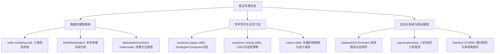
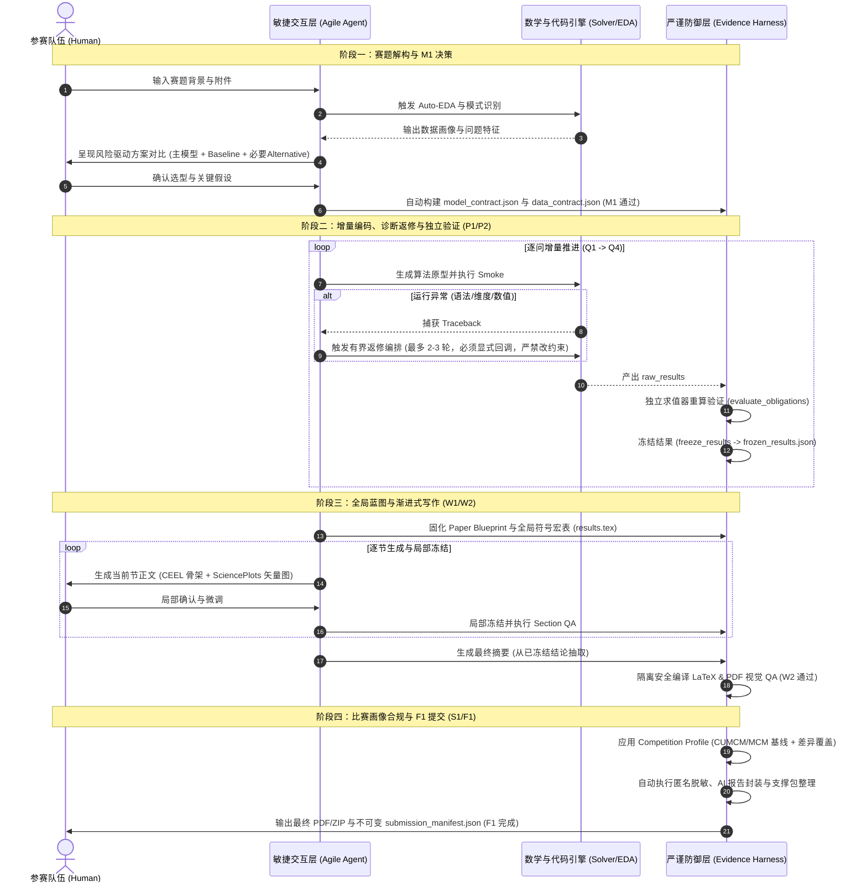
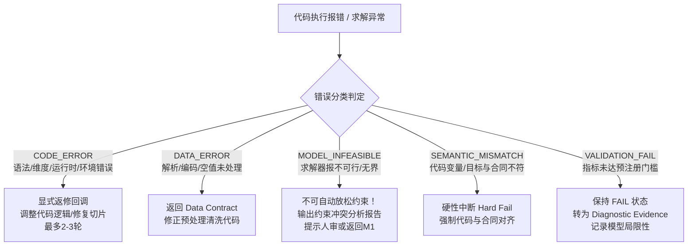
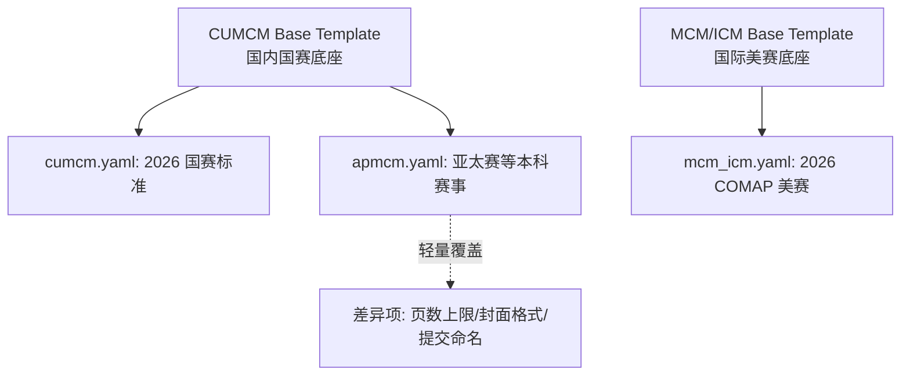
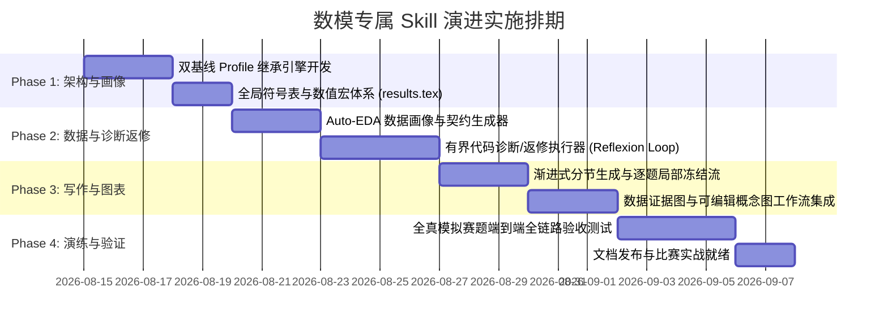

# 数学建模专属 Skill 深度诊断与演进建议书（全链接增强版）
**——融合 GitHub 竞赛智能体、学术写作与 Auto-Research 前沿经验的工程化升级蓝图**

> **更新时间**：2026-08-14  
> **目标项目**：[`math-modeling-skill-sion`](file:///d:/Projects/随便做做/math-modeling-skill-sion/) (Math Modeling Evidence Harness)  
> **入口文件**：[`SKILL.md`](file:///d:/Projects/随便做做/math-modeling-skill-sion/SKILL.md) | [`README.md`](file:///d:/Projects/随便做做/math-modeling-skill-sion/README.md)  
> **核心定位**：专为本科生参加的**全国大学生数学建模竞赛（CUMCM，国赛）**与**美国大学生数学建模竞赛（MCM/ICM，美赛）**量身打造的**高严谨、高敏捷、重合规的双模自适应数模助手**。

> **文档边界**：本文是演进方案与设计记录，不是功能已完成证明。当前已实现、已测试和仍排期的内容以 [`MATH_HARNESS_IMPLEMENTATION_STATUS.md`](file:///d:/Projects/随便做做/math-modeling-skill-sion/docs/MATH_HARNESS_IMPLEMENTATION_STATUS.md) 为准；尤其是 Auto-EDA 泄漏审计、Reflexion 返修、数学推导和论文逻辑检查都不能被本方案文字替代。

---

## 目录
1. [一、 当前现状诊断与深度剖析（Current State Audit）](#一-当前现状诊断与深度剖析)
2. [二、 GitHub 前沿生态横向对比与谱系借鉴（Comparative Benchmark）](#二-github-前沿生态横向对比与谱系借鉴)
3. [三、 分模块核心问题与演进设计方案（Modular Architecture & Design）](#三-分模块核心问题与演进设计方案)
   - [模块 1：系统架构与工作流（双模自适应）](#模块-1系统架构与工作流双模自适应架构)
   - [模块 2：赛题拆解与算法发现（风险驱动 M1）](#模块-2赛题拆解与算法发现风险驱动-m1)
   - [模块 3：数据探索、实验执行与诊断返修（有界 Auto-EDA & Reflexion）](#模块-3数据探索实验执行与诊断返修有界-auto-eda--reflexion)
   - [模块 4：论文规划、学术表达与排版（全局蓝图优先的渐进式写作）](#模块-4论文规划学术表达与排版全局蓝图优先的渐进式写作)
   - [模块 5：多赛事适配、合规审查与交付打包（双基线 Profile 引擎）](#模块-5多赛事适配合规审查与交付打包双基线-profile-引擎)
4. [四、 目录架构重构与配置规范（Directory Layout & Schemas）](#四-目录架构重构与配置规范)
5. [五、 实施演进路线图与文件索引（Implementation Roadmap & Index）](#五-实施演进路线图与文件索引)

---

## 一、 当前现状诊断与深度剖析

通过对本地仓库 [`math-modeling-skill-sion`](file:///d:/Projects/随便做做/math-modeling-skill-sion/) 全部代码、文档、Schema 和测试用例的深度审计，当前项目展现了在**证据追溯与学术合规领域极高的工程成熟度**，但也存在面向 72~96 小时极限实战时的短板。

### 1.1 当前项目的核心优势（必须保留的护城河）
1. **全链路证据闭环（Evidence-Driven Harness）**：
   - 针对传统大模型数模中常见的“伪造结果”、“占位符验证（`{"ok": true}`）”和“摘要数字与正文/代码不一致”建立了阻断规则；这些规则仍需在具体项目中运行并通过，不能仅凭 Harness 存在就宣称彻底消灭。
   - 实现了 `raw_data -> code -> frozen_results -> derived_results -> paper_claims` 的单向不可变数据流。
   - 核心支撑实现：[`freeze_results.py`](file:///d:/Projects/随便做做/math-modeling-skill-sion/scripts/freeze_results.py)、[`register_evidence.py`](file:///d:/Projects/随便做做/math-modeling-skill-sion/scripts/register_evidence.py)、[`evaluate_obligations.py`](file:///d:/Projects/随便做做/math-modeling-skill-sion/scripts/validation/evaluate_obligations.py)。
2. **严密的比赛安全防线（Contest Safety & AI Disclosure）**：
   - 严格区分官方规则快照与本地保守策略，防范队外求助、赛题公开泄露等高危行为。详见安全指南 [`contest_safety.md`](file:///d:/Projects/随便做做/math-modeling-skill-sion/references/safety/contest_safety.md)。
   - 按 `integrity_mode` 记录 AI 使用轨迹、交互目的和修改范围；最终提交需要完整绑定，普通本地探索不要求机械生成每一条 Prompt/中间产物哈希。
3. **真实的 LaTeX / PDF 视觉守门（Visual QA & Template Usage）**：
   - 杜绝“模板在目录里却未实际使用”的假象，具有隔离编译 [`safe_build.py`](file:///d:/Projects/随便做做/math-modeling-skill-sion/scripts/latex/safe_build.py)、数值宏自动注入 [`generate_values_tex.py`](file:///d:/Projects/随便做做/math-modeling-skill-sion/scripts/latex/generate_values_tex.py) 以及全页 PDF 渲染和视觉缺陷检测 [`check_pdf.py`](file:///d:/Projects/随便做做/math-modeling-skill-sion/scripts/pdf/check_pdf.py)。
4. **完整的实现状态总表与前期调研**：
   - 参见状态文档 [`MATH_HARNESS_IMPLEMENTATION_STATUS.md`](file:///d:/Projects/随便做做/math-modeling-skill-sion/docs/MATH_HARNESS_IMPLEMENTATION_STATUS.md) 与上游调研复核 [`UPSTREAM_STRENGTHS_REVIEW_2026-08-13.md`](file:///d:/Projects/随便做做/math-modeling-skill-sion/docs/UPSTREAM_STRENGTHS_REVIEW_2026-08-13.md)。

### 1.2 实战应用中的核心痛点与瓶颈
| 痛点维度 | 现状表现与代码位置 | 实战风险与危害 |
|---|---|---|
| **1. 认知负荷与工程僵化** | 强依赖 [`run_manifest.json`](file:///d:/Projects/随便做做/math-modeling-skill-sion/references/contracts/artifact_contracts.md) 等 10+ 个 JSON 配置文件，各 Gate 转换门槛极高，缺乏交互式自动补全。 | 在 72 小时限时竞赛中，选手与 Agent 极易陷入频繁的手写/调试 JSON 契约泥潭，严重挤占算法思考与调参时间。 |
| **2. 赛题拆解与启发式算法能力偏弱** | [`check_modeling_plan.py`](file:///d:/Projects/随便做做/math-modeling-skill-sion/scripts/qa/check_modeling_plan.py) 偏重静态校验，缺乏对赛题背景的自适应语义解构、数学问题族映射及经典算法脚手架推荐。 | 容易让选手“为了填契约而填契约”，面对全新题型时无法快速获得高质量的候选模型拓扑。 |
| **3. 代码实验缺乏诊断返修与自动化前置** | P1/P2 是“脚本触发型”，需要保守的数据画像（Auto-EDA）和带边界的调试反馈循环。 | 面对 CUMCM C 题或 MCM C 题等复杂数据时，数据预处理繁重；求解器报错或维度不匹配时若没有显式返修编排，不能把一次执行伪装成已自愈。 |
| **4. 论文生成易“空洞化”或“断层”** | 依赖一次性 [`compile_writer_package.py`](file:///d:/Projects/随便做做/math-modeling-skill-sion/scripts/claims/compile_writer_package.py)，若单次生成全文易导致推导断层；若分段生成又缺乏全局符号锁。 | 导致正文符号前后漂移（如 Q1 记为 $x_i$，Q2 变成 $w_k$）、摘要堆砌数字但无洞察、图表缺乏统一的自解释学术图注。 |
| **5. 多赛事配置繁冗** | 缺乏清晰的继承机制，针对每个比赛若复制一套独立模板和规则，维护成本陡增。参考 [`template_sources.json`](file:///d:/Projects/随便做做/math-modeling-skill-sion/vendor/template_sources.json)。 | 遇到不同年份或杯赛时需重复编写规则，无法高效复用 CUMCM/MCM 积累的排版与流程成果。 |

---

## 二、 GitHub 前沿生态横向对比与谱系借鉴

针对上述瓶颈，我们横向调研了 GitHub 上数模智能体、学术写作、自动科研（Auto-Research）领域的顶流开源项目，提取其核心闪光点与需扬弃的缺陷：



### 2.1 模块化横向对比矩阵

| 对标领域 / 代表仓库 | 链接 | 核心可借鉴特性（Take） | 明确扬弃与排除之处（Drop） |
|---|---|---|---|
| **数模专修智能体** | [XiaoMaColtAI/math-modeling-skill](https://github.com/XiaoMaColtAI/math-modeling-skill)<br>[jihe520/MathModelAgent](https://github.com/jihe520/MathModelAgent)<br>[datawhalechina/intro-mathmodel](https://github.com/datawhalechina/intro-mathmodel)<br>[zhanwen/MathModel](https://github.com/zhanwen/MathModel)<br>[Algorithms_MathModels](https://github.com/HuangCongQing/Algorithms_MathModels) | • 结构化分角色流水线（Modeler/Coder/Writer）<br>• 常见算法模块库（LP, MIP, ODE, PSO, GA, ARIMA, XGBoost）<br>• 交互式提问与思路对齐 | • 盲目追求“1小时全自动生成获奖论文”的虚假承诺<br>• 随意放松约束或占位符通过<br>• 缺少代码与结果的强哈希绑定 |
| **学术写作与论证系统** | [academic-paper-skills](https://github.com/lishix520/academic-paper-skills)<br>[academic-writing-skills](https://github.com/WenyuChiou/academic-writing-skills)<br>[academic-research-skills](https://github.com/Imbad0202/academic-research-skills) | • **Strategist + Composer** 架构：先全局大纲后正文<br>• **CEEL 结构**（Claim-Evidence-Explanation-Limitation）<br>• 全局概念/符号字典（防止跨章节术语漂移） | • 拆分 7~8 个写作 Sub-agent 导致的上下文膨胀与碎片化<br>• 过于繁复的 35 点审稿机制拖慢比赛节奏<br>• 纯修辞性润色改变数学含义 |
| **科研配图与设计系统** | [nature-skills](https://github.com/Yuan1z0825/nature-skills)<br>[SciencePlots](https://github.com/garrettj403/SciencePlots)<br>[CUMCMThesis](https://github.com/latexstudio/CUMCMThesis)<br>[mcmthesis](https://github.com/LiamHuang-0205/mcmthesis) | • **Claim-First 图表契约**：一图对应一核心结论（One Figure = One Message）<br>• 自解释图注规范与矢量 PDF 优先<br>• 标准配色与无衬线字体（SciencePlots 风格） | • 期刊级极端复杂的排版规范不适配限时竞赛<br>• 概念示意图冒充数据证据图 |
| **自动化科研探索** | [SakanaAI/AI-Scientist](https://github.com/SakanaAI/AI-Scientist)<br>[SakanaAI/AI-Scientist-v2](https://github.com/SakanaAI/AI-Scientist-v2)<br>[AgentLaboratory](https://github.com/SamuelSchmidgall/AgentLaboratory)<br>[Stanford STORM](https://github.com/stanford-oval/storm)<br>[microsoft/RD-Agent](https://github.com/microsoft/RD-Agent) | • 自动探索性数据画像（Auto-EDA Pipeline）<br>• 实验异常的**有界诊断/返修循环（Bounded Reflexion Loop）**<br>• 失败实验作为演化证据（Diagnostic Evidence）保留 | • 开放式无监督树状搜索（算力不可控且易脱离题意）<br>• 允许大模型自主修改优化目标和约束条件 |

---

## 三、 分模块核心问题与演进设计方案

结合用户在 `/grill-me` 中的决策意图，我们设计了**以「严谨 Harness 为底座、敏捷 Agent 为前端、双基线 Profile 为适配」的五大模块升级蓝图**。

---

### 模块 1：系统架构与工作流（双模自适应架构）

#### 核心设计：双层工作流分离
系统采用**「上层敏捷探索 Loop」+「底层严谨 Harness 守门」**的双层自适应架构：
- **上层（Agile Agent Layer）**：面向选手交互。提供自然语言引导、快速算法脚手架、一键 Auto-EDA、代码自动排错、渐进式分节拟稿。选手感知到的是极其流畅、响应敏捷的建模 Copilot。
- **底层（Strict Harness Guardrails）**：面向数据与规则真实性。在关键 Gate 节点自动生成与校验 JSON 契约、管理不可变数据流、执行确定性数学/代码/LaTeX QA，并在后台生成 F1 Manifest。



---

### 模块 2：赛题拆解与算法发现（风险驱动 M1）

#### 2.1 核心原则
- **拒绝盲目生成固定 2~3 套方案**：普通子问题采用「主模型 + 极简 Baseline（如规则启发式/简单统计）」，高风险或核心决胜问题引入一套有实质差异的「Alternative 模型」，若物理/几何机理明确则采用「单模型 + 机理推导」。参考：[`model_planning.md`](file:///d:/Projects/随便做做/math-modeling-skill-sion/references/research/model_planning.md)。
- **Precedent Cards 查漏机制**：仅在初步问题解构完成后检索历史优秀论文机制卡 [`references/cards/`](file:///d:/Projects/随便做做/math-modeling-skill-sion/references/cards/)，用于发现遗漏的约束、典型验证方法或常见陷阱，**严禁以往届论文直接决定选型**（参见 [`precedent_policy.md`](file:///d:/Projects/随便做做/math-modeling-skill-sion/references/research/precedent_policy.md)）。
- **Socratic 歧义分支（Assumption Forks）**：仅在题意存在二义性、参数语义缺失且会颠覆后续建模时触发向选手的提问，不作为每题冗长的固定对话。
- **契约自动生成**：通过校验工具 [`check_modeling_plan.py`](file:///d:/Projects/随便做做/math-modeling-skill-sion/scripts/qa/check_modeling_plan.py) 和语义检查 [`check_math_semantics.py`](file:///d:/Projects/随便做做/math-modeling-skill-sion/scripts/qa/check_math_semantics.py) 确保公式符号与参数来源完备。

#### 2.2 建模问题族模式库（Pattern Catalog）
在 Agent 内部注入六大标准数模问题族知识（可参考 [intro-mathmodel](https://github.com/datawhalechina/intro-mathmodel) 与 [Algorithms_MathModels](https://github.com/HuangCongQing/Algorithms_MathModels)）：
1. **机理与物理系统**：微分方程（ODE/PDE）、动力学系统、传热/流体、守恒定律。
2. **运筹与决策优化**：LP/MILP、非线性规划（NLP）、多目标优化（Pareto/NSGA-II）、鲁棒优化、动态规划。
3. **统计与数据驱动**：时序预测（ARIMA/Prophet/LSTM）、回归/分类（GLM/XGBoost/LightGBM）、聚类与降维（PCA/t-SNE/UMAP）。
4. **图论与网络系统**：最短路/网络流、复杂网络度量、匹配问题、旅行商（TSP/VRP）。
5. **评估与决策分析**：TOPSIS、层次分析法（AHP）、熵权法、模糊综合评价、数据包络分析（DEA）。
6. **随机与仿真系统**：蒙特卡洛模拟、排队论、元胞自动机、马尔可夫链（MCMC）。

---

### 模块 3：数据探索、实验执行与诊断返修（有界 Auto-EDA & Reflexion）

#### 3.1 自动化前置 Auto-EDA（先于正式编码执行）
自动对赛题数据执行全面体检，生成结构化数据契约：
- **基础元数据**：行数列数、各列字段类型（Numerical/Categorical/Datetime/Text）、内存占用。
- **质量体检**：缺失值比例、异常值检测（IQR/3-Sigma）、重复记录数、主外键/唯一性约束。
- **分布与时序特征**：偏度、峰度、多峰分布、时间跨度、采样频率连续性、趋势/季节性自相关。
- **数据泄漏与安全检查**：特征与目标之间的未来信息泄漏预警、样本量是否支撑高复杂度模型。
- **输出**：生成机器可读的 `data_contract.json`，由 [`check_data_contract.py`](file:///d:/Projects/随便做做/math-modeling-skill-sion/scripts/qa/check_data_contract.py) 校验。

#### 3.2 有界代码诊断/返修引擎（Bounded Reflexion Loop）
建立严格的**分级错误诊断体系**。当前 Runner 默认只诊断；只有上层显式提供返修回调才进入最多 2~3 轮返修，绝不静默放宽数学口径：



#### 3.3 独立 Validator 架构
- **求解与验证彻底解耦**：优化器或模型代码自身输出的 `{"status": "optimal"}` 不能作为论文事实。
- **独立验证重算**：由独立验证脚本 [`evaluate_obligations.py`](file:///d:/Projects/随便做做/math-modeling-skill-sion/scripts/validation/evaluate_obligations.py) 从 raw output 重新计算：
  1. 实际约束残差（是否违背物理/业务约束）；
  2. 真实目标函数值与基准线对比（提升百分比由 [`derive_results.py`](file:///d:/Projects/随便做做/math-modeling-skill-sion/scripts/derive_results.py) 重算）；
  3. 样本外泛化指标（OOS Metrics）与稳定性指标（参见 [`check_oos_artifact.py`](file:///d:/Projects/随便做做/math-modeling-skill-sion/scripts/qa/check_oos_artifact.py) 与 [`check_sensitivity_experiment.py`](file:///d:/Projects/随便做做/math-modeling-skill-sion/scripts/qa/check_sensitivity_experiment.py)）；
  4. 求解器收敛 gap 与灵敏度波动区间。
- **保留失败实验**：失败 run 经由 [`check_failure_evidence.py`](file:///d:/Projects/随便做做/math-modeling-skill-sion/scripts/qa/check_failure_evidence.py) 固化为诊断证据，留存模型演化轨迹。

---

### 模块 4：论文规划、学术表达与排版（全局蓝图优先的渐进式写作）

#### 4.1 全局蓝图与统一符号/指标注册表（Pre-writing Blueprint）
在撰写正文前，必须先在 `paper_plan.json` 中固化全局蓝图，并生成全局符号/指标宏表：
1. **全局论文蓝图**：各子问题核心主张（Claim）、重点详略分配（Normal vs. Deep）、图表支撑关系、摘要核心结论预选。参见指南：[`paper_plan.md`](file:///d:/Projects/随便做做/math-modeling-skill-sion/references/contracts/paper_plan.md)。
2. **全局符号/身份约束**：
   - 在 `model_contract.plan_details`、`paper_plan.argument_units` 和生成的数值宏中固化全篇数学符号定义（如 $i \in \mathcal{I}$ 表示设备集合，统一全局使用，严禁后续章节私自变更）；
   - 固化模型官方名称（如统一为 `Q2-CVaR-MILP`，禁止混用“条件风险价值模型”与“CVaR规划”）；
   - 固化所有输出数值宏（由 [`generate_values_tex.py`](file:///d:/Projects/随便做做/math-modeling-skill-sion/scripts/latex/generate_values_tex.py) 注入 `paper/generated/results.tex`），正文与摘要统一引用宏，彻底杜绝手算漂移。

#### 4.2 渐进式分节生成与逐题局部冻结（Progressive Drafting）
- 推进顺序：`Q1 建模求解与写作 -> 局部 QA -> 冻结 Q1 -> Q2 推进 -> ... -> 全局一致性 QA -> 最终摘要生成`。
- **CEEL 论证骨架（自然叙述呈现，借鉴 [academic-writing-skills](https://github.com/WenyuChiou/academic-writing-skills)）**：
  - **Claim（主张）**：明确模型效果或发现（例如：在峰值负荷下，系统综合调度成本降低 4.44%）；
  - **Evidence（证据）**：绑定已冻结的基准模型与优化模型数值回执及图表（见图 4-2）；
  - **Explanation（机理机理解释）**：从数学机理阐明原因（得益于储能削峰填谷与区域容量动态分配）；
  - **Limitation（边界与局限）**：明确指出成立的前提与潜在风险（受限于电池循环寿命衰减与极端天气边界）。
- **数学推导完整性守门**：由 [`check_derivation_integrity.py`](file:///d:/Projects/随便做做/math-modeling-skill-sion/scripts/qa/check_derivation_integrity.py) 和 [`check_math_writing.py`](file:///d:/Projects/随便做做/math-modeling-skill-sion/scripts/qa/check_math_writing.py) 检查公式依赖 DAG 与正文定位。

#### 4.3 竞赛级科研配图规范（One Figure = One Message）

总览图、关键任务图和模型框架图单独采用可编辑矢量工作流：先生成 `diagram_spec.json`（节点、边、来源、布局、唯一 message），再用 draw.io/Figma/PowerPoint 等工具排版，默认导出 SVG/PDF。Mermaid 和 Python 仍可用于内部说明或数据证据图，但不作为这些概念图的最终排版后端。若目标模板确实只接受位图，可以选择 `raster_only + raster_text`，但必须保留可编辑源、声明至少 300 DPI（建议 600 DPI），并通过最终尺寸视觉审查。
- **核心原则**：3 秒看懂、无冗余花哨装饰、坐标轴与量纲极其明确、基准线清晰。参考：[`figure_contract.md`](file:///d:/Projects/随便做做/math-modeling-skill-sion/references/contracts/figure_contract.md) 与 [`plot_recipes.md`](file:///d:/Projects/随便做做/math-modeling-skill-sion/references/visualization/plot_recipes.md)。
- **严格区分两大图型（借鉴 [nature-skills](https://github.com/Yuan1z0825/nature-skills) 与 [SciencePlots](https://github.com/garrettj403/SciencePlots)）**：
  - **数据证据图（Data Evidence Figures）**：必须由已冻结数据通过 Python 脚本（SciencePlots 风格、无衬线字体、矢量 PDF）确定性生成，配自解释完整图注。
  - **机理概念图（Concept Figures）**：仅用于展示流程架构、物理受力拓扑或算法逻辑流，禁止将概念示意图伪装为数据结果。

#### 4.4 分层轻量审稿（Two-Layer Critic）
- **第一层：确定性 QA（Deterministic QA）**：由 [`run_deterministic_qa.py`](file:///d:/Projects/随便做做/math-modeling-skill-sion/scripts/qa/run_deterministic_qa.py) 毫秒级检查数字、单位、符号冲突、交叉引用与文献索引。
- **第二层：单一语义审稿人（Single Semantic Critic）**：依据 [`semantic_critic_rubric.md`](file:///d:/Projects/随便做做/math-modeling-skill-sion/references/review/semantic_critic_rubric.md) 检查逻辑断层、结论过度外推、未注册因果词汇、AI 模板化套话。
- **摘要最后写**：依据 [`abstract_guidelines.md`](file:///d:/Projects/随便做做/math-modeling-skill-sion/references/writing/abstract_guidelines.md) 仅从最终冻结结论中提炼方法、2~4 个核心指标与核心权衡。

---

### 模块 5：多赛事适配、合规审查与交付打包（双基线 Profile 引擎）

#### 5.1 架构设计：两套黄金基线 + Profile 差异覆盖
不为每个国内/国际赛事开发独立模板，而是沉淀两套经过严格编译与打印验证的黄金基线：
1. **`cumcm` 基线**：适配国内赛事（规范中文排版、宋体/Times字体、编号页、支撑材料规范，参考 [CUMCMThesis](https://github.com/latexstudio/CUMCMThesis)）。
2. **`mcm_icm` 基线**：适配国际赛事（全英文标准版式、Summary Sheet 首页面板、25页严格上限、AI Report 附录规范，参考 [mcmthesis](https://github.com/LiamHuang-0205/mcmthesis)）。



#### 5.2 本科生双核心比赛画像引擎规范
在 `competition_profiles/` 目录下，仅需维护极简、清晰的配置体系：
- **`cumcm.yaml`（国赛标准）**：中文排版、匿名编号页、20~25页主体、AI 使用声明放在支撑材料压缩包内或正文指定位置、代码与附件严格整理；
- **`mcm_icm.yaml`（美赛标准）**：全英文标准版式、Summary Sheet 首页面板、25页严格上限、文末附加不计页数的 AI Report、全匿名无学校/个人信息。

差异化覆盖示例（如参加亚太杯等本科生第三方杯赛）：
```yaml
# competition_profiles/apmcm.yaml
inherits: cumcm
competition_name: "亚太地区大学生数学建模竞赛 (APMCM)"

overrides:
  page_limit: 25
  language: "en"
  cover_page_style: "apmcm_cover"
  anonymous_mode: true
  ai_disclosure:
    policy: "required_when_used"
    location: "in_paper_section"
  submission_format:
    paper_filename: "Team_{team_id}.pdf"
```

#### 5.3 S1/F1 自动化合规打包流水线
1. **规则 Freshness 强制自检**：检查官方规则快照时间戳，杜绝沿用往届旧规则。
2. **源码与 PDF 深度脱敏**：由 [`check_submission.py`](file:///d:/Projects/随便做做/math-modeling-skill-sion/scripts/qa/check_submission.py) 自动扫描并抹除队号、姓名、学校、文件元数据（Author、Creator 等）。
3. **AI 使用透明度汇总**：从 `run_manifest.ai_usage[]` 自动编译生成规范的 AI 使用报告（附于美赛文末或打包进国赛支撑包）。
4. **F1 不可变 Manifest**：由 [`freeze_submission.py`](file:///d:/Projects/随便做做/math-modeling-skill-sion/scripts/freeze_submission.py) 固化最终 PDF/ZIP 的 SHA-256、生效 Profile 版本与提交时间戳，输出防篡改清单；后续可随时通过 [`check_submission_manifest.py`](file:///d:/Projects/随便做做/math-modeling-skill-sion/scripts/qa/check_submission_manifest.py) 复验。详见：[`submission_freeze.md`](file:///d:/Projects/随便做做/math-modeling-skill-sion/references/submission/submission_freeze.md)。

---

## 四、 目录架构重构与配置规范

为了清晰支撑上述模块升级，重构后的规范文件与目录链接结构如下：

```text
math-modeling-skill-sion/
├── SKILL.md                         # [Skill 入口与双模调度器](file:///d:/Projects/随便做做/math-modeling-skill-sion/SKILL.md)
├── README.md                        # [核心文档与快速上手](file:///d:/Projects/随便做做/math-modeling-skill-sion/README.md)
├── agents/                          # UI 元数据与 Agent 角色定义
├── competition_profiles/            # [新增] 本科生比赛画像引擎 (继承与差异覆盖)
│   ├── _base_cumcm.yaml             # 国赛通用基线规则
│   ├── _base_mcm_icm.yaml           # 美赛通用基线规则
│   ├── cumcm.yaml                   # 2026 CUMCM 国赛专属配置
│   └── mcm_icm.yaml                 # 2026 MCM/ICM 美赛专属配置
├── assets/templates/                # 经隔离验证的本地 LaTeX 源码
│   ├── cumcm-2026-electronic/       # 国赛社区类与清洗骨架
│   │   ├── main.tex
│   │   └── template_contract.json
│   └── mcm-icm-2026/                # 美赛社区类与清洗骨架
│       ├── main.tex
│       └── template_contract.json
├── schemas/                         # [契约与回执 JSON Schemas](file:///d:/Projects/随便做做/math-modeling-skill-sion/schemas/)
│   ├── model_contract.schema.json
│   ├── data_contract.schema.json    # [新增] 数据体检画像契约
│   ├── paper_plan.schema.json        # 论文蓝图、论证单元和数学引用契约
│   ├── model_contract.schema.json    # 符号、公式与推导图元数据
│   ├── frozen_results.schema.json
│   └── submission_manifest.schema.json
├── scripts/
│   ├── eda/                         # [新增] 自动化数据探索模块
│   │   ├── auto_eda.py              # 结构化数据画像与泄漏扫描
│   │   └── profile_generator.py     # 导出 data_contract.json
│   ├── reflexion/                   # 有界代码诊断/返修编排模块
│   │   ├── runner.py                # 增量执行器与 Traceback 捕获
│   │   └── error_classifier.py      # 5类错误诊断与修复边界控制
│   ├── scaffold/                    # [新增] 经典数模算法模块库
│   │   ├── opt_milp.py              # 混合整数线性规划脚手架
│   │   ├── ode_system.py            # 微分方程数值求解脚手架
│   │   └── metaheuristics.py        # 遗传/粒子群算法脚手架
│   ├── validation/                  # [独立验证求值器](file:///d:/Projects/随便做做/math-modeling-skill-sion/scripts/validation/evaluate_obligations.py)
│   ├── claims/                      # [符号宏生成与 Writer Package 编译](file:///d:/Projects/随便做做/math-modeling-skill-sion/scripts/claims/)
│   ├── latex/                       # [安全编译与数值宏注入](file:///d:/Projects/随便做做/math-modeling-skill-sion/scripts/latex/safe_build.py)
│   ├── figures/                     # [SciencePlots 规范制图与矢量导出](file:///d:/Projects/随便做做/math-modeling-skill-sion/scripts/figures/)
│   ├── pdf/                         # [全页 PDF 渲染与视觉 QA](file:///d:/Projects/随便做做/math-modeling-skill-sion/scripts/pdf/check_pdf.py)
│   └── qa/                          # [确定性 QA、符号一致性与 Gate 检查器](file:///d:/Projects/随便做做/math-modeling-skill-sion/scripts/qa/)
├── references/                      # [核心规约、机制库与写作指南](file:///d:/Projects/随便做做/math-modeling-skill-sion/references/)
│   ├── cards/                       # 历史优秀论文机制卡与方法/失败卡
│   ├── safety/                      # [比赛安全、网络与 AI 披露政策](file:///d:/Projects/随便做做/math-modeling-skill-sion/references/safety/contest_safety.md)
│   ├── validation/                  # [题型触发的验证义务与测试规范](file:///d:/Projects/随便做做/math-modeling-skill-sion/references/validation/validation_obligations.md)
│   └── writing/                     # [CEEL 论证规范与自解释图注指南](file:///d:/Projects/随便做做/math-modeling-skill-sion/references/writing/)
└── tests/                           # [全量回归测试套件](file:///d:/Projects/随便做做/math-modeling-skill-sion/tests/test_p0_harness.py)
```

---

## 五、 实施演进路线图与文件索引



### 关键文件导航索引
- **核心文档**：
  - [`SKILL.md`](file:///d:/Projects/随便做做/math-modeling-skill-sion/SKILL.md)：Skill 主控与工作流协议
  - [`README.md`](file:///d:/Projects/随便做做/math-modeling-skill-sion/README.md)：架构说明与快速开始
  - [`MATH_HARNESS_IMPLEMENTATION_STATUS.md`](file:///d:/Projects/随便做做/math-modeling-skill-sion/docs/MATH_HARNESS_IMPLEMENTATION_STATUS.md)：实现状态表与 M0–M4 规划
  - [`UPSTREAM_STRENGTHS_REVIEW_2026-08-13.md`](file:///d:/Projects/随便做做/math-modeling-skill-sion/docs/UPSTREAM_STRENGTHS_REVIEW_2026-08-13.md)：开源项目取长补短复核报告
- **核心脚本**：
  - [`check_modeling_plan.py`](file:///d:/Projects/随便做做/math-modeling-skill-sion/scripts/qa/check_modeling_plan.py)：M1 建模计划与文献检查
  - [`freeze_results.py`](file:///d:/Projects/随便做做/math-modeling-skill-sion/scripts/freeze_results.py)：P2 结果冻结与上游快照
  - [`evaluate_obligations.py`](file:///d:/Projects/随便做做/math-modeling-skill-sion/scripts/validation/evaluate_obligations.py)：独立验证求值器
  - [`generate_values_tex.py`](file:///d:/Projects/随便做做/math-modeling-skill-sion/scripts/latex/generate_values_tex.py)：数值宏代码生成器
  - [`safe_build.py`](file:///d:/Projects/随便做做/math-modeling-skill-sion/scripts/latex/safe_build.py)：隔离环境安全 LaTeX 编译
  - [`check_pdf.py`](file:///d:/Projects/随便做做/math-modeling-skill-sion/scripts/pdf/check_pdf.py)：PDF 全页渲染与视觉 QA
  - [`freeze_submission.py`](file:///d:/Projects/随便做做/math-modeling-skill-sion/scripts/freeze_submission.py)：F1 不可变提交封包

---

## 结论与行动建议

本轮升级已经把 Auto-EDA 的保守泄漏边界、M1 结构性合理性门槛、数学推导/实现映射检查、模板身份一致性和诊断式 Reflexion 的基础接口落入仓库；分节写作质量、代数/单位/索引证明、模型语义合理性和全真比赛 benchmark 仍需按状态文档逐项验收，不能把路线图当作“自动获奖”承诺。
