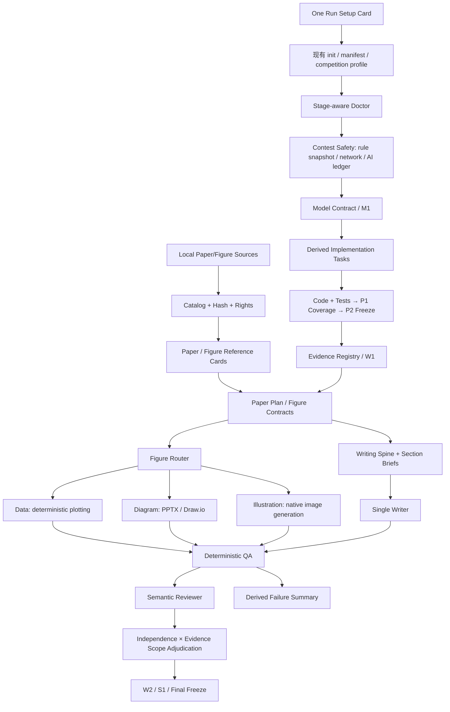

# Harness Integration Analysis: MetaMath and OSS Convergence

> **结论先行：** MetaMath Harness 不适合被整体并入当前项目。当前 Harness 的 Gate、冻结、Evidence Registry 和数学合同已经较强，真正影响实战体验的是三个“最后一公里”断点：`paper_plan` 没有投影成章节级写作任务；`illustration → image_generation` 只有路由标签，没有让 Agent 主动调用原生生图的执行协议；模型合同虽详细，却没有稳定投影成编码任务，而且 enhanced M1 还错误地要求“已验证的实现映射”。P0 应先补 **Writing Orchestration、Illustration Execution、Model-to-Code Handoff**，再建设小规模论文/图形 Reference。不要增加 Writer/Coder 子 Agent、固定图数或复制上游资产。

## 1. 审计范围

- 上游仓库：[`LKQ667/metamath-harness`](https://github.com/LKQ667/metamath-harness)
- 固定审计版本：[`1eb7a702ee6814cf73856544700fa8b48acd4218`](https://github.com/LKQ667/metamath-harness/tree/1eb7a702ee6814cf73856544700fa8b48acd4218)
- 初始审计日期：2026-08-27；收敛复审：2026-08-28
- 实际检查：Skill/reference 文本、卡片与插件代码、Gate 脚本、预检、E2E、优秀论文目录及一篇 CUMCM 论文的摘要/建模/公式/附录页面、一张科研架构图实例；另逐文件对照 Nature Writing/Polishing/Figure、AutoResearch、research-writing-skill、academic-paper-strategist/composer、agent-research-skills、MathModelAgent 和 XiaoMaColtAI 数模 Skill 的写作、绘图、建模与编码流程。
- 初始审计记录：`harness doctor --offline` 通过；完整 `unittest` 为 **462/462 通过**。该结果是原审计时点的证据，本轮未用它替代未来实现后的回归测试。本轮复审只修改本文档，不改实现、Schema 或其他文档。

重点上游证据包括：卡片的 [schema](https://github.com/LKQ667/metamath-harness/blob/1eb7a702ee6814cf73856544700fa8b48acd4218/plugins/dsh-mathmodel/src/cards/schema.js)、[registry](https://github.com/LKQ667/metamath-harness/blob/1eb7a702ee6814cf73856544700fa8b48acd4218/plugins/dsh-mathmodel/src/cards/registry.js) 与 [prompt renderer](https://github.com/LKQ667/metamath-harness/blob/1eb7a702ee6814cf73856544700fa8b48acd4218/plugins/dsh-mathmodel/src/cards/prompt.js)，科研审计的 [observability levels](https://github.com/LKQ667/metamath-harness/blob/1eb7a702ee6814cf73856544700fa8b48acd4218/.dsh/skills/anti-autoresearch/references/observability-levels.md) 与 [forensics contract](https://github.com/LKQ667/metamath-harness/blob/1eb7a702ee6814cf73856544700fa8b48acd4218/.dsh/skills/anti-autoresearch/references/integrity-forensics-contract.md)，优秀论文的 [隔离策略](https://github.com/LKQ667/metamath-harness/blob/1eb7a702ee6814cf73856544700fa8b48acd4218/.dsh/skills/_shared/references/excellent-paper-policy.md) 与 [选择脚本](https://github.com/LKQ667/metamath-harness/blob/1eb7a702ee6814cf73856544700fa8b48acd4218/.dsh/skills/_shared/scripts/discover_excellent_papers.py)，以及 [阶段 Gate runner](https://github.com/LKQ667/metamath-harness/blob/1eb7a702ee6814cf73856544700fa8b48acd4218/.dsh/skills/math-paper-cn/scripts/checks/run_stage_gate.py)、[运行时预检](https://github.com/LKQ667/metamath-harness/blob/1eb7a702ee6814cf73856544700fa8b48acd4218/plugins/dsh-mathmodel/src/preflight.js) 和 [真实论文 E2E](https://github.com/LKQ667/metamath-harness/blob/1eb7a702ee6814cf73856544700fa8b48acd4218/plugins/dsh-mathmodel/scripts/run-paper-e2e.py)。

写作对照证据包括 Nature Writing 的 [article architecture](https://github.com/Yuan1z0825/nature-skills/blob/205ed18839181b0fe67323c7e42077a0807d8b03/skills/nature-writing/references/article-architecture.md)、[paragraph flow](https://github.com/Yuan1z0825/nature-skills/blob/205ed18839181b0fe67323c7e42077a0807d8b03/skills/nature-writing/references/paragraph-flow.md)、[main-text discipline](https://github.com/Yuan1z0825/nature-skills/blob/205ed18839181b0fe67323c7e42077a0807d8b03/skills/nature-shared/core/main-text-discipline.md) 与 [Results claim escalation](https://github.com/Yuan1z0825/nature-skills/blob/205ed18839181b0fe67323c7e42077a0807d8b03/skills/nature-shared/core/nature-results-discussion.md)，research-writing-skill 的 [editorial principles](https://github.com/zLanqing/codex-claude-academic-skills/blob/7ed6377f0efb6a38951b48ef03b19d996e454b1f/research-writing-skill/references/paper-writing/author_profile/editorial_principles.md)，academic-paper-composer 的 [chapter workflow](https://github.com/lishix520/academic-paper-skills/blob/main/composer/SKILL.md)，以及 agent-research-skills 的 [targeted revision](https://github.com/lingzhi227/agent-research-skills/blob/9e6c085d65e313e475e921fdfe795ac11eb7589e/skills/paper-revision/SKILL.md)。

绘图与建模对照证据包括 Nature Figure 的 [router](https://github.com/Yuan1z0825/nature-skills/blob/205ed18839181b0fe67323c7e42077a0807d8b03/skills/nature-figure/SKILL.md)、[manifest](https://github.com/Yuan1z0825/nature-skills/blob/205ed18839181b0fe67323c7e42077a0807d8b03/skills/nature-figure/manifest.yaml)、[AI graphical-abstract workflow](https://github.com/Yuan1z0825/nature-skills/blob/205ed18839181b0fe67323c7e42077a0807d8b03/skills/nature-figure/references/ai-graphical-abstract-workflow.md) 与 [image-generation route](https://github.com/Yuan1z0825/nature-skills/blob/205ed18839181b0fe67323c7e42077a0807d8b03/skills/nature-figure/references/openrouter-image-generation.md)，XiaoMaColtAI 的 [建模手](https://github.com/XiaoMaColtAI/math-modeling-skill/blob/30832f62f1c681aa2ac77b26ee063f0564e43b23/references/roles/%E5%BB%BA%E6%A8%A1%E6%89%8B/SKILL.md) 与 [编程手](https://github.com/XiaoMaColtAI/math-modeling-skill/blob/30832f62f1c681aa2ac77b26ee063f0564e43b23/references/roles/%E7%BC%96%E7%A8%8B%E6%89%8B/SKILL.md)，以及 MathModelAgent 的 [workflow](https://github.com/jihe520/MathModelAgent/blob/83d8783187a2d29dda1b046cb667009cc50c8203/backend/app/core/workflow.py)、[modeler prompt](https://github.com/jihe520/MathModelAgent/blob/83d8783187a2d29dda1b046cb667009cc50c8203/backend/app/core/prompts/modeler.py)、[coder prompt](https://github.com/jihe520/MathModelAgent/blob/83d8783187a2d29dda1b046cb667009cc50c8203/backend/app/core/prompts/coder.py) 和 [analysis-modeling Skill](https://github.com/jihe520/MathModelAgent/blob/83d8783187a2d29dda1b046cb667009cc50c8203/skills/2analysis-modeling/SKILL.md)。

### 1.1 逐仓库审计闭环

下表把原要求中的全部来源收敛到同一判断口径。“当前对照”以本仓库实际 contract、Gate 和 reference 为准；“时机”表示是否值得在下一次比赛前实现，而不是上游机制本身的成熟度。

| 来源 | 最值得借的 1–3 个机制与具体文件 | 当前对照 | 建议与冲突 | 层 | 成本 | 收益 | 时机 |
|---|---|---|---|---|---|---|---|
| [XiaoMaColtAI/math-modeling-skill](https://github.com/XiaoMaColtAI/math-modeling-skill/tree/30832f62f1c681aa2ac77b26ee063f0564e43b23) | [建模手](https://github.com/XiaoMaColtAI/math-modeling-skill/blob/30832f62f1c681aa2ac77b26ee063f0564e43b23/references/roles/%E5%BB%BA%E6%A8%A1%E6%89%8B/SKILL.md) 的选模交付；[编程工作流](https://github.com/XiaoMaColtAI/math-modeling-skill/blob/30832f62f1c681aa2ac77b26ee063f0564e43b23/references/roles/%E7%BC%96%E7%A8%8B%E6%89%8B/references/%E5%B7%A5%E4%BD%9C%E6%B5%81%E7%A8%8B.md) 的最小纵向切片与失败回退 | 已有 [`model_contract`](../references/contracts/model_contract.md)、M1/P1/P2，但 P1 只有命令成功事实，缺合同覆盖 | **增强，不替换**：生成 Implementation Task View 并校验 smoke coverage。拒绝固定图数、固定误差阈值和角色 Agent 化 | Workflow / handoff | 中 | 高 | P0 |
| [jihe520/MathModelAgent](https://github.com/jihe520/MathModelAgent/tree/83d8783187a2d29dda1b046cb667009cc50c8203) | [analysis-modeling Skill](https://github.com/jihe520/MathModelAgent/blob/83d8783187a2d29dda1b046cb667009cc50c8203/skills/2analysis-modeling/SKILL.md) 的代码任务清单；[workflow](https://github.com/jihe520/MathModelAgent/blob/83d8783187a2d29dda1b046cb667009cc50c8203/backend/app/core/workflow.py) 的真实执行/结果回传 | receipt、冻结和数学合同更强，缺的是从合同到 Coder 的窄 handoff | **增强**投影视图；不复制宽泛重试、模板化 EDA、字符串 JSON 或新的 interpreter Agent | Workflow / Artifact projection | 中 | 高 | P0 |
| [sweetcornna/mathodology](https://github.com/sweetcornna/mathodology) | [`mathodology-award-gates/SKILL.md`](https://github.com/sweetcornna/mathodology/blob/main/.claude/skills/mathodology-award-gates/SKILL.md) 的稳定 finding ID、阻断等级、修订预算和结构化 handoff | [`revision_policy.md`](../references/review/revision_policy.md) 与当前 review report 已有 stable ID、freshness、bounded revision | **保留并小幅增强** evidence scope；拒绝固定三席 Blind Judge、分数阈值和九阶段外壳，避免与 W2 双重裁决 | Reviewer / QA | 低中 | 高 | P1；核心已在 |
| [Yuan1z0825/nature-skills](https://github.com/Yuan1z0825/nature-skills/tree/205ed18839181b0fe67323c7e42077a0807d8b03) | [`nature-figure/SKILL.md`](https://github.com/Yuan1z0825/nature-skills/blob/205ed18839181b0fe67323c7e42077a0807d8b03/skills/nature-figure/SKILL.md) 的 claim-first 路由/渲染 QA；[`nature-polishing/SKILL.md`](https://github.com/Yuan1z0825/nature-skills/blob/205ed18839181b0fe67323c7e42077a0807d8b03/skills/nature-polishing/SKILL.md) 的动态加载；[paragraph flow](https://github.com/Yuan1z0825/nature-skills/blob/205ed18839181b0fe67323c7e42077a0807d8b03/skills/nature-writing/references/paragraph-flow.md) 的反向提纲 | Figure Contract 和写作规则已有，缺主动 illustration 执行与 section-scoped Writing Spine | **增强**单 Writer 与 Figure authoring；不借 Nature 文体、固定图型或独立章节 Agent | Micro-Skill / Writer / Figure | 中 | 高 | P0 |
| [lingzhi227/agent-research-skills](https://github.com/lingzhi227/agent-research-skills/tree/9e6c085d65e313e475e921fdfe795ac11eb7589e) | [`backward-traceability`](https://github.com/lingzhi227/agent-research-skills/blob/9e6c085d65e313e475e921fdfe795ac11eb7589e/skills/backward-traceability/SKILL.md) 的数字反查；[`citation-management`](https://github.com/lingzhi227/agent-research-skills/blob/9e6c085d65e313e475e921fdfe795ac11eb7589e/skills/citation-management/SKILL.md) 的采集/校验/去重；[`experiment-design`](https://github.com/lingzhi227/agent-research-skills/blob/9e6c085d65e313e475e921fdfe795ac11eb7589e/skills/experiment-design/SKILL.md) 的分阶段实验义务；[`paper-revision`](https://github.com/lingzhi227/agent-research-skills/blob/9e6c085d65e313e475e921fdfe795ac11eb7589e/skills/paper-revision/SKILL.md) 的定向修订 | Artifact DAG、Evidence Registry、三态引文与 validation profiles 已覆盖主干；section revision packet 尚弱 | **原位增强** locator、publication-status/retraction 和 revision packet。不要再建第二套 traceability DB，不把源码锚点暴露到论文正文，也不复制 [`self-review`](https://github.com/lingzhi227/agent-research-skills/blob/9e6c085d65e313e475e921fdfe795ac11eb7589e/skills/self-review/SKILL.md) 的三 persona | Artifact / QA / Reference | 中 | 高 | P1；题型验证已在 |
| [lishix520/academic-paper-skills](https://github.com/lishix520/academic-paper-skills) | [`strategist/SKILL.md`](https://github.com/lishix520/academic-paper-skills/blob/main/strategist/SKILL.md) 的论文蓝图、章节职责和前后章承诺；[`composer/SKILL.md`](https://github.com/lishix520/academic-paper-skills/blob/main/composer/SKILL.md) 的章节级写作工作流 | [`paper_plan.md`](../references/contracts/paper_plan.md) 已有中心论点/argument unit，但未编译为 Writer 的实际执行顺序 | **增强**为 Writing Spine；不复制评分体系、字数配额或额外 Strategy Gate，W1 就是 Paper Strategy Gate | Workflow / Writer | 低中 | 高 | P0 |
| [zLanqing/codex-claude-academic-skills](https://github.com/zLanqing/codex-claude-academic-skills) | [`research-writing-skill/SKILL.md`](https://github.com/zLanqing/codex-claude-academic-skills/blob/main/research-writing-skill/SKILL.md) 的先论证后成文、结果—解释—边界和结构优先修订；[editorial principles](https://github.com/zLanqing/codex-claude-academic-skills/blob/7ed6377f0efb6a38951b48ef03b19d996e454b1f/research-writing-skill/references/paper-writing/author_profile/editorial_principles.md) 的段落功能 | [`narrative_patterns.md`](../references/writing/narrative_patterns.md) 部分已有；当前执行未保证摘要最后写、段落功能不外泄 | **增强**为按需 micro-reference；内部标签只用于 QA，交付正文不得出现 `ANCHOR-*`、`LOC-*` 等机器标记 | Micro-Skill / Writing QA | 低 | 高 | P0 |
| [LKQ667/metamath-harness](https://github.com/LKQ667/metamath-harness/tree/1eb7a702ee6814cf73856544700fa8b48acd4218) | [typed cards](https://github.com/LKQ667/metamath-harness/blob/1eb7a702ee6814cf73856544700fa8b48acd4218/plugins/dsh-mathmodel/src/cards/schema.js)、[preflight](https://github.com/LKQ667/metamath-harness/blob/1eb7a702ee6814cf73856544700fa8b48acd4218/plugins/dsh-mathmodel/src/preflight.js)、[observability](https://github.com/LKQ667/metamath-harness/blob/1eb7a702ee6814cf73856544700fa8b48acd4218/.dsh/skills/anti-autoresearch/references/observability-levels.md)、论文隔离与真实 E2E | DSH、doctor、quarantine、review independence、分段测试均已有局部能力 | **增强**一个 setup card、阶段感知 doctor、evidence scope 与黑盒 E2E；不复制 runtime、资产库、固定配额和 stage 外壳 | Integration / QA | 中 | 高 | P1；P0 仅 Reference 种子 |

## 2. 当前项目已有优势

| 能力 | 当前状态 | 判断 |
|---|---|---|
| Contest Safety | 已有 competition profile、规则快照、联网/外部写入边界、AI usage ledger 与最终提交检查 | 保留为最上层策略，不与建模 Gate 混合 |
| Workflow/Gate | 已有 M1、P1、P2、W1、W2、S1、F1，包含新鲜度、receipt、freeze | 不替换为上游 `step0–step5` |
| Artifact truth | 已有 frozen results、Evidence Registry、Claim-Evidence Map、submission freeze | 不再新增平行真源 |
| Modeling contract | 已有候选比较、参数来源、推导图、数学语义和验证义务 | 保留；修正向编码阶段的投影与 Gate 时序 |
| Figure Contract | 已按 claim、evidence、data shape、argument intent 和最终尺寸设计 | 比上游固定图数/偏好图型更可靠 |
| Figure routing | 已区分 data、diagram、illustration | 分类可用，但 illustration 尚未接通 Agent 原生生图执行 |
| Reviewer 独立性 | 已区分同上下文、fresh context、异模型与人工审核 | 保留；另补“看到了什么证据”轴 |
| DSH 集成 | 已有状态、证据、checkpoint、freeze 等原生面板/MCP 能力 | 缺的是一次运行如何被结构化启动，而非更多工具 |
| 往届论文政策 | 已有 quarantine、合法来源、哈希、pattern card 原则 | 规则已具备，但两个赛事索引仍为空，机制未运营起来 |

## 3. 值得吸收的机制与取舍

| 优先级 | 上游机制 | 当前是否已有 | 建议 | 放置位置 | 成本 | 收益 |
|---|---|---|---|---|---|---|
| P0 | [整篇 argument chain、section job 与反向提纲](https://github.com/Yuan1z0825/nature-skills/blob/205ed18839181b0fe67323c7e42077a0807d8b03/skills/nature-writing/references/paragraph-flow.md) | 有 plan/argument units，但没有实际 section 投影 | **增强**：把现有 IR 编译成 section-scoped Writer Brief 与全篇 Writing Spine | Writing / Authoring | 中 | 高 |
| P0 | [按 paper type→section→paragraph→sentence 动态加载](https://github.com/Yuan1z0825/nature-skills/blob/205ed18839181b0fe67323c7e42077a0807d8b03/skills/nature-polishing/SKILL.md) | 只有通用 editorial/narrative references | **增强**：按 section role 与 problem family 加载 micro-guidelines | Micro-Skill / Writer | 低中 | 高 |
| P0 | [结果分配、最短证据链、段落必要性和重复控制](https://github.com/Yuan1z0825/nature-skills/blob/205ed18839181b0fe67323c7e42077a0807d8b03/skills/nature-shared/core/main-text-discipline.md) | 有 depth priority 和 Appendix Strategy，但没有可执行分配/压缩回查 | **新增派生视图与语义审查**，不新增事实 artifact | Writing / Review | 中 | 高 |
| P0 | [AI schematic 独立路由、策略检查、生成记录与人工科学复核](https://github.com/Yuan1z0825/nature-skills/blob/205ed18839181b0fe67323c7e42077a0807d8b03/skills/nature-figure/SKILL.md) | 已能判定 illustration，但不会主动执行原生生图 | **增强**：增加 Agent-facing 自动调用协议、能力状态、请求记录、AI ledger 与回收 QA | Figure / Integration | 中 | 高 |
| P0 | [可交给代码阶段的任务清单](https://github.com/jihe520/MathModelAgent/blob/83d8783187a2d29dda1b046cb667009cc50c8203/skills/2analysis-modeling/SKILL.md) | `model_contract` 有实现步骤，CLI 未投影成逐模型编码任务 | **增强**：从现有合同生成 implementation task view，不建新真源 | Modeling / Coding | 中 | 高 |
| P0 | [每个驱动全量运行的模型族先过最小纵向切片](https://github.com/XiaoMaColtAI/math-modeling-skill/blob/30832f62f1c681aa2ac77b26ee063f0564e43b23/references/roles/%E7%BC%96%E7%A8%8B%E6%89%8B/references/%E5%B7%A5%E4%BD%9C%E6%B5%81%E7%A8%8B.md) | P1 只要求“恰好一个成功 smoke command”，没有覆盖语义 | **增强**：一次命令可以，必须报告覆盖的 model/question/contract items | P1 / Validation | 中 | 高 |
| P0 | [优秀论文 catalog、筛选、哈希验证、全文隔离](https://github.com/LKQ667/metamath-harness/blob/1eb7a702ee6814cf73856544700fa8b48acd4218/.dsh/skills/_shared/scripts/discover_excellent_papers.py) | 有政策和空索引，无可用语料 | **增强**：实现小规模、可追溯的论文与图形 Reference 管线 | Reference / Authoring | 中 | 高 |
| P1 | [Reviewer observability：PDF-only、source、artifacts、rerunnable](https://github.com/LKQ667/metamath-harness/blob/1eb7a702ee6814cf73856544700fa8b48acd4218/.dsh/skills/anti-autoresearch/references/observability-levels.md) | 只有 Reviewer 独立性等级 | **新增独立维度**，限制 finding 可达到的严重度和结论强度 | Reviewer / QA | 中 | 高 |
| P1 | [只读 preflight 的 available/degraded/missing、来源、版本、修复建议](https://github.com/LKQ667/metamath-harness/blob/1eb7a702ee6814cf73856544700fa8b48acd4218/plugins/dsh-mathmodel/src/preflight.js) | 两套 doctor 能力分散 | **合并增强**，形成阶段敏感 capability report | Safety / Workflow | 中 | 高 |
| P1 | [typed Skill card、严格字段、默认值校验、draft-only](https://github.com/LKQ667/metamath-harness/blob/1eb7a702ee6814cf73856544700fa8b48acd4218/plugins/dsh-mathmodel/test/cards.test.mjs) | DSH 工具丰富，但缺运行入口卡 | **新增一张 setup card**，编译到现有 manifest/profile | DSH UX | 中 | 中高 |
| P1 | [单阶段全部失败汇总 `failures_summary`](https://github.com/LKQ667/metamath-harness/blob/1eb7a702ee6814cf73856544700fa8b48acd4218/.dsh/skills/math-paper-cn/scripts/checks/run_stage_gate.py) | 有 first blocker/next action | **新增派生视图**，不成为新 contract | Workflow / QA | 低 | 中 |
| P1 | [Draw.io→LaTeX→PDF→render 的黑盒 E2E](https://github.com/LKQ667/metamath-harness/blob/1eb7a702ee6814cf73856544700fa8b48acd4218/plugins/dsh-mathmodel/scripts/run-paper-e2e.py) | 单元/E2E 多使用 stub 或分段验证 | **新增环境标记的交付验收** | Release QA | 中高 | 高 |
| P1 | [日志/错误中的凭据脱敏](https://github.com/LKQ667/metamath-harness/blob/1eb7a702ee6814cf73856544700fa8b48acd4218/plugins/dsh-mathmodel/src/security/redact.js) | 当前未见统一 redaction 边界 | 在接入网络/付费 provider 前加入 | Safety / Integration | 低 | 中 |
| P1 | [Concern→section→action→recheck 的 targeted revision](https://github.com/lingzhi227/agent-research-skills/blob/9e6c085d65e313e475e921fdfe795ac11eb7589e/skills/paper-revision/SKILL.md) | 有 bounded revision 规则，但无 section 级修订包 | **增强**：将 finding 编译成受限 revision packet | Review / Writing | 中 | 中高 |
| P2 | [pinned portable runtime](https://github.com/LKQ667/metamath-harness/blob/1eb7a702ee6814cf73856544700fa8b48acd4218/portable/runtime-manifest.json) 与 [实际调用验收](https://github.com/LKQ667/metamath-harness/blob/1eb7a702ee6814cf73856544700fa8b48acd4218/portable/test/Runtime-Acceptance.ps1) | 暂无统一 runtime lock | 先做 lock；大体积 portable bundle 后置 | Distribution | 高 | 中 |

### 3.1 最大论文质量缺口：Reference 层“有政策、无运行”

当前 [`precedent_policy.md`](../references/research/precedent_policy.md) 和 [`pattern-cards/schema.md`](../references/precedents/pattern-cards/schema.md) 已经规定了正确边界，但 `cumcm/index.json` 与 `mcm-icm/index.json` 都还是空数组，机制卡也只有少量通用条目。结果是 Writer 虽然不会乱抄，却也无法稳定调用高质量的摘要组织、逐问论证、验证深度和图表表达模式。

上游最值得借用的不是它附带的几十篇 PDF，而是 `catalog → 过滤 → 哈希校验 → 最多选少量同类论文 → 抽取机制` 的流程。实查的一篇 CUMCM 论文显示，值得提炼的是：

- 摘要按子问题写清“方法—结果”，关键结果可快速定位；
- 每个子问题形成“分析—模型—求解—验证”的局部闭环；
- 模型评价、改进和适用范围在结果后集中收束。

同时必须把反模式写进卡片：问题分析与建模章节重复、解释超出证据、固定章节骨架、超长代码附录。优秀论文不是无缺陷的金标准。

### 3.2 最大图形质量缺口：缺少 Figure Reference Card

当前 [`figure_contract.md`](../references/contracts/figure_contract.md) 和 [`figure_design.md`](../references/visualization/figure_design.md) 已经解决“为什么画、用什么证据、如何 QA”，但缺少一个可检索的**视觉表达经验库**。上游的 [chart selection](https://github.com/LKQ667/metamath-harness/blob/1eb7a702ee6814cf73856544700fa8b48acd4218/.dsh/skills/math-paper-cn/references/py-chart-selection.md) 与 [template registry](https://github.com/LKQ667/metamath-harness/blob/1eb7a702ee6814cf73856544700fa8b48acd4218/.dsh/skills/math-paper-cn/scripts/plotting/template_registry.py) 提供了“任务语义→图型家族”的思路；科研架构图实例则可提炼主次层级、稳定颜色语义、重复模块、局部放大和信息流方向。

应借的是布局与编码语法，不是上游的“默认 15 图”、禁止柱图、强制考虑 3D 或所谓“Top 1 期刊风格”。图型仍由 Figure Contract 的 evidence role、data shape 和 comparison 决定，图数仍由证据覆盖决定。

### 3.3 最大 Reviewer 真值缺口：独立性不等于可观察性

当前 `review_report` 能表达 Reviewer 是否来自 fresh context、异模型或人工，但 Reviewer 即使足够独立，也可能只看到 PDF，没有源码、结果 artifact 或可重跑环境。上游在这里给出了最有价值的机制：每条 finding 同时声明“现有证据范围”和“结论所需证据范围”；证据不足时只能报告差异或待核查项，不能升级为高严重度事实判断。

为避免与现有 L0–L3 独立性等级冲突，建议新增命名轴：

```text
review_independence = same_context | fresh_context | different_model | human
evidence_scope      = paper_only | paper_source | result_artifacts | rerunnable
```

`finding.required_evidence_scope > report.available_evidence_scope` 时，确定性 adjudicator 应降级、标为 `requires_external_check` 或阻止其作为 Gate 阻断项；它不能靠 Critic 自己“更有信心”来补足证据。

### 3.4 写作为什么“不如预期”：合同丰富，交接贫弱

当前写作规则本身并不弱。[`paper_plan`](../references/contracts/paper_plan.md) 已有中心论点、章节角色、argument unit、前置依赖、预期读者判断、边界与深度优先级；[`narrative_patterns`](../references/writing/narrative_patterns.md) 也覆盖问题框定、模型阐释、结果解释、跨问衔接与模型评价。问题出在执行面：

- [`harness paper write`](../scripts/harness.py) 只调用 `ensure_section()`，创建空白 `brief.md`、`draft.md`、`review.md`；它不要求 W1-ready writer package，也不把当前章节的论证单元投影进去。
- [`authoring_context()`](../scripts/human_surface.py) 会加载完整 `paper_plan`、`model_contract` 和 raw `frozen_results`，却不优先加载已经受控的 writer package。这让 Writer 再次临场拼装事实与逻辑，削弱了 truth boundary。
- [`compile_writer_package.py`](../scripts/claims/compile_writer_package.py) 输出 claim、result、argument unit 和通用 writing pattern，但遗漏 `requirements`、章节顺序/职责、figure/table、terminology 与 canonical recommendation。它有“砖”，没有“施工顺序”。
- `select_writer_patterns()` 只按 rhetorical role 选择通用卡片，没有生成章节内的 unit 顺序、段落功能、前后衔接和读者离场判断。

Nature Writing 最值得借的不是 Nature 文风，而是“整篇论证链 → 章节任务 → 段落反向提纲 → 句子”的加载顺序；其 [main-text discipline](https://github.com/Yuan1z0825/nature-skills/blob/205ed18839181b0fe67323c7e42077a0807d8b03/skills/nature-shared/core/main-text-discipline.md) 还要求每项结果按论证功能分配到正文、图注或补充材料，并对新增段落执行必要性/重复检查。AutoResearch 那种“固定章节模板 + 每节复用同一 evidence digest”的做法只强化溯源，不能解决整篇逻辑，不能照搬。

推荐增加一个**派生的 Writing Orchestration 层**：

```text
paper_plan + writer_package
        ↓
WRITING_SPINE.md（可再生视图，不是真源）
        ↓
section-scoped Writer Brief
        ↓
section draft
        ↓
reverse outline / claim-location / repetition sweep
        ↓
bounded revision packet
```

`harness paper write <section>` 在 formal 模式下应只给 Writer 当前章节所需的：有序 argument units、对应 claims/evidence/results、必用公式和图表、已建立的上文事实、术语、`must_not_claim`、本节读完后的判断、下一节 handoff。writer package 可扩充现有字段；不要为每节新增 canonical JSON。`WRITING_SPINE.md` 和 section brief 都放 `.harness/views/`，绝不覆盖作者 Markdown。

写作顺序可以与阅读顺序分离：先写决定性结果与验证，再补模型阐释和跨问综合，最后写引言、结论与摘要；摘要仍必须最后从 Evidence Registry 投影。建议按 `section_role + problem_family + competition_profile + revision_mode` 动态加载少量 micro-guidelines，而不是增加 Abstract/Results/Conclusion Agent。

### 3.5 可视化为什么每次都要提醒：有 route，没有 capability contract

当前 [`tool_router.py`](../scripts/figures/tool_router.py) 已能把 `physical mechanism`、`system concept`、`scenario illustration`、`energy flow concept` 分类为 `illustration`，并返回 `default_tool=image_generation`；[`figure_contract.md`](../references/contracts/figure_contract.md) 也规定了 prompt、DPI、AI usage、人工复核和“不得承载数值结论”。这说明设计意图已经存在。

但 Agent 不会主动生图有四个直接原因：

1. 根 [`SKILL.md`](../SKILL.md) 的 description 没有“科研示意图、生图、机制图、场景图、图形摘要”等触发语义。
2. 正文只说 illustration “走 Figure Contract”，没有命令式声明“若当前环境提供原生生图且 profile 允许，就直接调用，不等待用户再次提醒”。
3. [`harness figure`](../scripts/harness.py) 只返回字符串 `image_generation`；CLI 仅能 stage PPTX，没有生成请求、能力状态或生成结果回收步骤。
4. [`FIGURE_BRIEF_TEMPLATE`](../scripts/human_surface.py) 的 Output 仍默认“editable PPTX”，与 illustration route 冲突，也没有生产模式、负面约束和 AI 审计字段。

Nature Figure 的 [router](https://github.com/Yuan1z0825/nature-skills/blob/205ed18839181b0fe67323c7e42077a0807d8b03/skills/nature-figure/SKILL.md) 把 AI schematic 放在 Python/R 之前独立路由，并明确加载生成脚本、策略检查、人工科学复核和 provenance。它仍要求用户“explicitly asks”，这点不符合本项目需求；本项目应由**已批准的 Figure Contract**触发，而不是反复依赖自然语言提醒。

推荐执行契约：

```text
Figure Contract
  ├─ data         → deterministic plotting
  ├─ diagram      → PPTX / Draw.io
  └─ illustration → native image generation（available + allowed）
                         ↓
                 prompt/parameters record
                         ↓
                 generated draft + AI ledger
                         ↓
                 scientific/visual/final-size review
```

关键规则应直接写进 Skill：**完成的 Figure Contract 被判为 `illustration`，当前 Agent 暴露原生生图能力，且 competition profile 允许时，主动调用生图工具，不等待单独提醒。** 不自动生成 data figure、公式/中文/数值密集图、合同不完整的可选装饰图，或规则禁止的 live-contest 图。原生工具不可用时输出 `available | missing | forbidden_by_profile` 的事实状态与可执行 prompt，不得假装已经生成。

仓库脚本不应硬编码某一家图片 API。正确边界是：Harness 生成 provider-neutral 的 `image_generation_request` 派生记录；Agent 负责调用当前环境原生工具；Harness 再接收输出路径、哈希、prompt record、AI usage 和 review status。行为测试至少覆盖“illustration 自动调用”“data 永不调用”“公式密集结构图走 editable backend”“profile 禁止时阻断”“缺 prompt/AI ledger/review 不得晋升正式图”。

### 3.6 建模与编码：数学合同强，但阶段投影和 Gate 时序有缺口

当前建模底座明显强于所审上游。与 MathModelAgent 的模型名称决策树、单层字符串 JSON 相比，[`model_contract`](../references/contracts/model_contract.md) 已覆盖候选比较、假设分叉、typed parameter provenance、equation plan、derivation graph、单位、模型身份、objective semantics、failure modes 和题型触发的 validation obligations；[`implementation_map.schema.json`](../schemas/implementation_map.schema.json) 还能把公式绑定到代码符号、哈希和测试。这些不应替换。

需要修正的是三个运行问题：

1. **enhanced M1 存在阶段倒置。** [`check_gates.py`](../scripts/qa/check_gates.py) 在 `enhanced_integrity_profile=true` 的 M1 要求 `implementation_map.status=verified`，而该 schema 又强制每条公式已有 code refs、通过的 tests 和哈希；但 [`harness solve --compile`](../scripts/harness.py) 明明从编码后的 `03_SOLUTION_REPORT.md` 生成它。M1 不可能合法证明尚未发生的编码事实。M1 只应检查 `model_contract.plan_details`；verified implementation map 应在 P1/P2 检查。
2. **合同没有变成编码任务。** `harness context --stage solve` 只是列出模型合同、空白 solution report 和验证规则，没有按 model/question 投影入口、输入、输出、公式、参数、失败模式、测试 oracle 与 smoke acceptance。Coder 仍要自行拆解一份很大的合同。
3. **P1 只验证一个成功命令，不验证覆盖。** 一条总入口 smoke 命令可以保留，但其输出应声明覆盖了哪些 `model_id`、`question_id`、关键 equation/constraint 和 data boundary。否则一个不相关的成功脚本也可能满足数量条件。

XiaoMaColtAI 的 [编程工作流](https://github.com/XiaoMaColtAI/math-modeling-skill/blob/30832f62f1c681aa2ac77b26ee063f0564e43b23/references/roles/%E7%BC%96%E7%A8%8B%E6%89%8B/references/%E5%B7%A5%E4%BD%9C%E6%B5%81%E7%A8%8B.md) 值得借“纵向切片先行、模型不可实现时携最小复现回退建模”的机制，但它的固定图数、固定数值阈值和自动降级模型不能借。MathModelAgent 值得借“建模报告末尾给代码任务清单”和真实 interpreter 循环，但其 [coder prompt](https://github.com/jihe520/MathModelAgent/blob/83d8783187a2d29dda1b046cb667009cc50c8203/backend/app/core/prompts/coder.py) 中“不检查文件存在”、模板化 EDA 和宽泛重试属于反模式。

推荐增加一个可再生的 **Implementation Task View**：

```text
ready model_contract
      ↓ project by model/question
implementation task
  - contract item / equation / constraint IDs
  - typed inputs and outputs
  - solver/algorithm and scale assumptions
  - code entrypoint and module boundary
  - oracle/metamorphic/feasibility tests
  - smoke acceptance and failure return route
      ↓
code + tests → smoke coverage → full run → verified implementation_map
```

它不是新 artifact truth；来源仍是 model contract，生成到 `.harness/views/IMPLEMENTATION_TASKS.md` 或运行时 JSON。Coder 不得在任务视图里改数学定义；实际报错若暴露公式、约束、参数或数据边界错误，携最小复现回到 M1，新 model contract 会使下游映射失效。

### 3.7 Gate、Artifact 与 Reviewer 的收敛裁决

#### Gate 不合并，但不再增加

M1、P1、P2、W1、W2 分别证明“模型可编码”“最小链可运行”“正式结果可主张”“论文论证已规划”“成稿与审查通过”，事实对象不同，强行合并会让失败无法准确回退。应保留五个 Gate，但作三项收口：

- 修正 enhanced M1 的时序倒置；`implementation_map=verified` 只在 P1/P2 出现。
- W1 同时承担 Paper Strategy Gate，不新增独立 Gate；Writing Spine 是 W1 的派生视图。
- Abstract Gate 不单列：在 W2 确定性 QA 中强制摘要关键数字来自 Evidence Registry，并与正文、结论、图表执行同一 consistency sweep。
- S1/F1 只负责赛事交付与最终冻结，不重复 W2 的语义审稿。

#### Artifact 分三类，不为每个动作建文件

当前最大风险不是核心 contract 太多，而是把派生提示、状态页和审查摘要误当成新真源。新增机制必须先回答“修改它是否能合法改变事实”；不能的就只能是 view/report。核心清单见 4.2，禁止新增平行 Claim-Evidence Map、per-section JSON、第二套 citation registry 或 reviewer 总账。

#### Reviewer 只保留三个不重叠职责

| 层 | 只负责 | 不负责 |
|---|---|---|
| Deterministic QA | Schema、哈希、数字/单位/术语漂移、图表引用、页数、匿名性、编译与 freshness | 判断论证是否有说服力、预测奖项 |
| Semantic Critic | 模型假设、证据边界、主张强度、跨章节逻辑、遗漏反例；输出稳定 finding ID | 修改作者文件、伪造确定性 PASS、重复格式检查 |
| Judge lens | 站在阅卷人视角检查摘要可扫描性、贡献辨识度、结果呈现和致命短板 | 重新做 Critic 的逐项正确性审计、固定打分门槛 |

普通比赛运行一轮 Critic 即可；research 增加 Judge lens；只有 submission 才要求至少一次 fresh-context（L1+）审查。三名 Blind Judge 只在冲奖终稿、时间充足且三席确有不同信息需求时作为可选压力测试，不进入 W2 的常规必需条件。修订沿用 [`revision_policy.md`](../references/review/revision_policy.md)：按 stable ID 定向修改，论文变化后旧 review 立即 stale；blocker/high 未严格减少就停止循环并交还人工，而不是无限重写。

## 4. 推荐的 Reference 子系统

```text
合法/授权来源
    ↓ 登记 source URL、权利状态、赛事、年份、题号、奖项、SHA-256
本地原文隔离区（不入 Git，不进入 evidence_registry）
    ↓ 赛前人工抽取并复核
Paper Pattern Card ─────────────┐
Figure Reference Card ─────────┤
                               ↓ 按 problem family / evidence role 检索
Problem Analysis → Paper Plan / Figure Contract → Writer / Figure Authoring
```

建议保留现有目录，不移动既有内容，只增加图形卡与来源登记能力：

```text
references/precedents/
├── cumcm/index.json
├── mcm-icm/index.json
├── pattern-cards/          # 论文机制卡，已存在
├── figure-cards/           # 新增：图形表达机制卡
└── local-sources/          # 本地原文/图片；整体忽略，不提交
```

论文索引至少增加或落实：`source_url`、`official_or_authorized`、`rights_status`、`award`、`local_path`、`sha256`、`extraction_status`。Figure Reference Card 建议包含：

- `figure_pattern_id`、`source_id`、`rights_status`；
- `problem_family`、`evidence_role`、`data_shape`、`chart_family`；
- `layout_grammar`、`encoding_map`、`required_inputs`；
- `why_effective`、`failure_modes`、`adaptation_boundary`、`do_not_copy`。

选择顺序必须是 `claim/evidence → evidence_role/data_shape → reference card`，不能先挑一张好看的图再寻找数据。原图缩略图只有在权利允许时才入库；否则卡片只保留来源定位与自行描述。比赛中 Writer 默认只接触卡片，全文读取受 competition profile 和 live-contest policy 控制。

首轮不需要建设大库。可用 **2 篇 CUMCM + 2 篇 MCM/ICM 合法来源论文**验证论文卡流程，再从这些论文与权利清晰的科研图例中提炼 **8–12 张图形卡**，覆盖结果比较、预测/不确定性、敏感性、机制/流程四类。这里的数量仅是种子库验收范围，不是论文图数配额。

### 4.1 Micro-reference 收敛目录

只补当前执行链缺失的最小 reference，不为每个章节、图型或模型族创建 Skill：

```text
references/
├── writing/
│   ├── manuscript_logic.md                 # 全文主线、章节任务、跨问承接
│   ├── narrative_patterns.md               # 现有，保留
│   └── reverse_outline_and_compression.md  # 段落功能、重复与正文/SI 分配
├── visualization/
│   ├── figure_design.md                    # 现有，保留
│   └── illustration_execution.md           # 原生生图触发、边界、回收与 QA
├── research/
│   ├── model_planning.md                   # 现有，保留
│   └── model_to_code_handoff.md            # 合同到编码任务、失败回退
└── precedents/
    ├── pattern-cards/                      # 论文逻辑机制
    └── figure-cards/                       # 图形表达机制
```

`manuscript_logic` 不复述 editorial style；`illustration_execution` 不复制图片生成工具手册；`model_to_code_handoff` 不重复 schema 字段。它们只说明何时加载、如何消费现有 contract、何时回退。具体模型族验证继续使用已有 `references/validation/profiles/`，不要再造“优化 Agent”“预测 Agent”。

### 4.2 核心 Artifact Contract

真正需要跨阶段长期保存的对象只保留以下几类。字段细节继续由 [`artifact_contracts.md`](../references/contracts/artifact_contracts.md) 及对应 Schema 管理，本方案不另起规范。

```text
paper claim → evidence_registry entry → frozen result/artifact → command + implementation map → raw data/input
```

每个箭头必须是结构化 ID/locator；关键数字不得只存在于提示词、草稿或 Agent 记忆。

| 长期保存的 canonical artifact | 存在必要性 | 主要生产/消费边界 |
|---|---|---|
| `competition_profile` + rule snapshot | 决定联网、AI、页数、附件和提交规则；不能靠会话记忆 | S0 生产；所有 Gate 消费 |
| `model_contract` | 固定假设、变量、公式、参数来源、候选比较和验证义务 | M1 生产；Coder/P1/P2/W1 消费 |
| command/validation/freeze receipts + `frozen_results` | 保存真实执行、验证、选中结果、单位与统计口径；关键数字不得只在上下文 | P1/P2 生产；Evidence/Writing/Review 消费 |
| `implementation_map` | 在代码存在后绑定公式、符号、代码和测试，支持事实性反查 | P1/P2 生产；QA/Review 消费；不得成为 M1 前置 |
| `evidence_registry` | 给每个可主张结果唯一 evidence/locator，连接结果 artifact、代码与原始数据 | P2/W1 生产；Paper Plan/QA 消费 |
| `paper_plan` | 拥有中心论点、章节职责、claim→evidence、figure/table contract 与边界 | W1 生产；Writer/W2 消费 |
| review/QA evidence 与 final submission manifest | 证明当前稿件经过何种检查，并绑定最终 PDF/附件/AI 声明 | W2/S1/F1 生产；最终冻结消费 |

Claim-Evidence Map 和 Figure Contract 应作为 `paper_plan` 中有明确 owner 的结构或其可重建投影，不再各建一套平行总账。AI usage 继续写入现有 run ledger，最终按赛事 profile 投影披露文件，也不另建 AI Registry。

以下内容可以保存以便调试或审计，但只能由 canonical artifact 再生：run index/DAG/status 页、writer package、Writing Spine、section brief、Implementation Task View、image-generation request、failure summary 与聚合 review 状态。作者草稿、人工 checkpoint 和独立 reviewer report 可以持久化，但不能被这些视图覆盖。候选段落、脑暴、图形审美探索、调试笔记和模型内部推理均是临时信息，不应进入 contract，更不应出现在最终 PDF；`ANCHOR-*`、`LOC-*` 只能存在于机器检查层，并须在交付前由确定性 QA 阻断外泄。

## 5. 推荐目标架构



这套结构不增加新 Agent。Implementation Task、Writing Spine、section brief、image-generation request 和 failure summary 都是可再生视图；Reference Card 是按需加载的 micro-reference；observability 是 Reviewer 契约。现有 JSON contracts、receipts、frozen results 和 evidence registry 仍是唯一真源。

## 6. 可执行实施包

### P0-A：闭合 Writer 的章节执行链

1. 补齐 writer package 的 requirements、sections、figures/tables、terminology 和 canonical recommendation。
2. 从现有 plan/package 生成 `WRITING_SPINE.md`；`paper write` 只投影当前 section 的有序论证任务。
3. formal 写作优先读取 writer package，不再让 Writer 直接从 raw frozen results 临场组装数字。
4. 加入 reverse-outline、claim-location 与 repetition/deletion 语义回查。

**验收：** 在不读取 raw outputs、不靠用户补充提醒的情况下，Agent 能写出一个有前提—主张—证据—解释—边界—过渡的章节；跨问承接与摘要证据约束可被测试。

### P0-B：让 illustration route 真正调用原生生图

1. 在 Skill trigger 和正文增加科研示意图/生图语义与主动调用规则。
2. 为 Figure Brief 区分 data/diagram/illustration 输出，不再统一默认 PPTX。
3. 输出 provider-neutral generation request；Agent 调当前环境原生工具，Harness 回收路径、哈希、prompt、AI ledger 和 review。
4. data figure 与公式/数值密集图禁止走生成式位图。

**验收：** illustration contract + capability available + profile allowed 时无需再次提醒即调用；其他三类边界有反例测试；未完成 provenance/AI usage/review 的图不能进入 W2。

### P0-C：修正 Model-to-Code 时序与 handoff

1. 从 enhanced M1 移除“verified implementation map”要求；M1 只验证可编码计划。
2. 从 model contract 生成 Implementation Task View，覆盖公式、约束、参数、I/O、测试 oracle、smoke acceptance 和失败回退。
3. P1 保留一次总 smoke 命令，但检查它对选中模型/问题/关键合同项的覆盖；verified implementation map 移到 P1/P2。

**验收：** 未写代码时 enhanced M1 可以合法通过；一个无关的成功脚本不能满足 P1；模型语义错误会携最小复现回到 M1，而不是被 Coder 静默改写。

### P0-D：把论文/图形 Reference 做成可用闭环

1. 扩展两个赛事索引的来源、权利、哈希和抽取状态字段，并增加 schema/validator。
2. 增加 `figure-cards/schema.md`；让卡片引用 `source_id`，但不进入 `evidence_registry`。
3. 实现只读 selector：按赛事、题型、evidence role 返回少量卡片；默认不返回全文路径给 Writer。
4. 建立上述小型种子集，人工检查每张卡的 `do_not_copy` 与反模式。

**验收：** 路径越界、哈希不匹配、无权利状态、重复来源、未知字段均失败；live contest 下 obey profile；删除本地 PDF 后已提交卡片仍可读，但不得伪装为已重新核验。

### P1-A：给 Reviewer 增加 evidence scope

1. 在 review report 与 finding schema 加入 available/required scope、外部核查标记和误报风险。
2. adjudicator 根据 scope 做确定性严重度约束。
3. 保留现有 independence 字段，两轴分别展示和测试。

**验收：** `paper_only` Reviewer 不能对代码执行真实性给出高严重度确定结论；`rerunnable` finding 必须关联运行 receipt/locator。

### P1-B：统一阶段敏感 Doctor

合并现有 Harness doctor 与独立 doctor 的重复检查，输出 `status/source/version/path/required_for_stages/guidance`。P1 前不需要复制上游大体积 portable runtime，但必须能明确说明 XeLaTeX、Draw.io、Poppler 缺失会阻塞哪个阶段。

### P1-C：收口操作体验和发布证据

- 只做一张 DSH Setup Card，字段编译进现有 manifest/profile；保持 draft-only，需用户确认后执行。
- 增加非 canonical 的全失败修复摘要，而不再造一个 Gate artifact。
- 增加带环境标记的真实 Draw.io→PDF→页面渲染黑盒验收；它只证明交付链，不证明模型或论文正确。
- 在引入联网、OAuth 或付费 provider 前，为 MCP stdout/stderr、receipt 和 UI 建立统一脱敏层。

### P2：未来平台化 / API Harness 再做

- provider-neutral capability broker：统一原生生图、外部 Reviewer 和可选检索后端，但不把某家 API 写进核心 CLI。
- 可移植 runtime、远程 worker、断点续跑与跨机器 artifact cache；前提是本地 E2E 已稳定且确有分发需求。
- Reference catalog service：集中管理来源、权利、哈希、赛事隔离和检索统计；在小型种子库证明有效前不平台化。
- 真实赛题 benchmark suite：覆盖模型—代码—结果—论文—提交全链，区分 regression、demo 与竞赛质量评估。

这些能力不会直接改善下一场比赛的论文主线，不得占用 P0 的实现和实战演练时间。

## 7. 明确不引入

| 不引入项 | 原因 |
|---|---|
| 18 个独立 Skill/Writer 子 Agent | 增加上下文漂移和协调成本，当前一个 Writer + references 更合适 |
| 上游 `step0–step5` 流程 | 会与现有 M1/P1/P2/W1/W2/S1 重复并形成双真源 |
| `figure_total=15`、正文至少 16 页 | 违背 evidence coverage 与 competition profile |
| 禁止柱图、偏好 3D 等审美硬规则 | 图型应由数据与论证决定 |
| 上游 PDF/图片资产直接复制进仓库 | 来源、授权和再分发状态不完整；且会形成版权与体积负担 |
| 将优秀论文当作当前题目的 evidence | 它只能提供方法与表达模式，不能证明本队结果 |
| 大量语言风格检查升格为 blocking Gate | 可程序化事实检查与人工编辑判断应分开 |
| 立即建设完整 portable runtime | 成本高；先统一 doctor、runtime lock 和真实 E2E |

## 8. 最终建议

如果下一次比赛马上开始，应按这个顺序推进：

1. **先修 enhanced M1 的 implementation-map 时序，再生成 Model-to-Code 任务视图。** 这是事实性的阶段错误，也是编码稳定性的直接来源。
2. **让 `paper write` 消费 section-scoped Writer Brief。** 这是整体写作逻辑最明显的缺口，比继续增加文风规则有效。
3. **把 illustration route 接到 Agent 原生生图能力。** 由已批准的 Figure Contract 自动触发，同时完成 AI ledger、人工复核和最终尺寸 QA。
4. **再用小规模合法来源建立论文/图形 Reference 种子集。** 先验证 selector 与 pattern card，不追求大库。
5. Reviewer evidence scope、统一 Doctor 和真实交付链演练随后完成；它们重要，但不应挤占前三项。

坚决不要继续折腾：更多 Agent、更多 Gate、每节/每类固定字数或图数、整库复制优秀论文、审美禁令、把图片 API 写死进 CLI，以及大体积运行时。当前 Harness 不缺更复杂的模型合同，也不缺更多“高分技巧”；它缺的是让既有合同稳定驱动 Writer、Coder 和原生生图工具。MetaMath Harness 最值得学习的是**把输入、可观察证据、参考来源和交付环境变得可验证**；它的外壳、资产规模和风格偏好不应被复制。

## 9. 仍未解决的问题与验证边界

- 本文是架构审计，不是完成证明。Writing Spine、主动生图、Implementation Task View 和 Reference selector 都必须在实现后用真实赛题项目验证，不能用 Schema 测试代替论文质量验证。
- 原生生图是 Agent 环境能力，Harness 只能定义 provider-neutral 请求、回收和审计边界；不同宿主能否自动调用仍需集成测试。
- 往届论文的官方/授权状态和比赛期间可读取范围必须逐条登记，并服从当届 competition profile；不能从仓库存在 PDF 推断可再分发或 live-contest 可用。
- Citation metadata verified 不等于 claim 获得全文支持。内容核验与 publication/retraction 状态仍须绑定具体证据 locator。
- Reviewer evidence scope 的严重度约束尚需误报样例校准；在此之前不应把三席分数聚合变成阻断 Gate。
