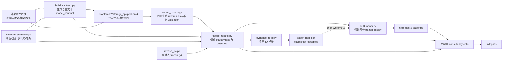

# 数学建模 Skill / Harness Research Integrity Architecture Audit

> 审计日期：2026-08-08  
> 审计结论：**NO-GO——当前产物可以作为自动建模与成文原型，但不能标记为“研究链已验证”的竞赛终稿。**  
> 核心原则：`Model declared ≈ Model implemented ≈ Model evaluated ≈ Result frozen ≈ Claim supported ≈ Paper stated`；`FAIL remains FAIL`。

## 审计边界与证据范围

本报告审计的是当前 Skill/Harness 及其真实生成运行：

- Harness 仓库：`D:\Projects\随便做做\math-modeling-skill-sion`
- 生成运行与全部痕迹：`D:\Projects\随便做做\全流程数模agent\C题_evidence_harness`
- 主要论文：`D:\Projects\随便做做\全流程数模agent\C题_evidence_harness\paper\论文.docx`
- 代码、合同、冻结结果、验证、paper plan、writer 和 critic 均纳入审计。

另一套 Skill 生成的 v7 论文只属于外部对照，不把它的问题归因于当前 Harness。2024 年 A242、B196、C038 仅用于观察优秀论文如何形成机制—模型—验证证据链，不把其算法、篇幅或版式当作模板。

除新增本审计报告外，本轮没有修改 Harness、运行痕迹、代码或论文。

---

# 1. Executive Summary

当前 Harness 已经具备合同、冻结结果、证据注册、paper plan、QA、critic 和 Gate 的“外形”，但这些组件之间主要是**哈希与 ID 的引用一致性**，尚不是**研究语义一致性**。因此它能够生成一篇结构完整、数字密集、措辞流畅的论文，同时让代码与合同不一致、验收失败、场景评价错位和无证据因果解释一起通过 W2。

## 1.1 最大的五个根因

| 根因 | 直接证据 | 后果 |
|---|---|---|
| Validation 接受自报状态，不重算 acceptance | `scripts/freeze_results.py:90-125` 只要求 `ok=true`、`status=pass`、非空 `observed`；`schemas/frozen_results.schema.json:34-40` 甚至只允许 `pass` | `498→550 MW` 和碳排 `+1.9%` 仍能成为 `pass` |
| Contract、代码和场景之间没有可执行绑定 | `model_contract.json` 的 objective/constraint/acceptance 是自由文本；求解代码不读取合同 | 合同写了变量与硬约束，代码可以不实现或静默放宽 |
| Frozen result 不是不可变的完整运行证据 | `results/frozen_results.json:30` 的 `input_snapshot=[]`；`refresh_q4.py:39-84` 可原地改结果并级联改哈希 | 无法证明结果来自哪版数据、场景和 evaluator，也无法阻止事后“修数” |
| Claim–Evidence 只校验“引用存在” | `scripts/qa/validate_contracts.py:339-392`、`check_consistency.py:144-180` 只核对 claim/evidence ID 与 verified 状态 | C7/C8 的陈旧数字与错误结论仍通过全部 QA |
| Writer 仍是 researcher | `build_paper.py` 不读取 `paper_plan.json`，只读部分 frozen display，再硬编码调参、机制、百分比、原因和有效性判断 | 上游没有的研究事实会在自然语言阶段被创造出来 |

## 1.2 最关键的现场反证

合同要求：

- `OB-Q3-PEAK`：储能后峰值不高于无储能，见 `model_contract.json:421-426`；
- `OB-Q3-CARBON`：储能后残余碳不高于无储能，见 `model_contract.json:428-433`。

实际冻结结果：

- `R-Q3-PEAK-NS = 498.0 MW`，见 `results/frozen_results.json:176-188`；
- `R-Q3-PEAK-OPT = 550.0 MW`，见 `results/frozen_results.json:190-202`；
- 净购电波动由 `477.46` 增至 `765.17 MW`，见 `results/frozen_results.json:204-230`；
- 验证报告明确写出碳排上升 `+1.9%`，却仍置为 `pass`，见 `results/validation_report.json:31-37`。

2026-08-08 对现有 Harness 重新执行只读 QA：

| 检查 | 结果 |
|---|---|
| `validate_contracts.py --strict` | `ok: true`, errors 0 |
| `check_consistency.py --strict` | `ok: true`, checked 28 results / 28 evidence |
| `check_gates.py --strict` | M1/P1/P2/W1/W2 全部 `pass` |

这不是单个模型效果不佳，而是**门禁可以让明确违反 acceptance 的运行继续晋级**。在修复它之前，优先润色或“去 AI 味”会把错误包装得更可信。

## 1.3 优先级判断

- **P0：先修研究完整性。** Validation 状态计算、合同—代码一致性、场景绑定、冻结不可变性、参数语义、指标定义、claim 重算、Writer 边界。
- **P1：再补研究深度。** 模型选择证据、独立验证、敏感性、消融、鲁棒性、失败边界。
- **P2：最后处理写作。** 模板化语句、过度肯定、摘要/结论复述、图表论证力、Word 样式与版面。

---

# 2. Current Architecture：真实执行链

## 2.1 设计图与真实图的差异

Harness 文档声明的主链是：

```text
Input → Model Contract → Coding/Execution → Frozen Results
      → Evidence Registry → Paper Plan/Figures → Writer → QA/Critic → Final Paper
```

真实运行则是：



## 2.2 各阶段的实际输入、输出与执行作用

| 阶段 | 实际输入 | 实际输出 | 下游消费者 | 真正被执行的字段 | 仅记录、未执行或可被绕过的内容 |
|---|---|---|---|---|---|
| Input | 外部 Excel 附件；`model_lib.py:22-24` 硬编码数据目录 | pandas/NumPy 数组 | 四问代码 | 实际文件内容 | frozen 中无 input hash；合同中的 data source 变换描述不约束 loader |
| Problem Analysis / Contract | 人工/Agent 解释、`build_contract.py` | `model_contract.json` | freeze、schema QA、paper plan | status、ID、哈希、字段存在性 | objective、constraint、acceptance、参数语义不被 solver 执行 |
| Coding | 合同和自然语言建模意图 | `code/*.py` | Execution | Python 实现本身 | 无 contract item → function/assertion 的绑定 |
| Execution | 代码与外部数据 | `results_raw.json`、图、日志 | freeze、writer 辅助 | 模型计算 | 场景身份、evaluator 身份、solver residual 未结构化 |
| Validation | 与结果相同的 `collect_results.py` 输出 | `validation_report.json` | freeze | 自报 `ok/status/observed` | acceptance 未重算；不是独立 evaluator |
| Freeze | raw result、合同、可选 input/code/validation | `frozen_results.json` | evidence、writer、QA | 快照哈希、result ID/display | `input_snapshot` 可为空；失败无法表示；结果可被脚本原地改写 |
| Evidence | frozen result | `evidence_registry.json` | paper plan、QA | ID、source hash、verified | 不判断 evidence 是否支持 claim 的完整语义 |
| Paper Plan | requirement、result/evidence IDs | `paper_plan.json` | QA/critic | 引用关系、字段存在 | Writer 不读取；claim 数字和推断不重算 |
| Writer | `frozen_results.json` + 硬编码正文 | `论文.docx`、文本摘录 | critic/final | 选定 display values | 可新造百分比、原因、机制、调参事实、有效性判断 |
| Critic / Gates | manifest、plan、文本、注册表 | JSON/Markdown 报告、Gate status | 最终交付 | 哈希、术语、引用、已注册数字 | 不审模型语义、场景一致性、acceptance、因果支持、渲染质量 |

## 2.3 哪些自然语言阶段可以改写前序事实

1. `collect_results.py:111-137`：用自然语言解释实际失败，同时直接写 `status="pass"`。
2. `conform_contracts.py:75-135`：事后新增/替换 validation obligation，并把全部状态写成 pass，再刷新合同和冻结哈希。
3. `paper_plan.json:11-18`：claim 文本可包含没有结果字段支持的数字和推断。
4. `build_paper.py`：可绕过 paper plan 新写研究事实。
5. `semantic_critic`：只判断结构、术语、注册数字，无法驳回上述改写。

---

# 3. P0 Integrity Findings

## A. Contract → Code Drift

### A1. 关键合同项与实际行为对照

| Contract item | 声明行为 | 实际代码行为 | 一致性 | 严重度 |
|---|---|---|---|---|
| Q1 season | `model_contract.json:160` 写 `季=24` | `problem1.py:43-44,82-93` 固定 `m=168` | 否 | P0 |
| Q1 参数校准 | 论文 `build_paper.py:362-365` 声称验证集择优 α/β/γ 后重训 | `problem1.py:44,99,107` 始终使用默认 `0.3/0.05/0.1`，无搜索 | 否 | P0 |
| Q2 开工时刻 `s_k` | `model_contract.json:267-270,346-351` 把开始时刻列为决策并约束 LatestFinish | `problem2.py:49,68` 永远令 `ast[k]=ArrivalHour` | 否 | P0 |
| Q2 GPU 容量硬约束 | `model_contract.json:262-265` 声明不得超容量 | `problem2.py:52-68` 无可行候选时仍回源区域并直接加占用，源容量未重查 | 否 | P0 |
| Q2 实时任务本地 | 合同/论文声明本地执行 | `problem2.py:53-54` 实现正确 | 是，仅 Q2 | — |
| Q3 新能源平衡 | `model_contract.json:369-371` 写 `ur+cur+gs=avail-load` | `storage_opt.py:53-63` 实现 `ur+ch+gs+cur=Avail`，另有 `gp+ur+dis=L` | 否，合同公式本身错误 | P0 |
| Q3 最大购电功率 | LP bounds 将 `MaxGridImport` 作为硬上限 | `storage_opt.py:103-111` 首次不可行时静默解除购电上限重算 | 否；硬约束被降级 | P0 |
| Q4 实时任务本地 | 合同外层约束与基本假设要求时延/本地语义 | `problem4.py:61-69` 对 RealTimeInference 允许六区域任意选择 | 否 | P0 |
| Q4 服务质量项 | `model_contract.json:488-490` 目标含 `w_svc·迁移` | `problem4.py:43-46,97` 乘以默认 `service_penalty=0`；调用均未赋非零值 | 名义存在、实际失效 | P0 |
| Q4 LatestFinish / capacity | `model_contract.json:476-478` 声明硬约束 | `problem4.py:73-82` 可把不可行窗口强制设为 arrival；`:106-108` 无容量可行解仍强制分配 | 否 | P0 |
| 任务功率映射 | 附件 `power_mapping.xlsx` 是给定输入 | `model_lib.py:36-37` 虽读取为 `pm`，但 `schedule_to_ai_it` 在 `:70-82` 默认使用硬编码 `POWER`（`:29`），调用未传 `pm` | 给定数据未进入计算 | P0 |

### A2. 指标语义也存在 Contract/Code Drift

- `R-Q1-VIOL` 名称与统计定义写“容量越界小时数”，但 `problem1.py:150-156` 每个未成功放置的任务加 1，实际是**未放置任务次数**，不是去重后的越界小时数。
- `R-Q2-MIGR` 写“被迁移任务数 / 总可迁移任务数”，见 `collect_results.py:55-56`；实现却在 `model_lib.py:148-151` 除以全部任务数，包含不可迁移实时任务。
- “峰值净购电”由 `model_lib.py:128-135` 取单区域单时刻 `gp.max()`；没有减上网售电，也不是六区域系统逐时净购电之和。若赛题指标不是这一口径，结果名称会误导。
- Q4 frozen boundary 写 `w=(1,1,0,1)`，见 `collect_results.py:79-86` 与 `frozen_results.json:260-314`；实际 TOU 调度使用 `w_carbon=150`，且 service 项为零。

**风险：** 即使数字是代码真实输出，名称、分母、边界和数学含义不一致，论文事实仍然错误。结果完整性必须覆盖 metric definition，不只是 value。

## B. Scenario → Evaluation Drift

### B1. Flat-price 场景在 solver 与 evaluator 中不是同一场景

- Scheduler 使用平价覆盖：`problem4.py:183-186` 将 `flat_price` 传给 `unified_schedule`。
- Evaluator 不接受 `price_override`：`problem4.py:121-138` 在 `evaluate()` 内重新读取原始 TOU `Price`。
- 因此 flat 场景是“按平价排任务、按分时电价计成本”，而论文 `build_paper.py:506-514` 将其解释为完整的固定平价机制。

这是典型 scenario/evaluator drift，属于 P0；该情景的成本比较不能用于结论。

### B2. Pareto 扫描的内外层目标不一致

- `problem4.py:172-176` 扫描外层 `w_carbon`，但调用 `evaluate(data, ar, ast)` 时没有传 `carbon_w`。
- `evaluate()` 只有显式收到 `carbon_w` 才把它传给储能 LP，见 `problem4.py:136-138`。
- 结果是外层排序随碳权重变化，内层储能仍按成本单目标求解；合同和论文所称的统一多目标 Pareto 并未完整实现。

### B3. 新能源渗透场景只部分进入决策

`avail_override` 在 `unified_schedule()` 入口被赋给 `Avail`（`problem4.py:30-32`），但外层打分和容量选择没有使用新能源可用量；它主要在 evaluator 的 LP 中生效。论文可以报告“给定调度下电力侧响应”，不能未经消融就声称“统一调度因新能源变化而重排并产生收益”。

### B4. 当前 frozen result 缺少场景绑定

`frozen_results.json` 没有 `scenario_id`、transform hash、solver input hash、evaluator input hash。不同场景只靠 result 名称和自由文本 boundary 区分，无法机器证明：

```text
scenario definition
  = transformed inputs used by solver
  = transformed inputs used by evaluator
  = boundary stated in paper
```

## C. Result Integrity

### C1. 当前 frozen result 只能证明“某些文件当时被哈希”，不能完整证明运行身份

已有：model contract snapshot、raw result snapshot、部分 code snapshot、validation snapshot、command、results hash。

缺少或不充分：

- `input_snapshot=[]`：见 `results/frozen_results.json:30`；数据附件没有绑定；
- `seed=null`：见 `:432`，同时验证却声称“固定随机种子重跑”；
- 无 git commit / environment / dependency lock；
- 无 scenario ID 及变换/evaluator hash；
- 无 solver name/version/status/objective value；
- 无每类硬约束 residual 和容差；
- 无 evaluator version；
- result 的 statistical definition 仍是自由文本，不能参与重算。

### C2. Frozen artifact 可以被原地改写

`refresh_q4.py:39-55` 直接从日志解析四个 Q4 数字并覆盖 `frozen_results.json`；`:59-84` 再级联更新 registry/manifest 哈希。它没有创建新 run ID，也没有重新绑定数据、代码、验证和 evaluator，且脚本自身没有同步重算 `results_sha256`。

`conform_contracts.py:111-155` 又可以事后：

1. 替换 validation obligations；
2. 把新增义务全部写成 `pass`；
3. 修改 model contract snapshot；
4. 重算 result/文件哈希；
5. 更新 evidence registry 与 run manifest。

这说明“哈希一致”目前不等于“不可篡改的执行血缘”；它也可能只是事后重新封装后的自洽。

### C3. 旧结果可在合同变化后继续被误用

现有 validator 会检查当前 snapshot hash 是否匹配，但 `conform_contracts.py` 可把新合同 hash 写回旧结果，而不重新运行模型。因而“合同变了就使旧结果失效”的规则没有在架构上强制执行。

**最低修复标准：** frozen run 可以保存 FAIL，但一经创建不得原地覆盖；任何合同、代码、数据、场景、evaluator 变化都必须生成新 `run_id` 与新结果文件。

## D. Validation Integrity（最高优先级）

### D1. Validation producer 与 result producer 是同一段代码

`collect_results.py:21-38` 执行模型并为每个结果无条件写 `validation_status="verified"`；同一文件 `:111-137` 又创建验证义务并手写全部 `status="pass"`。这不是独立验证，而是模型输出对自身的声明。

### D2. 自然语言解释覆盖了明确 FAIL

`collect_results.py:124-131` 对 Q3：

- 峰值由 498 上升到 550；
- 碳排上升约 1.9%；
- 用“成本套利价值”“需配合新能源接入”等解释说明原因；
- 仍然输出 `pass`。

正确状态只能是：

```text
status = FAIL
observed = {baseline, candidate, delta}
interpretation = "成本单目标导致峰值和碳恶化"
revision_or_boundary = "修改目标或将结论限定为降本，不声称削峰/降碳"
```

解释可以保留研究价值，但不能改变 status。

### D3. Generic freezer 不计算 acceptance

`scripts/freeze_results.py:90-125` 只验证：报告 `ok=true`、每项 `status=pass`、`observed` 非空、义务 ID 集合匹配。它从不解析 `model_contract.models[].validation_obligations[].acceptance`，也不读取 baseline/candidate 计算比较式。

`schemas/frozen_results.schema.json:34-40` 又把 obligation status 设为 `const: pass`，使“冻结一个失败但可复现的实验”在 schema 上无从表达。结果是研究失败只能被丢弃或伪装成通过。

### D4. 多项“验证”没有对应测量

- `OB-Q3-FEAS` 声称平衡残差 `<1e-6`，但 `storage_opt.py` 没有输出该 residual。
- `OB-Q2-LAT` 声称 100% 满足 MaxLatency；`latency_stats()` 只统计迁移时延均值/最大值，没有逐任务输出 violation count 与合同边界。
- `OB-Q4-DETR` 声称固定种子重跑一致；frozen seed 为 null，验证报告没有第二次运行的 hash 对比。
- `storage_opt.py:203-209` 的敏感性分析捕获所有异常后回填 no-storage 值，会把求解失败伪装为“没有收益”，破坏失败可见性。

## E. Claim → Evidence Integrity

### E1. 当前矩阵是引用矩阵，不是语义矩阵

`validate_contracts.py:339-392` 与 `check_consistency.py:144-180` 能检查：claim ID 是否唯一、evidence ID 是否存在、evidence 是否标记 verified、section/figure/table 是否引用合法 ID。它们不检查：

- claim 文本中的数字是否等于 evidence result；
- 百分比是否由同一 baseline/candidate 重算；
- scenario/boundary/metric definition 是否一致；
- evidence 是否覆盖 claim 的全部子句；
- inference 是否有 comparison/ablation 支撑；
- recommendation 是否有 observation → inference 链。

### E2. 现有 C1–C8 的严格审计

| Claim | 类型 | 可验证程度 | 结论 |
|---|---|---|---|
| C1 | Observation + Inference | MAPE 两个数字可对 frozen 重算；“可作为调度依据”和模型选择理由不可由这两个结果推出 | 部分支持；且论文调参叙述为假 |
| C2 | Observation + Inference | RegionA 数字可查；“69 个越界小时”实际是任务计数；“存在储能空间”也不是由局部 GPU 拥塞推出 | 当前不足 |
| C3 | Observation + Inference | 4.44%/5.29% 是代码计算值；但基准调度、吸收上限和容量语义存在 P0 漂移，“验证节能潜力”过强 | 部分支持，不能晋级最终 claim |
| C4 | Observation + Inference | 平均时延可查；迁移率分母错误；“100% 满足”和“服务未受损”没有对应 result ID | 当前不足 |
| C5 | Observation + Causal inference | evidence 只包含现状成本、峰值、波动；没有无储能/储能优化成本和碳 result，无法支持“降约 5%”及效率损失因果 | 当前不足 |
| C6 | Observation | 文本数字与当前 frozen 的现状成本/碳一致 | 当前最接近机器可验证，但仍缺官方输入 hash |
| C7 | Observation + Inference | plan 写 `1694756488/2051374`；frozen 实际 `2152828976/2058472`（`frozen_results.json:260-286`），且候选成本高于现状 | **文本错误且方向错误** |
| C8 | Observation + Inference | plan 写 `1635322430/1956736`；frozen 实际 `2092084668/1974136`（`:288-314`）；两个 TOU 结果不能证明 Pareto 机制 | **文本错误且证据不完整** |

严格按端到端标准，当前没有一条 claim 完全闭环；C6 只是最接近。C7/C8 是最清楚的回归样例：它们含陈旧数字，现有 consistency/critic 仍返回 pass。

### E3. Figure contract 同样只做“可达”，不做“证据”

例如 `paper_plan.json:35-42`：

- 图1 的 panel map 声称“预测 + 甘特”，data artifact 只登记 `fig_p1_gantt.png`；
- 图4 的 panel map 声称“迁移率/时延”，实际绘图代码主要是成本/碳和区域峰值；
- 图5 声称成本/碳对比，但 evidence 没有优化成本/碳结果；
- 图6 用单一 TOU cost/carbon evidence 支撑整个权重扫描 Pareto；
- 图7/图8 的多指标、多情景 caption 只绑定少量单场景结果。

图存在、被正文引用、文件 hash 正确，只能证明“图被使用”，不能证明“图支持这句话”。

## F. Parameter Provenance

### F1. 关键参数台账

| 参数 | 正确来源分类 | 当前实际来源/使用 | 论文呈现 | 风险 |
|---|---|---|---|---|
| 任务功率映射 | GIVEN | 官方表虽读取但未消费；使用硬编码 `POWER` | 像附件给定统一口径 | P0 |
| `absorb_ratio` | 历史统计 DERIVED；升级为硬约束则属于 ASSUMED/POLICY | `model_lib.py:60-62` 用历史平均 `(UsedRenewable+RenewableCharge)/AvailableRenewable` | 被写成电网技术最大消纳比例与物理硬约束 | P0 |
| season length 168 | ASSUMED 或需 ESTIMATED/CALIBRATED | 代码固定 168；合同写 24；无周期诊断 | 写成数据呈现明显周周期 | P0/P1 |
| α/β/γ | 当前是 ASSUMED | 固定默认值，无验证集搜索 | 写成 CALIBRATED | P0 |
| `LAMBDA=500` | ASSUMED/POLICY | `problem2.py:19` 硬编码，无 Q2 sensitivity | 像可直接使用的碳社会成本 | P1；若作为政策结论则 P0 |
| Q4 权重 | ASSUMED/POLICY | 扫部分 carbon weight；service 实际为零 | 写成四目标统一框架 | P0 |
| `MAX_SHIFT=240`、步长 6h | POLICY | `problem4.py:62,77-82` 硬编码 | 合同/论文未充分声明与敏感性 | P1 |
| solver tolerance / residual | POLICY | 未结构化输出 | 论文声称 `<1e-6` | P0 |

### F2. `absorb_ratio` 的数学语义不能从历史平均直接推出

代码计算的是：

```text
rho_r = mean_t[(UsedRenewable_r,t + RenewableCharge_r,t)
               / AvailableRenewable_r,t]
```

它是历史运行结果的平均比例，受历史负荷、价格、储能状态、调度策略、弃电和售电共同影响。一般不能推出：

```text
ur_r,t + ch_r,t + gs_r,t <= rho_r * AvailableRenewable_r,t,  for every t
```

原因有三：

1. **平均值不等于逐时上限。** 平均观测不能作为每个时刻的技术容量边界。
2. **观测量是内生结果。** 历史利用率低可能来自负荷不足或策略选择，并不代表电网物理能力低。
3. **分子口径不一致。** `rho` 的估计排除了 `GridSell`，论文和 LP 的硬约束却包含 `gs`。

此外，同一参数在两个模块中语义不同：

- `dispatch()` 在 `model_lib.py:98-105` 只对 `used` 应用 cap，随后又从全部剩余新能源计算 `gs`，所以 `used+gs` 可能突破 cap；
- `storage_opt.py:74-84` 则对 `ur+ch+gs` 共同应用 cap。

该参数直接支配购电、成本、碳、弃电和储能价值，是**P0 模型语义问题**，不是“补一张 sensitivity 图”即可解决。首先要确认题目是否给出真实接入上限；若没有，只能把它明确标为情景假设，并报告多组 `rho` 下的条件性结论，不能称为数据推导出的物理上限。

## G. Writer Boundary

### G1. Writer 实际没有消费 paper plan

`build_paper.py:3` 声称“依据冻结结果与 paper_plan”，但 `:24-40` 只加载 `frozen_results.json`；全文没有读取 paper plan。因而 claim 的类型、boundary、evidence coverage 和 QA status 都不会限制 Writer。

### G2. Writer 当前可以创造的研究事实

| 越界能力 | 现场证据 |
|---|---|
| 新数字/百分比 | 摘要 Q1/Q2 数字在 `build_paper.py:262-267` 硬编码；Q3 “约百分之四”、Q4 “约百分之三/两成八/两成三”在正文计算链外生成 |
| 新 calibration 事实 | `:362-365` 声称验证集择优 α/β/γ，代码未执行 |
| 新决策机制 | `:398-405` 声称 Q2 做迁移+时移错峰，代码固定 arrival start |
| 新约束保证 | `:403-405` 声称容量可行性保证不新增越界，代码有强制不可行分配 |
| 新 service/SLA 结论 | `:417-420` 声称全部满足时延、服务未受损、未新增局部峰值；无完整 result/validation |
| 新因果解释 | `:464-471` 把碳上升归因于效率损失；没有对应消融或流量分解 |
| 新 Pareto 结论 | `:498-502` 写“低碳调度几乎零成本”及区域原因；scenario/evaluator 尚不一致 |
| 新政策判断 | `:513-520` 写“调度灵活性是主要来源”“新能源是最显著杠杆”；没有因素分解/交互实验 |
| 新可信度声明 | `:545-548,657-658` 写“关键结论均可冻结复现”“严格物理约束”；与审计证据冲突 |

**Writer 必须降权为 verbalizer：** 只能把 typed claim、已验证 observation、边界和失败转成自然语言。任何新的数字、比较、原因、机制或“说明有效”判断，都必须返回 research pipeline，而不是在写作阶段生成。

---

# 4. P1 Research-Depth Findings

P0 修好后，第一篇论文仍会显得 under-modeling。问题不是模型少，而是每一问通常只到“模型名称 → 一个结果 → 正向解释”，没有形成完整的研究证据链。

## 4.1 各问的深度缺口

| 问题 | 当前做到的层次 | 缺失的研究证据 |
|---|---|---|
| Q1 预测 | HW vs seasonal naive；单个 24h test window | 168h 周期的 ACF/periodogram/STL 证据；加法 vs 乘法选择；真实参数校准；区域误差；多窗口稳定性；失败时段诊断 |
| Q1 基础调度 | 本地贪心与一个“越界”计数 | 正确的小时/任务 violation 定义；容量热区定位；按区域/任务类型的瓶颈机制；可行率与 deadline residual |
| Q2 调度 | 区域平均 price + λ·carbon 的贪心迁移 | 题目现实规则到变量/约束逐项映射；真正的 start-time decision；λ 来源和 sensitivity；时移/迁移消融；独立 SLA/capacity audit；合理替代模型 |
| Q3 储能 | 逐区域 LP；成本、碳、峰值结果 | 残差、solver status、约束活跃度；`absorb_ratio` 的物理来源；成本目标与削峰/减碳假设分离；无储能 ablation 的完整 frozen metrics；失败边界 |
| Q4 统一模型 | 权重扫描与多场景图表 | 先修 scenario binding；Pareto dominance 重算；四个权重是否有效；价格×新能源×调度的因素/交互分解；可行性与边界 |

## 4.2 Model Choice 目前是模板映射，不是比较过程

Q1 检测到“时间序列”后直接使用 Holt-Winters；Q2 检测到“调度”后使用综合 score；Q3 检测到“储能”后使用 LP。缺少：

1. 候选模型集合；
2. 与题目机制相关的选择标准；
3. 简单 baseline；
4. reasonable alternative；
5. 为什么当前数据下不选 alternative；
6. 选择在什么条件下会失效。

这不要求每问堆四个算法。一个普通模型只要被推导、选择、验证和限定完整，研究可信度就会显著高于“高级模型清单”。

## 4.3 Validation 与 result visualization 被混为一谈

当前多数图是成本柱状图、利用率、场景结果和 Pareto 展示。它们回答“算出了什么”，不自动回答“模型是否可信”。更接近 validation 的证据应包括：

- held-out / rolling-window test；
- constraint residual 与 violation table；
- objective 独立重算；
- convergence 或 optimality gap；
- ablation；
- parameter perturbation；
- sanity check / analytical boundary；
- scenario identity check。

未来每张图必须先回答 `claim_supported_by_this_figure`，并绑定实际 data hash。回答不了的图可以删；关键 claim 没图，也可以用表或残差报告证明，不设最低图数。

## 4.4 Failure 应成为证据，而不是被正向包装

Q3 实际发现了一个有价值的边界：**成本单目标储能套利可能降低成本，却提高碳排、峰值和波动。** 这可以形成更可信的研究链：

```text
Hypothesis: 储能同时降本、减碳、削峰
→ Test: 成本单目标 LP vs no-storage
→ FAIL: peak 498→550, carbon +1.9%, fluctuation 477.46→765.17
→ Diagnosis: 目标函数、价格信号、效率损失、消纳约束的作用分解
→ Revision: 加入 peak/carbon 项或把结论限定为“仅降本”
→ Retest: 新合同、新 run_id、新结果
```

这比“结果相反但仍说明模型有效”更像研究论文，也更少 AI 式圆满叙事。

## 4.5 与 2024 优秀论文的真正差距

以下为扫描版页面的视觉抽样，页码范围按 PDF 页面近似记录，只用于结构比较：

- `A题论文展示（A242）.pdf`：正文约前 30 页。其链条是实际几何关系 → 坐标/递推 → 碰撞条件 → 优化 → 局部几何与曲线复核；约第 12–17、26、28–29 页持续回到临界条件和算法结果验证，后续为代码附录。
- `B题论文展示（B196）.pdf`：约第 5–12 页把抽样统计与生产成本过程推完整，约第 18–23 页做收敛、置信与敏感性，之后才是代码。
- `C题论文展示（C038）.pdf`：约第 5–10 页先做数据画像，第 11–30 页把现实规则逐条数学化，第 31–44 页继续做相关性、鲁棒性和敏感性。

共同点不是页数、PSO、CVaR 或遗传算法，而是：

```text
困难机制 → 可检验命题 → 数学表示 → 求解 → 独立证据
        → 反事实/敏感性 → 边界 → 结论
```

当前论文将四问平均压缩成相似篇幅和节奏。下一版应按 difficulty、novelty、decision importance、semantic risk 分配深度；最危险或最关键的一问应获得更多推导与验证，而不是四问平均铺陈。

---

# 5. Writer / Style Findings（P2）

## 5.1 “AI 味”的可观察来源

这不是对作者身份的判断，而是对文本机制的判断。Word 只读检查显示：

- 118 个非空段落全部使用 `Normal` 样式；8 个表、8 个内嵌图；没有语义化 Heading style。
- 正文中“说明”出现 14 次、“统一”20 次、“显著”7 次、“可复现”2 次。
- 四问高度重复同一种节奏：`针对……采用……` → 公式/算法名 → 数字 → `说明/表明模型有效`。
- 摘要、问题结果、模型评价、结论重复同一组数字和判断，信息密度高但研究过程被压扁。
- 高频使用“完整模型链”“严格物理约束”“最显著杠杆”“低碳调度几乎零成本”等完成态评价，实际 support strength 未进入措辞。
- 模型评价采用固定“三个优点、四个不足”清单，内容通用，未回到本模型已观察到的失败与边界。

## 5.2 为什么现在不应直接做措辞重写

当前模板感主要来自：上游只有结果条目，没有机制诊断、失败、反例和不确定性可供 Writer 表达。Writer 为了让四问完整，只能重复“建立—求解—下降—说明有效”的正向句式。单纯替换词汇会降低表面重复，却会继续保留错误研究事实。

## 5.3 P0/P1 完成后的写作改进方向

1. 每个正文段落绑定 claim ID，并声明句子功能：definition / derivation / observation / inference / limitation。
2. Observation 用数值和边界说话；Inference 明示“在本场景下推测”；Recommendation 写出依赖条件。
3. 禁止 Writer 自行使用“证明、主要原因、说明有效、最显著、几乎零成本”等强词；只有 support level 达标才可解锁。
4. 允许失败段落：先报告 FAIL，再解释，再给修订或边界，不强制每问正向收尾。
5. 按证据链组织章节，不强制四问使用同样的小节模板。
6. Style critic 检查重复句法、摘要—结论重叠、无证据评价词和过强因果，不替代 semantic gate。
7. 生成 Word 时使用 Heading 1/2/3、正确题注/交叉引用，并做 PDF 渲染、分页和溢出 QA。

---

# 6. Recommended Target Architecture

目标不是继续增加 Agent 或平行 JSON，而是强化现有 `model_contract`、`frozen_results`、`paper_plan` 三个权威对象。

| Gate | 当前状态 | 最小增强位置 | Writer 前 fail-fast 条件 |
|---|---|---|---|
| Gate 0 — Official Alignment | 基本缺失；只有 question/数据源自由文本 | 强化 `model_contract`：官方目标、官方 metric、单位、输入清单/hash、auxiliary metric 标记 | 官方目标/metric 未枚举；输入未绑定；auxiliary 偷换主指标 |
| Gate 1 — Semantic Consistency | 有 schema/ID/hash 校验，无合同—实现语义绑定 | `model_contract` 增加 implementation binding；`validate_contracts.py` 加静态/动态 contract test | 声明变量未使用；硬约束未实现/被 fallback 放宽；metric definition 不一致 |
| Gate 2 — Execution / Result Integrity | 有部分 code/contract/raw hash，input 可空，frozen 可改 | 强化 `frozen_results` 与 `freeze_results.py` | 数据/代码/合同/场景/evaluator hash 缺失；solver 未成功；冻结文件被原地覆盖 |
| Gate 3 — Validation | 形式存在，但信任自报 pass | 结构化 acceptance + 独立 evaluator；状态由机器计算 | 任一 required obligation FAIL/unknown；自然语言不能改状态 |
| Gate 4 — Claim–Evidence | 有 ID matrix，无语义重算 | 强化 `paper_plan` typed claim；`check_consistency.py` 重算数字/百分比/边界 | claim 数字、baseline、scenario、boundary 不一致；inference support 不足 |
| Gate 5 — Research Sufficiency | 基本缺失 | 仍在 model contract/paper plan 记录候选、选择理由、核心验证和边界 | 核心结论只有结果图，无独立 validation；关键 ASSUMED 参数无风险测试 |
| Writer | 可创造事实 | 只消费通过 Gate 0–5 的 read-only claim package | 发现未注册数字/比较/原因/模型机制即退回 research pipeline |
| Style Critic | 有术语/引用/数字表面检查 | 增加重复、强词、claim strength、render QA | 只影响表达质量；不得把 semantic FAIL 变 pass |

Gate 0–4 必须在 Writer 前 hard fail。Gate 5 对“最终论文/ready paper plan”也应 hard fail，但探索性实验可以保留为 draft。Style critic 永远不能替代 Gate 0–5。

建议保留现有 M1/P1/P2/W1/W2 名称也可以，但必须把上述职责映射进去；不必为了命名再增加一套平行 stage。

---

# 7. Minimal Migration Plan

## Phase A — Integrity（先完成，P0）

### A1. 强化现有合同和冻结结构

- `schemas/model_contract.schema.json`
  - 增加 official metric/auxiliary metric 标记；
  - 参数包含 `type = GIVEN | DERIVED | ESTIMATED | CALIBRATED | ASSUMED | POLICY`、source、unit、derivation、risk；
  - acceptance 从自由文本升级为 metric refs + comparator + threshold + tolerance；
  - scenario 声明 transformed inputs、solver/evaluator 使用要求；
  - contract item 绑定 implementation function/test ID。
- `schemas/frozen_results.schema.json`
  - `input_snapshot` 至少一项；
  - 增加 scenario、solver、objective、residual、metric/evaluator version、environment；
  - 允许记录 `pass | fail | error | not_run`，但只允许 pass claim 晋级；
  - 保留失败运行，禁止覆盖。
- `schemas/paper_plan.schema.json`
  - claim 类型为 Observation / Inference / Recommendation；
  - 数值 Observation 使用结构化 result refs/computation，不把数字藏在自由文本；
  - 增加 boundary、support strength、supporting/contradicting evidence。

### A2. 改变验证责任

- `scripts/freeze_results.py`：不再信任 status；由独立 evaluator 对 structured acceptance 重算。冻结 FAIL 合法，但不能标 verified。
- `scripts/qa/validate_contracts.py`：加入 contract-to-code binding、official metric、scenario/evaluator、parameter provenance 检查。
- `scripts/qa/check_consistency.py`：从 baseline/candidate 重算百分比；扫描 claim/paper 数字与 scenario/boundary；验证完整子句覆盖。
- `scripts/qa/check_gates.py`：required P0 obligation 为 fail/unknown 时，W1/W2 不得 pass。
- `conform_contracts.py`、`refresh_q4.py`：不得再原地修改冻结运行。若保留为迁移工具，必须创建新 run ID、新文件并重新执行 Gate 1–4。

### A3. 修正当前 C 题实现语义

- `code/model_lib.py`：使用附件 `pm`；定义唯一的新能源 cap 语义，并在 dispatch/LP 共用；明确 peak/net import 口径。
- `code/problem1.py`：要么实现真实参数选择和周期诊断，要么把参数标为 assumed 并删掉“验证集择优”声明；修正 violation 统计。
- `code/problem2.py`：实现 start-time decision，或从合同/论文删除时移；无可行容量时返回 infeasible，不强制分配；独立计算 SLA violations。
- `code/storage_opt.py`：禁止静默解除 MaxGridImport；输出 solver status、objective、所有关键 residual；异常不得回填 baseline。
- `code/problem4.py`：实时任务本地；scenario override 同时传 solver/evaluator；service 权重必须有效或从目标删除；任何不可行任务返回 fail；Pareto 内外层使用同一权重定义。
- `code/collect_results.py`：只产 raw metrics，不自授 verified/pass；验证由独立程序执行。

### Phase A 出口条件

1. Q3 peak/carbon obligation 在当前结果上机器返回 FAIL；
2. C7/C8 陈旧数字使 Gate 4 FAIL；
3. flat-price scenario 的 solver/evaluator price hash 不同使 Gate 2/3 FAIL；
4. 无 input snapshot 的旧 frozen result 不得晋级；
5. Writer 尚未运行时，P0 即已阻断。

## Phase B — Research Evidence（P1）

- 在 `model_contract` 内记录候选模型、选择理由、关键风险和按风险触发的 validation obligation，不新建七个平行 JSON。
- Q1：ACF/periodogram/STL 至少一种周期证据；真实 calibration；rolling/multi-window 与区域误差。
- Q2：迁移、时移、二者联合的消融；λ sensitivity；容量/SLA residual；与简单本地/最低价/最低碳 baseline 比较。
- Q3：先解决 absorb 物理来源；分别测试 cost-only、cost+carbon、cost+peak，保留负结果与边界。
- Q4：在 scenario binding 修复后再做 Pareto；机器剔除被支配点；做价格、可再生能源和调度机制的因素分解。
- `paper_plan` 中每个核心 inference 至少绑定 comparison/ablation/robustness 中一种，不以结果可视化代替验证。
- Figure plan 绑定 claim、data artifact hash、result/scenario IDs 和预期可驳回命题。

## Phase C — Writing（P2）

- `build_paper.py` 必须读取 ready `paper_plan`，不得维护第二套硬编码研究事实。
- 所有数字由 result/computation formatter 生成；未注册 numeric literal 直接 fail。
- 因果与强结论由 claim support level 控制；Writer 不得提升 claim strength。
- 采用段落功能约束，减少四问同构句式；保留失败、不确定性和适用边界。
- Word 使用语义标题、题注、交叉引用，并加入 DOCX→PDF→逐页渲染 QA。

---

# 8. Regression Tests

以下测试是未来最小自动化门槛，不要求全部成为独立 Agent。

## 8.1 Contract / Code / Feasibility

1. `test_realtime_tasks_never_migrate_q2_q4`
2. `test_declared_start_time_decision_is_exercised_or_removed`
3. `test_latest_finish_residual_nonpositive_for_every_task`
4. `test_gpu_capacity_residual_nonpositive_for_every_region_hour`
5. `test_no_force_assignment_when_candidate_set_infeasible`
6. `test_max_grid_import_is_never_silently_relaxed`
7. `test_official_power_mapping_is_consumed`
8. `test_dispatch_and_storage_lp_share_absorb_cap_semantics`
9. `test_metric_definition_matches_implementation`：尤其 violation hours、migration denominator、net import peak。

## 8.2 Scenario / Execution / Freeze

10. `test_scenario_price_hash_solver_equals_evaluator`
11. `test_scenario_availability_hash_solver_equals_evaluator`
12. `test_pareto_outer_and_inner_objective_weights_match`
13. `test_contract_code_input_evaluator_hashes_are_required`
14. `test_solver_status_objective_and_residuals_are_frozen`
15. `test_frozen_result_is_append_only`
16. `test_contract_change_invalidates_old_run`
17. `test_deterministic_rerun_compares_two_actual_output_hashes`

## 8.3 Validation

18. `test_validation_failure_cannot_become_pass`
19. `test_q3_peak_acceptance_fails_for_550_gt_498`
20. `test_q3_carbon_acceptance_fails_for_positive_delta`
21. `test_observed_text_cannot_override_status`
22. `test_claim_ready_rejects_fail_error_unknown_not_run`
23. `test_assumed_parameter_triggers_risk_or_sensitivity_obligation`
24. `test_calibrated_parameter_requires_train_validation_test_provenance`
25. `test_reported_residual_is_recomputed_not_self_declared`

## 8.4 Claim / Figure / Writer

26. `test_all_claim_percentages_recompute_from_bound_baseline_candidate`
27. `test_claim_numeric_literals_equal_bound_result_display`
28. `test_claim_scenario_metric_boundary_match_evidence`
29. `test_inference_requires_comparison_ablation_or_explicit_low_confidence`
30. `test_recommendation_traces_to_observation_and_inference`
31. `test_official_metric_cannot_be_replaced_by_auxiliary_metric`
32. `test_figure_data_hash_and_values_match_frozen_results`
33. `test_figure_caption_claim_is_fully_covered`
34. `test_writer_cannot_introduce_unseen_numeric_literals`
35. `test_writer_cannot_introduce_new_parameter_scenario_or_causal_claim`
36. `test_paper_plan_stale_C7_C8_values_fail_consistency`

## 8.5 Document / Style

37. `test_heading_styles_and_cross_references_exist`
38. `test_docx_renders_without_overlap_cutoff_or_blank_pages`
39. `test_unsupported_strong_claim_lexicon_fails`
40. `test_abstract_conclusion_repetition_is_reported_but_never_overrides_semantic_status`

---

# 9. Proposed Changes（仅计划，不实施）

| 文件/组件 | 最小修改 | 优先级 |
|---|---|---|
| `schemas/model_contract.schema.json` | official metric、参数 provenance、结构化 acceptance、scenario 与 implementation binding | P0 |
| `schemas/frozen_results.schema.json` | 完整 run identity、输入/场景/evaluator/solver/residual、失败可冻结、append-only | P0 |
| `schemas/paper_plan.schema.json` | typed claims、结构化数值计算、support strength、反证与边界 | P0/P1 |
| `scripts/freeze_results.py` | 独立重算 acceptance；不信任自报 status | P0 |
| `scripts/qa/validate_contracts.py` | 合同—实现、官方指标、参数、场景语义检查 | P0 |
| `scripts/qa/check_consistency.py` | claim 数字/百分比/boundary/scenario 全量重算 | P0 |
| `scripts/qa/check_gates.py` | P0 fail/unknown 在 Writer 前硬阻断 | P0 |
| `code/model_lib.py` | 官方功率映射、统一 cap、明确 KPI | P0 |
| `code/problem1.py` | 周期与参数选择真实化；修正 violation metric | P0/P1 |
| `code/problem2.py` | 实现时移或删声明；无可行解显式 fail | P0 |
| `code/storage_opt.py` | 不放宽硬约束；输出独立 residual/solver evidence | P0 |
| `code/problem4.py` | 修复实时/服务/容量/场景/Pareto 语义 | P0 |
| `code/collect_results.py` | 与 validator 解耦；不得自授 verified/pass | P0 |
| `refresh_q4.py` / `conform_contracts.py` | 禁止原地改 frozen；迁移必须新 run + 重跑 Gate | P0 |
| `build_paper.py` | 只 verbalize validated paper plan；禁止新研究事实 | P0/P2 |
| semantic/style critic | 从表面术语检查扩展到 claim strength、重复与 render；不参与修改 validation 状态 | P2 |

---

# 10. Final Decision

## 10.1 当前论文如何定位

可以保留为：

- Harness 的功能演示；
- P0 回归测试的固定反例；
- 重建 research pipeline 的对照基线。

不应直接定位为：

- 已通过研究完整性验证的论文；
- 可由当前 Gate 证明“所有关键结论可复现”的终稿；
- 仅需润色即可达到标杆论文可信度的版本。

## 10.2 允许进入论文深度与风格改进的 promotion gate

至少满足：

1. 当前 Q3 失败被正确记录为 FAIL；
2. Q2/Q4 合同、代码、场景和 evaluator 对齐；
3. frozen result 绑定全部输入并不可原地修改；
4. C1–C8 数字、百分比、边界和证据可机器重算；
5. Writer 无法新增研究事实；
6. 上述 P0 regression tests 全部通过。

之后再进入 P1：为最关键问题补机制、alternative、validation、robustness 和 boundary；最后才做 P2 的自然化写作与版面优化。

最终目标不是让论文“更像人写”，而是让它即使由 AI 辅助生成，也能被逐条审查、被反例推翻、把失败保留下来，并且只陈述证据真正支持的内容。

