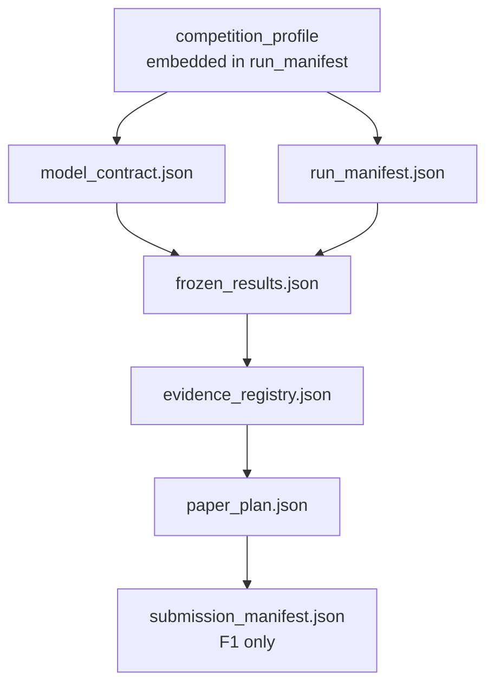

# Artifact Contracts

## Enhanced Integrity Profile

新项目应在 `run_manifest.json` 设置 `enhanced_integrity_profile=true`。该 profile 不另建一套 Gate，而是在现有 M1/W1/W2 增加以下不可替代 artifact：

| Artifact | Gate | 作用 | 生成来源 | 校验入口 |
|---|---|---|---|---|
| `problem_snapshot.json` | M1 | 题面/附件 hash、选题依据与逐 requirement 交付追踪 | 人工/Agent 编写 | `check_problem_coverage.py` |
| `data_contract.json`（每个权威数据集一份） | M1 | 列类型、单位、范围、主键、缺失、时间和泄漏语义 | `scripts/eda/profile_generator.py` 初稿 + 人工确认 | `check_data_contract.py` |
| `implementation_map.json` | M1 | equation/symbol → contract item → code symbol → passing test | 人工/Agent 编写 | `check_implementation_map.py` |
| `artifact_dag.json` | M1 | 输入/输出/命令/receipt 依赖图与 stale 传播真源 | 人工/Agent 编写 | `check_artifact_dag.py` |
| `presentation_contract.json` | W1 | 结果宏、舍入、单位、百分比与出现位置唯一真源 | 人工/Agent 编写 | `check_presentation_safety.py`（strict 档）；`generate_values_tex.py` 消费 |
| `claim_inventory.json` | W2 | 扫描正文中 plan 外数字与研究强词；由工具生成 | `scripts/claims/inventory_claims.py` / `run_deterministic_qa.py --claim-inventory-output` | W2 Gate 校验 `ok=true` |
| `writer_package.json` | W2 | 只读写作输入；可绑定 `draft_coverage`，证明首稿不是只有结果流水账 | `scripts/claims/compile_writer_package.py` | `check_writer_package.py` |
| `build_receipt.json` | W2 | 隔离 LaTeX build、禁 shell escape、源码前后 tree hash | `scripts/latex/safe_build.py` | W2 Gate（enhanced）校验 `source_unchanged=true` |
| `pdf_visual_qa.json` | W2 | 实际 PDF 页数/纸张/字体/全页渲染 receipt | `scripts/pdf/check_pdf.py` | W2 Gate（enhanced）校验 `formal_ok=true` |
| `visual_review_receipt.json` | W2 | 最终尺寸人工/多模态逐页审查，绑定同一 PDF/hash | 人工/多模态按 schema 生成 | W2 Gate（enhanced）校验 `verdict=pass` |

默认 false 只用于 schema 1.1 项目的显式迁移窗口，不能据此声称已通过增强研究完整性门槛。

模型合同声明 `sensitivity` / `out_of_sample` 时，P2 还需在 `run_manifest.artifacts[]` 登记 `sensitivity_experiment` / `oos_artifact`；FAIL/ERROR 冻结 run 需登记 `failure_evidence`。这些角色只要求本地可追溯路径和语义检查，dev/research 不强制每个辅助文件都填哈希；OOS 场景身份摘要必须由生成流程实际计算。

M1 Gate 会调用 formal `check_modeling_plan.py`，并重新验证每份 data contract、implementation map 与 artifact DAG；W1 再把 problem snapshot 与最终 paper plan 做逐 requirement 闭环。DAG 检查能够发现输入/输出 hash 漂移、上游 digest 漂移、重复 producer、cycle 与非 current 节点；它目前负责阻断 stale，不负责自动调度重跑。增强 W2 Gate 还会依据 deterministic report 的声明输入重建一次临时 QA，不信任孤立的 `ok=true`。

基础兼容 profile 长期保存五个核心 contract；enhanced profile 只为无法嵌入权威对象的题面、数据语义、实现映射和机器/人工 receipts 增件。只有最终提交阶段再增加不可变 manifest。代码、数据、验证日志、图和论文是被合同引用的实际 artifact，不为每个阶段另写重复总结文件。



- `model_contract.json`：M1 的题意、数据、模型和验证义务。数学口径变化后创建新 run。
- `run_manifest.json`：可变控制面；记录规则快照、安全策略、AI 使用、人审、命令、artifact、Gate 与 Reviewer，不存长篇内容。
- `frozen_results.json`：P2 的不可覆盖结果快照；绑定 model contract、代码、输入、可重算验证报告和逐项义务；可保留失败 run，但只有 `claimable=true` 的 PASS run 可进入 evidence。
- `evidence_registry.json`：唯一的增量证据账本；可先登记文献，再合并冻结结果。它不维护 claim 反向列表。
- `paper_plan.json`：W1 的 requirement/claim/evidence、章节、摘要结果和图表合同。
- `submission_manifest.json`：F1 才生成；冻结比赛 profile、规则、最终论文、附件、AI 声明、S1 report、截止时间与包哈希。

Competition Profile 嵌入 run manifest，避免新增一个常驻顶层 JSON；AI 使用也放 `run_manifest.ai_usage[]`。规则原文、交互记录和报告仍是独立 artifact，通过路径与 SHA-256 引用。

## 结果字段

```json
{
  "result_id": "R-Q1-01",
  "question_id": "q1",
  "name": "optimal_cost",
  "value": 123.45,
  "unit": "CNY",
  "precision": 2,
  "display_value": "123.45",
  "statistical_definition": "independently recomputed objective",
  "boundary": "仅适用于冻结需求与给定约束",
  "source_artifact": "results/q1.json",
  "source_key": "optimal_cost",
  "validation_status": "passed",
  "claimable": true
}
```

单位必须显式填写；无量纲量写 `dimensionless`。显示值必须等于 `value + precision` 的 ROUND_HALF_UP 结果，Writer 不得自行换算或重新舍入。`validation_status` 由总验证结论派生（`passed`/`failed`/`error`），`claimable` 必须等于冻结件的 `claimable`，不能由 Writer 或 Registry 自行提升。

只有记录数结果才填写 `metric_semantics.metric_type=record_count`；`population` 用于区分 `raw_records`、`valid_records`、`included_records` 和 `excluded_records`。摘要、正文和结论不得把同一个冻结数字改写成另一种 population；`check_consistency.py` 会在同一句中发现这种语义漂移并报告 `METRIC_SEMANTIC_MISMATCH`。

```json
{
  "result_id": "R-Q1-N",
  "name": "valid record count",
  "value": 1081,
  "unit": "records",
  "precision": 0,
  "display_value": "1081",
  "metric_semantics": {
    "metric_type": "record_count",
    "population": "valid_records",
    "validity_rule": "rows passing the declared data-quality filter"
  }
}
```
