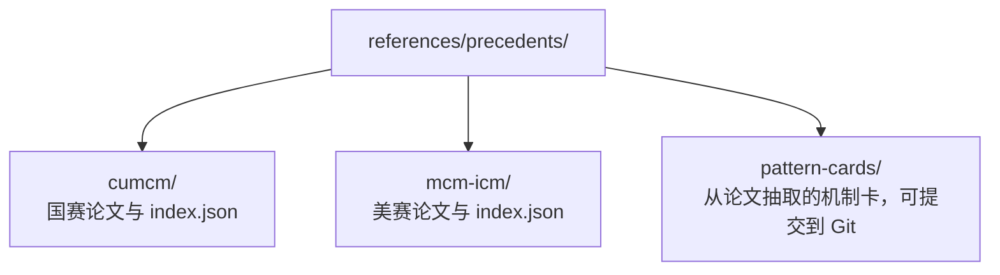

# Outstanding Paper Quarantine

往届优秀论文用于赛前学习机制，不是本题事实证据，也不是可直接复用的写作模板。

## 目录

PDF、Word 和压缩包默认被 `.gitignore` 排除，避免版权、体积和公开传播风险。只在获得合法来源后放到本地；`index.json` 记录赛事、年份、题号、奖项、官方 URL、文件哈希、权利说明、标签与处理状态。

## 使用规则

1. 只在赛前或明确允许的赛后复盘阶段读取全文。
2. 抽取题目拆解、模型选择理由、验证方式、论证结构、摘要组织和 Figure Contract 做法。
3. 将可迁移机制写成 pattern card，保留来源论文 ID，但不复制段落、公式、结果或固定模板。
4. `live_contest` 下遵守当届规则；若当前赛题内容的网络浏览被禁止，不因论文已在目录中就默认允许使用。
5. Writer 默认加载 pattern cards，不长期挂载优秀论文全文。

优秀论文不能进入科学 `evidence_registry` 证明外部事实，也不能证明本队模型正确；它们更适合作为 Harness 的端到端回归样例。
