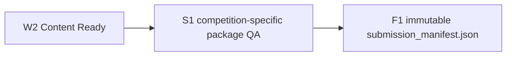

# Submission QA and Final Freeze

## 门户提交回执

F1 只证明本地最终包不可变，不证明门户已接受。用户实际提交后，可按 `schemas/submission_receipt.schema.json` 登记：F1 manifest hash、实际上传文件 hash、控制号、官方端点、时间、门户状态、截图/下载回执 hash 与人工确认。Harness 不自动上传，也不能把 `submission_receipt` 预填为 accepted。

W2 只表示内容准备完成；它不等于可提交。



## S1

按照 pinned Competition Profile 检查文件扩展名、字节数、页数范围、附件政策和 AI 声明政策。匿名性、字体/裁切、最终渲染、附件内容完整性等无法可靠从当前 stdlib 脚本判断的项目，必须列入 `required_manual_checks` 并由 S1 human checkpoint 确认。

页数必须同时记录数值和获取方法。`manual_verified` 是明确的人审边界，不应描述成程序自动测量。

### AI 声明格式

`submission_rules.ai_disclosure_format` 只描述 AI report/detail 的内容载体，不替代正文标注和参考文献要求：

| 值 | 含义 | S1 检查 |
|---|---|---|
| `separate_file` | 可单独固定哈希的文件 | 检查 `--ai-disclosure` 文件存在且哈希一致；若赛事要求放进支撑包，还要确认打包关系 |
| `in_paper_section` | 论文内 section（如 MCM/ICM 的 Report on Use of AI） | 要求 S1 人审 `manual_checks` 包含 `ai_report_in_paper` |
| `both` | 论文内 report section + 可单独固定哈希的文件 | 同时检查文件和 `ai_report_in_paper`；只有当届官方规则明确要求时使用 |
| `none` | 不要求（未设置时的默认行为同 `separate_file`） | 不检查 |

未设置该字段时，向后兼容为 `separate_file`。

赛事对“使用 AI”和“未使用 AI”的人工检查可能不同。把条件项写进同一个 profile，不新增 artifact：

```json
"ai_manual_checks": {
  "when_used": ["ai_generated_content_marked", "ai_tool_in_references"],
  "when_not_used": ["no_ai_declaration_after_references"]
}
```

S1 根据 `run_manifest.ai_usage[]` 是否为空选择一组，并与通用 `required_manual_checks` 合并。CUMCM 的实际 profile 还应在 `when_used` 中加入 `ai_disclosure_in_support`；ZIP 支撑包会自动核对包内同名文件的 SHA-256，RAR 等非 ZIP 格式保留人工确认。COMAP profile 应加入 `ai_inline_citations`、`ai_tool_in_references`、`ai_report_in_paper`。

### 页数与 AI report 排除

`submission_rules.max_pages_excludes_ai_report` 为 `true` 时（MCM/ICM），AI report section 不计入页数限制。`--paper-pages` 必须是整个 PDF 总页数，`--ai-report-pages` 是末尾 AI report 的页数。S1 检查 `0 <= ai_report_pages < paper_pages` 和 `paper_pages - ai_report_pages <= max_pages`，并要求人工确认 `ai_report_position`。

S1 report 和 F1 paper record 都保存总页数、AI report 页数、受限页数及获取方法，避免只留下一个不可复核的 pass。

### 问题选择

`competition_profile.problem_choice`（可选）记录选题（如 MCM/ICM 的 A–F 或 CUMCM 的 A/B/C/D/E/F）。MCM/ICM 提交文件名须为控制号 `0000000.pdf`，该字段供人审参考。

## F1

只有以下条件同时满足时才运行 `freeze_submission.py`：

- W2 与 S1 都通过；
- `run_manifest.status=submission_ready`；
- S1 report 为 `ok=true`，且覆盖当前 paper/support/AI disclosure 哈希；
- Competition Profile 哈希仍一致；
- AI Usage Registry、submission rules 和 S1 human checkpoint 的摘要哈希仍一致；
- 截止时间与时区已明确。

`submission_manifest.json` 禁止覆盖。论文、附件、AI 声明、规则或截止时间变化时，重新执行 S1，并生成新的 F1 文件；不要修改旧 manifest。

当前 F1 schema 为 `1.1`。它用 `run_manifest` 指向完整控制面，并在 `paper` 中保存 `pages`、`ai_report_pages` 与 `limited_pages`；这是相对早期 `1.0` 草案的破坏性合同升级。
