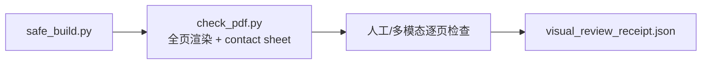

# Visual Review Protocol

视觉 QA 分三层，结论不得互相替代：

1. **Semantic QA（hard）**：图表数据、baseline、方向、统计定义、caption 与 claim/evidence 一致。
2. **Formal QA（profile-driven）**：页数/纸张、字体嵌入、图像分辨率、构建成功和文件哈希。
3. **Perceptual QA（human/multimodal receipt）**：最终尺寸下的裁切、重叠、空白/重复页、CJK 可见性、图表可读性和视觉误导。

`pdffonts` 的 encoding 标签不能独立证明中文已经正确显示；必须查看渲染页。页面密度、留白与“美观”默认只产生 warning；只有官方 profile 违规、不可读、裁切或误导才是 hard error。

正式图还应在 `final_size_qa` 中记录目标宽高、预期缩放、嵌入后的最小有效字号、线宽/marker 大小、栅格 DPI、裁切和可读性状态。`check_figure.py --paper-plan ... --require-final-size` 可把“已完成最终尺寸回查”升级为显式 profile 要求；没有启用该选项时，缺字段只作为迁移提示。

颜色只登记语义，不追求期刊配色模仿。可用 `contest_default`、`colorblind_safe`、`muted`、`high_contrast` 四个 profile；发散色图应同时登记 `color_semantic_center`，没有中心的连续量不要伪装成正负发散。

W2 enhanced profile 的顺序：

图 QA 的自动部分运行 `scripts/figures/check_figure.py`；灰度、色觉、语义强调和双轴误导仍需人工判断。
