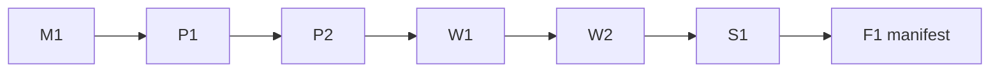

# P0 Gate Policy

## Enhanced profile additions

- M1：除 ready model contract 外，必须有 confirmed problem snapshot、每个权威数据集的 validated data contract、verified implementation map 和当前 artifact DAG；Gate 会实际重算数据、代码映射、hash/digest 与 cycle，而不只检查 JSON 形状。
- W1：必须有 ready presentation contract；摘要使用带选择原因的 `abstract_results[]`。
- W2：必须有 `claim_inventory.ok=true`、安全构建 receipt、实际 PDF formal QA 与 visual review pass。Style lint 的普通重复/密度 warning 仍由人工裁决，不能覆盖 semantic FAIL。
- W2 可显式升级写作/图表语义 profile：`--require-answer-contract`、`--require-abstract-backcheck`、`--require-figure-semantics`。它们分别复核题目答案覆盖、摘要事实回查和图表语义/最终尺寸；未启用时只报告迁移问题，不把经验性固定图数、固定句式或固定文献数变成默认 Gate。
- 若希望由 `check_gates.py` 在 W2 独立重跑这三项，可在 `run_manifest.json` 写入 `"editorial_semantics_profile": "strict"`；默认值为 `baseline`，旧项目不会静默升级。
- F1 后：如需要证明实际门户提交，人工建立 `submission_receipt.json`；Harness 不自动代替用户上传。

Contest Safety 持续执行，不计为额外 Gate。主链保留六个有限决策点：

| Gate | 唯一职责 | 通过条件摘要 |
|---|---|---|
| M1 | 数学与验证方案可编码 | ready model contract、规则/数据边界明确、research/submission formal M1 evidence-linkage check、M1 人审 |
| P1 | 最小执行路径可运行 | 恰一个成功 smoke，结构/单位/基本约束通过 |
| P2 | 全量结果可信且可用于论文 | full + freeze 成功、独立重算后全部 validation obligations `PASS`、`claimable=true`、P2 人审 |
| W1 | 论证可写 | ready paper plan、必要 claim 均有 verified evidence；结果 evidence 只能来自 claimable frozen run |
| W2 | 内容就绪 | 论文、确定性 QA、Semantic Critic、W2 人审；盲审按 profile |
| S1 | 当届提交包合规 | Competition Profile 专属 QA、全部人工检查、S1 report |
| F1 | 最终不可变交付 | 生成不可覆盖的 `submission_manifest.json`，不是 run manifest 中的新可变 Gate |

每个 Gate 使用 `pending | pass | fail | blocked`。`pass` 只对当前哈希有效；上游 artifact 变化后受影响 Gate 必须回到 `pending`。

增强 profile 的 W2 Gate 会从 deterministic QA 报告声明的输入重建一次临时 QA；它不覆盖原报告，重算失败不能通过手改 `ok=true` 绕过。

边界说明：未开启 enhanced/strict profile 时（baseline），deterministic QA 报告与 reviewer 状态是 manifest 中的声明性输入——`check_gates.py` 校验其存在性、哈希绑定与必需 check 标签，但不会重算报告内容；防手改的独立重跑仅存在于 enhanced/strict 档。正式研究链建议开启 `enhanced_integrity_profile` 或 strict 档位。

`judge_scan` 是 W2 的 issue-only 辅助审阅：检查 30 秒摘要可发现性、决定性结果、模型身份、验证定位和图后解释，并留下需要人工执行的渲染页速扫；它不产生总分，也不替代数学正确性、Semantic Critic 或最终 PDF 视觉复核。

## 回退

- M1 → Modeling；Coder 不猜数学合同。
- P1/P2 → Coding/Validation；禁止先写论文后补结果。
- W1 → Evidence/Results 或重做 paper strategy；不靠空话覆盖缺口。
- W2 → issue 指向的 Writer/Coder artifact；最多两轮。
- S1 → Submission Builder；内容变化时同时退回 W2。
- F1 后任何文件变化 → 重新 S1，生成新的 F1 manifest，旧文件保留审计。

## Reviewer 分档

- `sprint`：Deterministic QA + 1 Semantic Critic。
- `final_submission`：再加 1 个独立 Blind Reviewer。
- `award_max`：只在成稿冻结、明确冲奖且有返修时间时使用 3 席；不把通用分数阈值写死。
## Strict math correctness profile

`run_manifest.math_correctness_profile` 默认为 `baseline`，保留旧 run 的迁移窗口。仅在 run 已完成迁移（题面作用域合同、数值回放案例、Writer 绑定、presentation contract 与最终 PDF 源映射）后才设为 `strict`。该档位在 M1/W1/W2 追加要求，并从 deterministic report 的声明输入独立重跑；它是 Gate 政策，不声称检查器已证明任何定理或模型假设。迁移清单与 non-claims 的唯一权威描述见 [math_correctness_profile](math_correctness_profile.md)。
